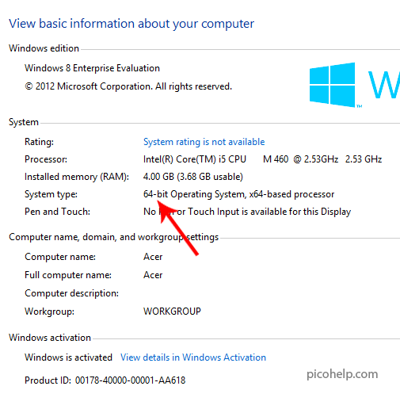
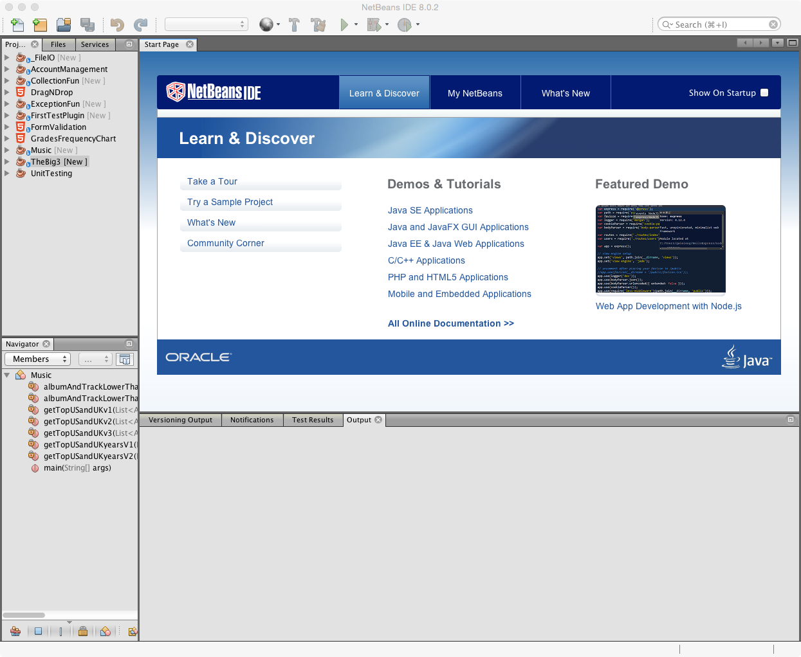

# Installationen
Damit du deine Plugins bequem testen kannst, ist es sinnvoll zuerst einen Minecraft-Server auf deinem eigenen Computer zu installieren.

Damit dein Computer ein Minecraft-Server wird, musst du eine bestimmte Software installieren, nämlich den "Minecraft-Server". Das klingt jetzt ein wenig seltsam. Das kommt daher, dass wir Informatiker das Wort "Server" manchmal für einen ganzen Computer benutzen (z. B. "Der Web-Server ist heute wieder mal superschnell"). Aber manchmal verwenden wir das Wort "Server" auch nur für ein Programm, die Server-Software, die einen Computer zu einem Server macht.

Also, um deinen Computer zu einem Minecraft-Server zu machen, musst du eine Server-Software, den "Minecraft-Server" installieren, alles klar?

Zum Testen brauchst du weiters natürlich einen Minecraft-Client und einen gültigen Minecraft-Account. Achte bitte darauf, dass sog. "Cracked-Versions" des Minecraft-Clients nicht funktionieren, weil man sich damit nicht auf einen anderen Server verbinden kann. Nun wären alle wichtigen Fragen geklärt und wir können loslegen.

## Download Java
Minecraft ist ein Java-Programm. Um Java-Programme laufen lassen zu können, musst du die Java Virtual Machine (JVM) auf deinem Computer installiert haben. Damit sich die ganze Installiererei auszahlt, ist auch noch NetBeans (das Programm, mit dem wir dann Java Programme schreiben werden) ein Java-Programm.

Bevor wir beginnen, wollen wir nachsehen, ob eventuell Java bereits auf deinem Rechner installiert ist. Dazu öffnest du unter Windows die Eingabeaufforderung oder am Mac das Terminal. Dann tippst du folgendes ein:

    java -version
    
Wenn du nun eine Antwort bekommst, die so oder zumindest so ähnlich aussieht, dann kannst du sofort zum Punkt **Download NetBeans** weiterspringen:

    java version "1.8.0_31"
    Java(TM) SE Runtime Environment (build 1.8.0_31-b13)
    Java HotSpot(TM) 64-Bit Server VM (build 25.31-b07, mixed mode)

Wenn das bei dir nicht ao aussieht, dann folge bitte den Anweisungen zur Installation von Java.

### Unter Windows

Zuerst überprüfen wir, ob du ein 32 oder 46 Bit Windows installiert hast. Dazu gehst du in die **Systemsteuerung**, dann wählst du den Punkt **System und Sicherheit** und hier **System**. Im darauffolgenden Fenster kannst du dann ablesen, welche Windows-Architektur du hast.

Nun öffen wir im Browser die Adresse <http://www.oracle.com/technetwork/java/javase/downloads/index.html> und klicken auf Java Download. Jetzt macht es sich bezahlt, wenn du dir gemerkt hast, welche Windows-Architektur du installiert hast, weil du dich hier entscheiden musst. Windows x86, wenn du ein 32-bit Windows hast, Windows x64, wenn du ein 64-bit Windows hast:

Auja, und den Radio-Button mit dem du das License Agreement akzeptierst, darfst du auch nicht vergessen, sonst wirds nix mit dem Download.

Wenn das exe auf deinem Computer heruntergeladen ist, startest du es und folgst den Installationsanweisungen. Wenn dir etwas komisch vorkommt, frag eineN deiner MentorInnen.

### Unter MacOS

Du öffnest im Browser die Adresse <http://www.oracle.com/technetwork/java/javase/downloads/index.html> und klickst auf Java Download. Jetzt wählst du aus der Liste der möglichen Systeme Mac OS X x64 aus.

Auja, und den Radio-Button mit dem du das License Agreement akzeptierst, darfst du auch nicht vergessen, sonst wirds nix mit dem Download.

Wenn das dmg vollständig runtergeladen ist machst du einen Doppelklick auf das dmg in deinem Download-Folder, startest den Installer und folgst den Anweisungen. Wenn dir etwas komisch vorkommt, frag eineN deiner MentorInnen.

     
### Großeltern-Imponier-Wissen
* Java ist eine Programmiersprache, die auf allen verschiedenen Betriebssystemen (Windows, MacOS, Linux etc.) läuft. Damit das gut funktioniert, benötigt es die JVM (Java Virtual Machine)
* JDK ist das **J**ava **D**evelopment **K**it. Das ist die Basis-Software, die man braucht, damit man Java entwickeln kann. 

## Download NetBeans
Damit wir unsere Plugins in Java bequem entwickeln können, werden wir NetBeans als IDE verwenden. Wenn du diese noch nicht installiert hast, werden wir das hier machen. Glücklicherweise läuft das unter Windows und MacOS und auch Linux sehr ähnlich ab:

1. Du gehst zur Website  <https://netbeans.org/downloads/index.html>. Dort kannst du dir aussuchen, in welcher "Ausbaustufe" du NetBeans haben möchtest. Wenn du genug Speicher auf deiner Festplatte oder SSD hast, würde ich die Variante "All" empfehlen. Damit kannst du NetBeans auch als IDE für Web-Entwicklung und C/C++-Entwicklung verwenden. Mit einem Klick auf den Button Download lädst du das gewünschte Bundle auf deinen Computer.
2. Abschließend musst du wieder das exe starten (Windows) oder das dmg öffnen und den Installer starten (Mac) und den Anweisungen im Programm folgen.
3. Abschließend kannst du dann NetBeans mal starten. Das müsste dann folgendermaßen aussehen:

Gratuliere, damit haben wir bereits den Großteil unserer Vorbereitungsarbeiten geschafft.

### Großeltern-Imponier-Wissen
* Eine IDE ist eine Integrierte Entwicklungsumgebung (**I**ntegrated **D**evelopment **E**nvironment). Damit kann man sehr bequem Programme entwickeln. Bekannte Exemplare dieser Gattung sind Visual Studio, Netbeans, Eclipse, XCode, IntelliJ usw.

## Download Server-Software
Es gibt eine Reihe von verschiedenen Servern, die wir installieren können. Die Originalfirma (Mojang) bietet zum Beispiel den Vanilla-Server an. Der hat aber den Nachteil, dass er keine Plugin-Schnittstelle zur Verfügung stellt. Die bekannteste Server-Software mit der man auch Plugins erstellen kann, ist Bukkit, welche wir auch verwenden werden. Du kannst im Internet nach der Server-Software suchen oder einfach auf die Coderdojo Website gehen und die Datei [``craftbukkit.jar``](craftbukkit.jar) auf deinen Computer herunterladen.

Dieses ``craftbukkit.jar`` ist unsere Server-Software, die wir jetzt starten müssen. Damit wir das in gewohnter Weise mit einem Doppelklick machen können, müssen wir noch eine kleine Vorkehrung treffen. Diese unterscheidet sich wieder leicht zwischen Windows und MacOS:

### Windows
Erstelle als erstes einen neuen Ordner mit Namen ``bukkitServer`` und bewege ``craftbukkit.jar`` da hinein. Dann starte deinen Lieblings-Texteditor (bitte nicht Word, sonder Notepad oder besser Notepad++) und tippe folgende Zeilen ab:

    java -Xms1024M -Xmx2048M -jar craftbukkit.jar -o true
    pause

Dann speicherst du die Datei unter dem Namen ``start.bat`` in den Ordner `bukkitServer` gleich neben `craftbukkit.jar` ab. 

### MacOS
Erstelle als erstes einen neuen Ordner mit Namen ``bukkitServer`` und bewege ``craftbukkit.jar`` da hinein. Dann starte deinen Lieblings-Texteditor (bitte nicht Word oder Pages, sonder TextEdit oder besser Atom oder TextWrangler) und tippe folgende Zeilen ab:

    #!/bin/bash
    cd "$( dirname "$0")"
    java -Xmx1024M -jar craftbukkit.jar -o true

Dann speicherst du die Datei unter dem Namen ``start.sh`` in den Ordner `bukkitServer` gleich neben `craftbukkit.jar` ab. 

### Großeltern-Imponier-Wissen:
* Ein Plugin ist ein Stück Software, mit dem man eine bestehende Software erweitert.
* Eine Schnittstelle (auf Englisch Interface) ist eine Sammlung von Funktionen, mit der man Programme benutzen kann. 

## Den Server das erste Mal starten
Wenn du diese Datei nun mit einem Doppelklick startest müsste ein Fenster mit dem Cmd-Prompt oder dem Terminal (schwarzes Fenster mit weißem Text unter Windows oder weißes Fenster mit schwarzem Text unter MacOS) erscheinen und nach einer Weile folgende Meldungen darin angezeigt werden.

    [18:22:27 INFO]: Starting minecraft server version 1.7.10
    [18:22:27 INFO]: Loading properties
    [18:22:27 INFO]: You need to agree to the EULA in order to run the server. Go to eula.txt for more info.
    [18:22:27 INFO]: Stopping server
    [18:22:27 INFO]: Stopping server
    
Damit sind wir schon fast am Ziel. Wie du oben siehst, will der Server noch, dass wir das EULA akzeptieren. Freundlicherweise schreibt er auch, was wir tun sollen, nämlich ``eula.txt`` für weitere Informationen ansehen. Diese Datei wurde durch das erste Mal starten im Ordner `bukkitServer` erstellt. Wir nehmen also wieder unseren Lieblings-Editor zur Hand und öffnen dieses ``eula.txt``.

In der letzten Zeile dieses Files steht ``eula=false``. Das müssen wir in ``eula=true`` umschreiben und dann probieren wir es noch mal und starten den Server mit einem Doppelklick. Jetzt müsste er sauber starten. Du merkst das, dass nun im Fenster sehr viel mehr Meldungen angezeigt werden und zum Schluss die Zeile

    [18:24:04 INFO]: Done (1.369s)! For help, type "help" or "?"

stehen sollte. Um ganz sicher zu gehen, musst du natürlich jetzt dein Minecraft starten. Um auf deinem Server spielen zu können wählst du am Startscreen die Option **Multiplayer**. Wenn es schnell gehen soll, klickst du auf den Button **Direct Connect** und gibst als Server-Adresse ``localhost`` ein.

Da wir den Server aber sicherlich öfter brauchen werden, zahlt es sich wahrscheinlich aus, dass du ihn zur Liste deiner Server hinzufügst. Dazu wählst du den Button **Add Server**. Dann kannst du deinem Server einen Namen geben, sodass du ihn schnell wiedererkennst und als Adresse gibst du wieder ``localhost`` an.

So jetzt solltest du dich mit dem Server verbinden können. Wenn du andere Spieler auf deinen Server einladen möchtest und diese Spieler im gleichen lokalen Netz sind wie du, musst du ihnen die IP-Number deines Computers mitteilen. Diese müssen sie dann bei Server-Adresse eingeben. Dann sollten Sie deinem Server beitreten können.

Gratuliere, du hast auf deinem Computer einen Minecraft-Server installiert. Auch hast du sonst schon alle Vorbereitungen getroffen, damit du in der nächsten Episode mit der Entwicklung deines ersten Plugins beginnen kannst.

### Großeltern-Imponier-Wissen:
* EULA ist eine Abkürzung und bedeutet **E**nd **U**ser **L**icense **A**greement, also Endbenutzer-Lizenz-Vereinbarung (danke ihr lieben JuristInnen, hüstel).
* IP-Numbers sind Zahlenkombinationen (z. B. ``192.168.0.3``) mit denen Computer in einem Netzwerk eindeutig gekennzeichnet sind. Der eigene Computer ist immer über die IP-Number ``127.0.0.1`` oder eben auch über den Begriff ``localhost`` erreichbar.
