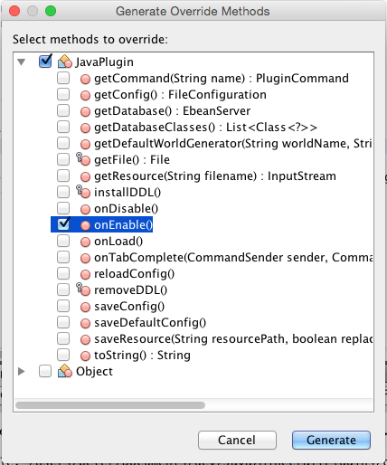
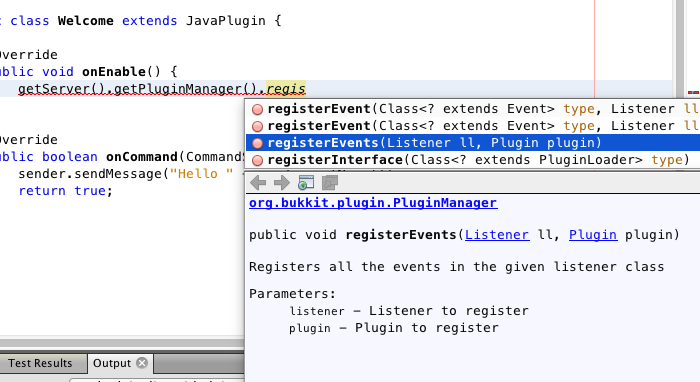
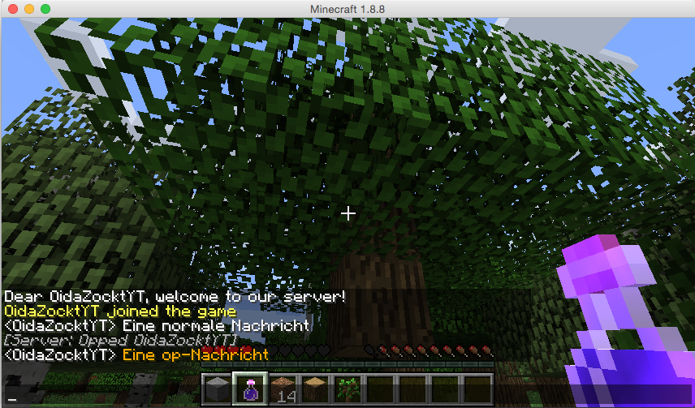

# Auf Ereignisse reagieren
Bisher haben wir in unseren Plugins immer etwas gemacht, sobald vom Spieler oder auch in der Konsole ein Kommando eingegeben wurde. Das ist ja schon ganz schön, aber manchmal ist es auch notwendig, dass wir auf Ereignisse reagieren. Ein Ereignis ist, wenn irgendetwas im Spiel passiert aber eben kein Kommando eingegeben wurde. Beispiel sind

* Der Spieler tritt einem Server bei
* Es werden Chat-Nachrichten versendet
* Es wird irgendetwas zerstört
* Es explodiert gerade ein Block
* Wenn ein Sign geändert wird
* ...

Du kannst unter `org.bukkit.event.*` die Liste aller Events ansehen. Wir fangen nun mit einem einfachen Event an. Wenn ein neuer Spieler deinem Server beitritt wollen wir ihn freundlich begrüßen, wenn er ihn verlässt soll er freundlich verabschiedet werden und wenn die Spieler miteinander chatten wollen wir die Nachrichten der ops in einer speziellen Farbe darstellen.

Da diese Listender sehr gut zum Thema Begrüßen passt, kannst du sie zu deinem ersten Plugin (das mit dem `/sayhello`) dazugeben oder auch ein neues Projekt beginnen, wie du willst.

## Die Listener-Klasse
Wenn du dein erstes Plugin nicht erweitern willst, dann musst du wieder ein neues Projekt erstellen, ein neues Package und darin eine neue Klasse (`com.bajupa.welcome.Welcome`). Gut, jetzt sind wir bereit, unseren ersten Listener einzubauen.

Ein wichtiger Punkt beim Programmieren ist Ordnung zu halten. Das heißt, dass wir unser Programm so ordnen, dass nur zusammengehörige Dinge in einer Klasse sind.  Daher legen wir für den Listener eine neue Klasse an. Das kannst du ja schon gut. Ich schlage vor, dass wir die neue Klasse `JoinAndLeaveListener` nenne, weil wir da auf die beiden Events, wenn ein Spieler unserem Server beitritt und wenn ein Spieler unseren Server verlässt, reagieren wollen.

So ähnlich wie bei der Plugin-Klasse, welche eine Erweiterung von `JavaPlugin` ist, müssen wir einen Listener auch von einer *Basisklasse* ableiten. Das sieht dann folgendermaßen aus

    public class JoinAndLeaveListener implements Listener {
    
    }

Wenn du genau hinsiehst, merkst du, dass hier statt `extends` das Wörtchen `implements` steht. Sehr grob 

In Listener-Klassen kannst du nun einen oder mehrere sog. *EventHandler* reinschreiben. Diese EventHandler sind eigentlich ganz normale Methoden, die halt nicht nach Eintippen eines Kommandos aufgerufen, sondern sobald ein Ereignis (auf Englisch eben Event) eintritt.

Also wollen wir unseren ersten EventHandler implementieren. Leider haben wir hier keine so tolle Unterstützung von NetBeans, dass wir einfach **Source** und **Insert Code ...** auswählen könne. Diesmal müssen wir das ganze selber machen.

<pre>
public class JoinAndLeaveListener implements Listener {
    @EventHandler
    public void onJoin(PlayerJoinEvent event) {
        Player player = event.getPlayer();
        p.sendMessage("Dear " + player.getName() + ", welcome to our server!");
    }
}
</pre>

Als erstes fällt auf, dass vor der Methode die *Annotation* `@EventHandler` steht. Das ist das "Erkennungsmerkmal", dass diese Methode im Falle eines Ereignisses aufgerufen wird. Anschließend kommt die Methode, welche mit `public void` beginnt. `void` heißt, dass Event Handler keinen Wert zurückgeben (vergleiche das mit dem `boolean`, der von der Methode `onCommand` zurückgegeben wird). Daran anschließend kommt der Name der Methode. Bei einem Event Handler kannst du dir den Namen (ähnlich wie bei Variablen und Parameter) aussuchen.

Nun kommen die Parameter und hier wird es wieder spannend. Wie du siehst, hat ein Event Handler nur einen Parameter und der ist dafür verantwortlich, dass der Event Handler beim richtigen Event aufgerufen wird. Für den Fall, dass ein Spieler einem Server beitritt gibt es den `PlayerJoinEvent` und daher wählen wir genau diesen Typ für den Parameter aus. Den Namen des Parameters darfst du dir dafür wieder selber aussuchen.

Zwischen den geschwungenen Klammern schreibst du jetzt rein, was zu passieren hat. In der ersten Zeile holen wir uns den Spieler, der gerade dem Server beitritt. Der wird sozusagen im Event mitgeliefert. Du kannst dir das so vorstellen: Wenn ein Ereignis auf dem Server eintritt, baut der Server ein Event-Objekt (also eine Variable mit dem Datentyp, der zu dem Event passt) zusammen und schickt dieses Objekt auf die Reise (so ähnlich wie eine Rohrpost, in der alle möglichen Informationen reingesteckt sind). Alle Event Handler, die den dazu passenden Parameter deklariert haben, bekommen diese Rohrpost und können die darin enthaltenen Informationen auslesen.

Also mit der Methode `getPlayer` des `PlayerJoinEvent`s kannst du den Spieler, der gerade beitritt auslesen. Wir speichern uns den Spieler in eine Variable `player` und dann holen wir uns in der nächsten Zeile von `player` den Namen mit der Methode `getName`. Das kennst du aber schon aus dem ersten Plugin.

## Den Listener registrieren
Anders als bei der Methode `onCommand`, die es nur einmal pro Plugin gibt, kann es mehrere Listener zu verschiedenen oder auch gleichen Events geben und das ganze noch dazu in verschiedenen Plugins. Daher müssen wir Listener beim Server anmelden (registrieren), damit sie dann im Fall der Fälle auch wirklich aufgerufen werden. Dieses Anmelden machen wir in der Plugin-Klasse. Die Methode `onCommand` wäre natürlich ein möglicher Platz, das zu machen. Damit müssten wir aber ein Kommando einführen, dass irgendjemand aufrufen muss, um deine Listener zu registrieren. Das wäre aber ein wenig unbequem, wenn der Server-Administrator immer nach dem Starten per Hand die ganzen Listener aller Plugins registrieren müsste.

Besser ist es, wenn das automatisch geht und dafür werden wir in der Plugin-Klasse eine neue Methode einführen. Dazu holst du dir als erstes im Editor die Klasse Welcome (oder wie auch immer deine Plugin-Klasse heißt) in den Vordergrund, dann setzt du den Cursor in die Klasse und wählst wieder **Source** und dann **Insert Code...**. Genauso wie bei `onCommand` wählen wir jetzt den Punkt **Override Method...** aus. Das darauffolgenden Fenster sieht dann so aus:

Wie in der Abbildung vorgegeben, wählst du **onEnable()** aus und drückst auf **Generate**. Damit sollte deine Klasse ca. so aussehen:

<pre>
public class Welcome extends JavaPlugin {

    @Override
    public void onEnable() {
        super.onEnable(); //To change body of generated methods, choose Tools | Templates.
    }
    
    @Override
    public boolean onCommand(CommandSender sender, Command command, String label, String[] args) {
        sender.sendMessage("Hello " + sender.getName());
        return true;
    }
    
}
</pre>

`onCommand` muss in deiner Klasse nicht da sein, je nachdem, ob du für diese Episode ein neues Projekt angefangen hast oder nicht. Die Methode `onEnable` eines Plugins wird dann aufgerufen, wenn das Plugin geladen wird. Das ist meist nach dem (Neu-)Starten des Servers oder nachdem auf der Konsole das Kommando `reload` eingegeben wurde. Damit ist das der ideale Platz um unseren Listener zu registrieren. Bevor du deinen Code reinschreibst, löscht du am besten den Template-Code mit `super.onEnable(); ...` damit da ordentlich Platz ist.

Der Listener muss beim Server registriert werden und der bequeme Server delegiert das ganze gleich noch an den sog. `PluginManager`, aber alles der Reihe nach. Um auf den Server zuzugreifen, rufst du die Methode `getServer` auf (die gibts praktischerweise direkt im Plugin), dann rufst du vom Server die Methode `getPluginManager` auf und der wiederum hat die Methode `registerEvents`. Du kannst die Aufruffolge im nächsten Bild ansehen.

Du siehst, dass diese Methode zwei Parameter verlangt, nämlich einen Listener (was wir ja erwartet haben) und aber auch ein Plugin, dem dieser Listener zuzuordnen ist. Also los gehts: Den Listener haben wir ja gerade programmiert, den müssen wir nur noch erzeugen (das passiert mit dem Wörtchen `new`) und das Plugin, das gibt es ja bereits (in dieser Klasse befinden wir uns gerade) und wir müssen nur darauf verweisen (das passiert mit dem Wörtchen `this`). Zum Schluss sollte deine Methode genau so aussehen:

<pre>
public void onEnable() {
    getServer().getPluginManager().registerEvents(new JoinAndLeaveListener(), this);
}
</pre>

## Auch eine schöne Verabschiedung
Damit wir das mit den Event Handlern gleich ein wenig üben, schlage ich vor, dass wir noch einen zweiten Handler zur Verabschiedung, also wenn ein Spieler den Server verlässt, hinzufügen. Der Event heißt `PlayerQuitEvent`. Damit sollte aber genug gesagt sein und den Rest solltest du schon ganz allein hinbekommen. Die Auflösung gibts in der nächsten Episode.

## Und noch ein kleines Beispiel zum Abschluss
Wenn du die Verabschiedung auch schon fertig hast, probier doch noch folgendes: Wir wollen beim Chatten die ops besonders hervorheben, weil sie ja auch soooo superwichtig sind. Das heißt, dass Chat-Nachrichten normaler Spiele, wie üblich in der Farbe weiß dargestellt werden. Wenn aber ein op eine Nachricht sendet, soll diese in einer anderen Farbe (wie zum Beispiel im folgenden Screenshot) golden dargestellt werden.

Natürlich bekommst du von mir noch ein paar sachdienliche Hinweise. Den Rest bekommst du dann sicherlich schon ganz gut alleine hin. Also, was brauchst du?

1. Die Klasse: Da dieser Handler nichts mehr mit den Begrüßungen zu tun hat, find ich es gut, den Handler in eine neue Klasse zu geben. Ich schlage vor, du legst eine neue Klasse namens `ChatListener` an. Den Event Handler nennen wir `onChatMessageIsSent` würde ich vorschlagen.
2. Der Datentyp für den Parameter des Event Handlers: `AsyncPlayerChatEvent`
2. Die Nachricht, die der Spieler eingegeben hat, auslesen: `AsyncPlayerChatEvent` hat dazu die Methode `getMessage`
3. Die Nachricht golden einfärben: Dazu gibts den Typ `ChatColor`. Der stellt verschiedene Farbwerte und Schriftveränderungen zur Verfügung, die man einfach vor einen String kleben kann. Damit veränderst du die Darstellung des Strings. Beispiel: `ChatColor.GOLD + "Hui"` stellt "Hui" in goldener Farbe dar. `ChatColor.GOLD + "" + ChatColor.BOLD + "Hui"` stellt "Hui" fett und in der Farbe Gold dar. Beachte dabei, dass die "echte Farbe" zuerst kommen muss und dann erst die sonstigen Dekorationen wie **bold** order *italic*. Weiters musst du aufpassen, dass zwischen den `ChatColor`-Angaben immer ein leerer String (also `""`) stehen muss. Sieh dir die verschiedenen Farben, die `ChatColor` zur Verfügung stellt, an und such dir eine aus.
4. Die Nachricht dann setzen: Achtung, die veränderte Nachricht "händisch" via sendMessage zu versenden würde nix bringen, da das ja nur an einen Spieler geht. Du müsstest dir ja alle Spieler vom Server holen und jedem einzelnen via `sendMessage` die Nachricht schicken. Das geht aber einfacher: Das Event hat auch eine Methode `setMessage`, mit der du die "Originalnachricht" durch die golden eingefärbte Nachricht ersetzen kannst und das Versenden der Message überlässt du wieder dem Server, der das ja sowieso machen wollte.
5. Da wir diesen Handler in eine eigene Listener-Klasse gegeben haben, musst du den im `onEnable` registrieren: `getServer().getPluginManager().registerEvents(new ChatListener(), this);`

Eine Sache find ich noch wichtig, dass du dir überlegst und du verstehst. Wenn ein Ereignis eintritt, macht der Bukkit-Server folgendes:

1. Er baut ein Event-Objekt (die Rohrpost), das den Event beschreibt
2. Er schickt die Rohrpost an alle Plugins, diese können das Event-Objekt auslesen, verändern und was weiß ich noch alles machen
3. Sobald das letzte Plugin das Event-Objekt gehabt hat, führt der Server das Event endlich aus. Dazu nimmt er aber das von den Plugins veränderte Event-Objekt her.

So, du hast nun einen großen Schritt gemacht und gelernt, wie du auf Ereignisse reagieren kannst. Damit stehen dir schon viele Möglichkeiten für deine eigenen Plugin-Ideen offen. In der nächsten Episode zeige ich dir noch eine Anwendung eines Listeners, indem wir unser Getafix-Plugin um einen Zaubertrank erweitern, der die Spielerin, die ihn getrunken hat, unbesiegbar macht.

Wenn du aber eigene Ideen hast, probier sie aus, besprich sie mit deinen MentorInnen und bleib hartnäckig dran, dann wird's bestimmt etwas.

## Zusammenfassung für Profis
1. Listener-Klasse bauen (`implements Listener`!)
2. Event-Handler in Listener-Klasse implementieren (Annotation `@EventHandler` über der Methode und den richtigen Datentyp für den Parameter suchen)
3. In der Plugin-Klasse die Methode `onEnable` generieren (wenn sie nicht schon vorhanden ist)
4. Die Listener-Klasse registrieren