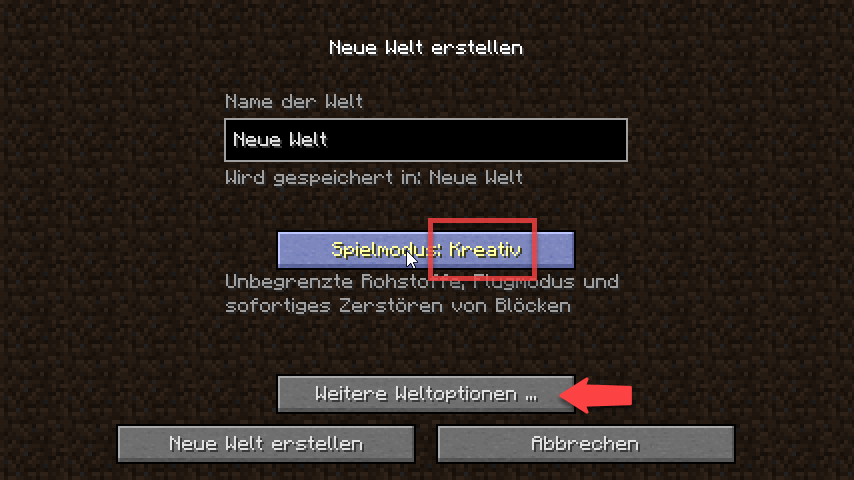
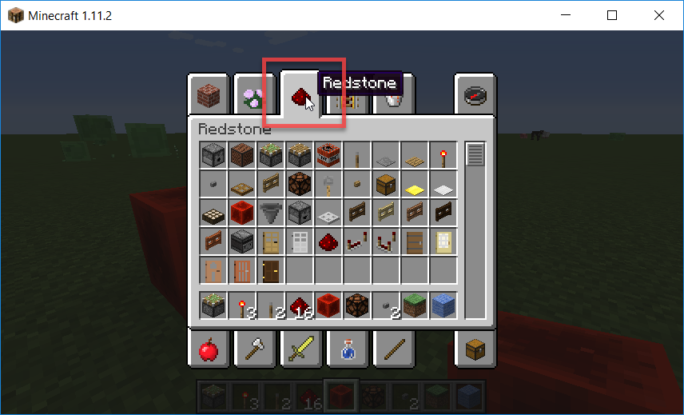
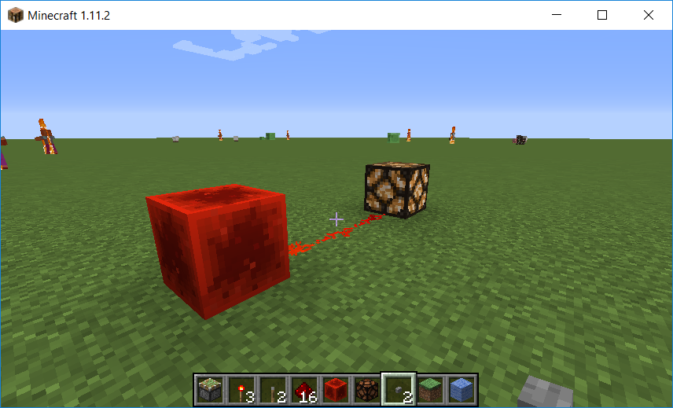
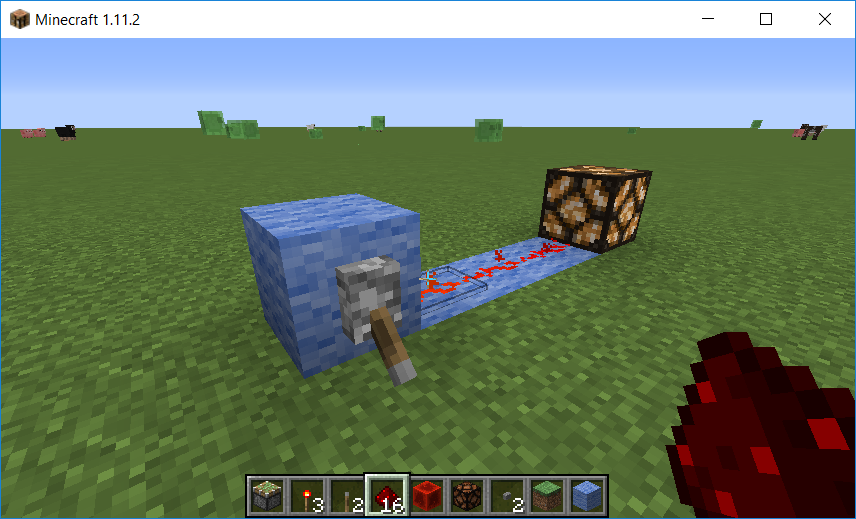
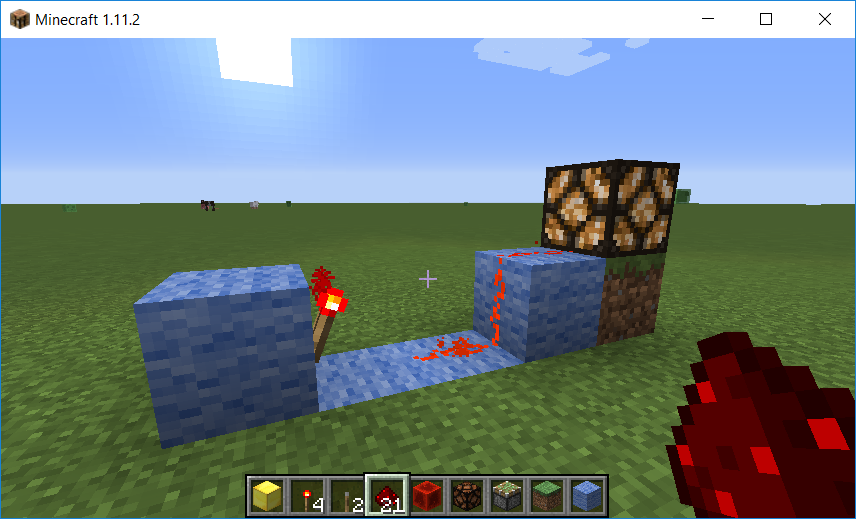
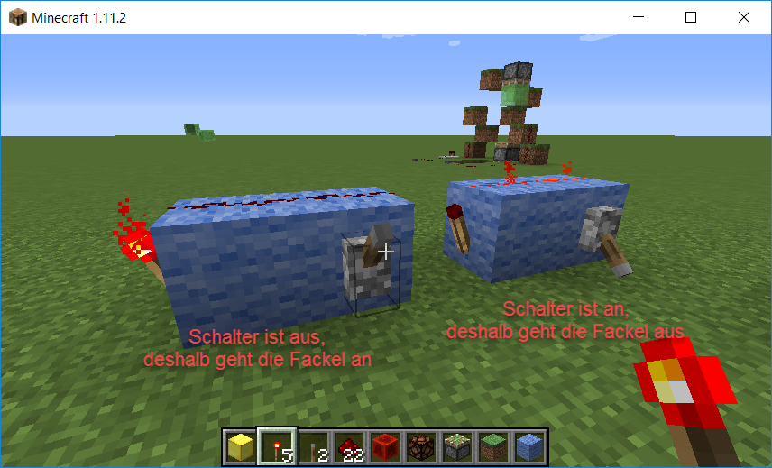
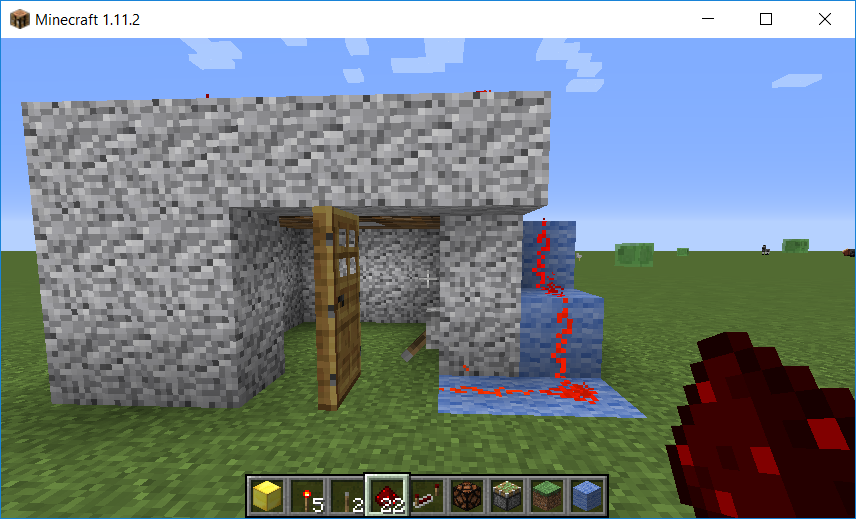
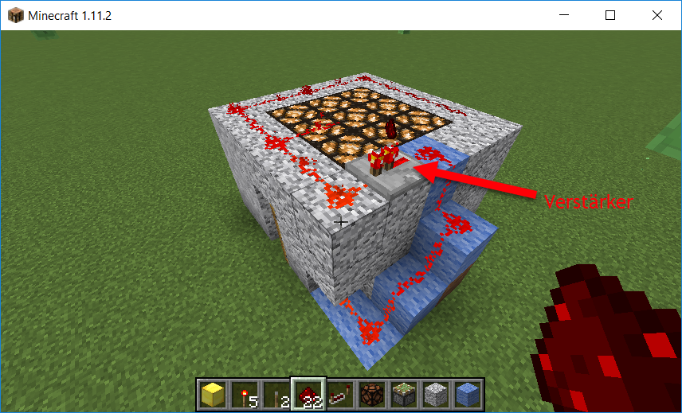

# Erste Schritte mit Redstone

## Voraussetzung

Für diese Übung brauchst du [Minecraft](https://minecraft.net/de-de/){:target="_blank"}. Du solltest mit den Grundfunktionen wie Steuerung des Spielers, verwenden von grundlegenden Blöcken etc. vertraut sein.

## Was ist *Redstone*?

{:right}
[Redstone](http://minecraft-de.gamepedia.com/Redstone){:target="_blank"} ist ein wichtiger Rohstoff in Minecraft. Wie in der echten Welt mit Strom kannst du mit Redstone in Minecraft Schaltkreise (Englisch *Ciruits*) bauen. Egal ob Falle für Monster, Lichtsteuerung oder automatische Türen - für all das verwendest du Redstone.

**Hinweis für Eltern:** Schaltungen mit Redstone sind ein gutes Beispiel dafür, warum Minecraft viel mehr ist als nur ein Unterhaltungsspiel. Kreativität und logisches Denken sind gefragt, wenn man mit Redstone arbeiten möchte.

## Spiel zum Experimentieren vorbereiten

Um Redstone kennenzulernen, startest du am besten eine flache Welt im Kreativmodus.

## Redstone im Inventar

Die Gegenstände, die mit Redstone zu tun haben, findest du im Inventar:

## Dein erster Schaltkreis

1. Setze einen [Redstone-Block](http://minecraft-de.gamepedia.com/Redstone-Block){:target="_blank"}. Er ist die **Energiequelle** für deine Schaltung.

1. Ein paar Felder daneben setzt du eine [Redstone-Lampe](http://minecraft-de.gamepedia.com/Redstone-Lampe){:target="_blank"}. Sie **leuchtet**, wenn sie mit Energie versorgt wird.

1. Anschließend verbinde die beiden Blöcke mit [Redstone](http://minecraft-de.gamepedia.com/Redstone){:target="_blank"}. Jetzt fließt Energie und die Lampe leuchtet.

## Schalter

1. Ersetze den Redstone-Block durch einen normalen Block. Ich verwende hier **blaue [Wolle](http://minecraft-de.gamepedia.com/Wolle){:target="_blank"}**. **Tipp:** Es ist üblich, dass Schaltkreise auf eingefärbter Wolle gelegt werden. Dadurch erkennt man leichter, wie eine Schaltung funktioniert.

1. Bringe einen **[Schalter](http://minecraft-de.gamepedia.com/Schalter_(Begriffskl%C3%A4rung)){:target="_blank"}** an dem normalen Block an. Er ist eine **Energiequelle**, die du ein- und ausschalten kannst.

1. Schalte jetzt die Redstone-Lampe ein und wieder aus.

1. Ersetze den Schalter durch einen **Knopf** und beobachte, wie er nach dem Drücken einen kurzen Energieimpuls abgibt.

## Kolben

1. Setze einen **klebrigen [Kolben](http://minecraft-de.gamepedia.com/Kolben){:target="_blank"}**. **Tipp:** Wenn der Kolben nach oben ausfahren soll, muss du in den Flugmodus wechseln (2 x schnell hintereinander die Leertaste drücken) und ihn von oben setzen.

1. Setze einen beliebigen Block auf den Kolben. Ich verwende einen Gold-Block.

1. Füge zu deiner Schaltung eine Abzweigung hinzu. Verbinde sie mit dem Kolben.

1. Betätige den Schalter und beachte, wie Licht und Kolben sich gleichzeitig verändern.

## Fackel

### Fackel als Energiequelle

1. Setze eine [Redstone-Fackel](http://minecraft-de.gamepedia.com/Redstone-Fackel){:target="_blank"} wie oben gezeigt. Die Fackel ist eine **Energiequelle**.

1. Achte im Beispiel oben darauf, wie Redstone über Stufen nach oben fließen kann. Dadurch fängt die Lampe zu Leuchten an.

### Fackel ein- und ausschalten

Fackeln gehen aus wenn sie mit Energie versorgt werden. Sie drehen ein Energiesignal also um (aus *an* wird *aus* und umgekehrt).
 
## Übungsaufgabe

Baue ein Haus mit Licht an der Decke. Es soll innen einen Schalter haben, mit dem du es ein- und ausschalten kannst. Verkleide anschließend dein Haus damit man von außen die Redstone-Schaltung nicht sieht.

**Tipp 1**: Lass die Energie mit Redstone über eine Treppe nach oben fließen:

**Tipp 2**: Redstone überträgt Energie maximal 15 Blöcke weit. Die Energiestärke nimmt dabei ab. Um das Signal nach einer langen Leitung zu verstärken, setze einen **[Verstärker](http://minecraft-de.gamepedia.com/Redstone-Verst%C3%A4rker){:target="_blank"}** ein.

**Tipp 3**: Um dein Licht auszuprobieren, kannst du mit dem Befehl `/time set night` auf Nacht umschalten. Mit `/time set day` kommst du wieder in den Tag.

## Wie geht es weiter?

Im CoderDojo Linz haben wir das *Schaltkreis-Handbuch für Minecraft*. Lies dort mehr über Redstone und baue die im Buch gezeigten Schaltungen nach.
