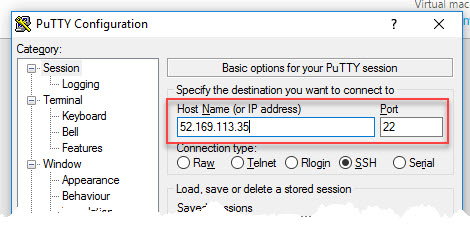
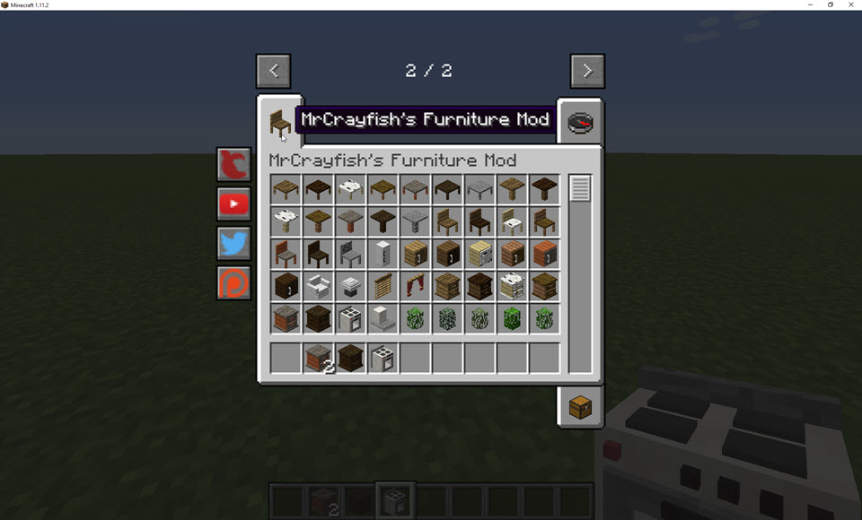

# Installation eines Minecraft Servers

## Voraussetzungen

In dieser Übung installieren wir einen Minecraft Server. Als Grundlage brauchst du dafür einen Computer, auf dem [Linux](https://de.wikipedia.org/wiki/Linux) installiert ist. Linux ist eine freie Software, die kostenlos im Internet zu haben ist.

Falls du nicht sicher bist, welches Linux du verwenden sollst, empfehlen wir für diese Übung [Ubuntu](https://www.ubuntu.com/). Du bekommst den Ubuntu Server zur Installation [kostenlos im Internet](https://www.ubuntu.com/download/server). Eine deutsche Anleitung zur Installation von Ubuntu findest du z.B. im [ubuntuusers Wiki](https://wiki.ubuntuusers.de/Server_Installation/).

Falls du keinen eigenen Server hast, sprich mit dem Mentorenteam vom CoderDojo Linz. Wir können eine limitierte Anzahl von Ubuntu-Servern, die in der [Cloud](https://de.wikipedia.org/wiki/Cloud_Computing) laufen, zur Verfügung stellen.

## Zugriff auf deinen Ubuntu-Server

Falls du direkten Zugriff auf den Ubuntu-Server hast, kannst du die folgenden Schritte in einem [lokalen Terminal](https://wiki.ubuntuusers.de/Terminal/) durchführen.

Wenn dein Server in der Cloud läuft und du keinen direkten Zugang dazu hast, musst du aus der Ferne zugreifen. Dafür brauchst du [PuTTY](http://www.chiark.greenend.org.uk/~sgtatham/putty/download.html). Lade die Software herunter und installiere sie. Wenn du sie startest, musst du die [IP-Adresse](https://de.wikipedia.org/wiki/IP-Adresse) deines Servers eingeben. Wenn du nicht sicher bist, wo du die IP-Adresse her bekommst, bitte jemanden vom CoderDojo Mentorenteam um Hilfe.



**Wichtig:** Damit der Zugriff auf den Server funktioniert, musst du möglicherweise die [Firewall](https://de.wikipedia.org/wiki/Firewall) konfigurieren. Bitte einen CoderDojo Mentor um Hilfe, wenn du nicht weißt, wie das geht.

## Installation

### Minecraft Server Control

Zur Verwaltung unserer Minecraft-Welten verwenden wir [Minecraft Server Control](https://github.com/MinecraftServerControl/mscs). Das müssen wir als erstes installieren.

**Wichtiger Tipp:** Wenn du wissen möchtest was *mscs* alles kann, lies unbedingt [die Dokumentation](https://github.com/MinecraftServerControl/mscs#overview). Das ist außerdem eine super Gelegenheit, um Englisch zu üben.

```
# Aktualisieren der Installationsquellen für unseren Ubuntu-Server
sudo apt-get update

# Installieren der Systemvoraussetzungen von mscs
sudo apt-get -y install default-jre perl libjson-perl python make wget rdiff-backup rsync socat iptables git

# Mscs herunterladen und eigentlichen Installation starten
cd /tmp
git clone https://github.com/MinecraftServerControl/mscs.git
cd mscs
sudo make install
```

### The Minecraft Overviewer

*Mscs* kann den [Minecraft Overviewer](https://overviewer.org/) steuern. Damit kannst du hochauflösender Bilder deiner Minecraft-Welt erzeugen (z.B. für deinen Blog). Installieren wir also den *Minecraft Overviewer*:

```
# Installationsquelle hinzufügen (damit Ubuntu den Minecraft Overviewer findet)
echo "deb http://overviewer.org/debian ./" | sudo tee -a /etc/apt/sources.list
sudo wget -O - http://overviewer.org/debian/overviewer.gpg.asc | sudo apt-key add -
sudo apt-get update

# Installieren des Minecraft Overviewer
sudo apt-get -y install minecraft-overviewer
```

### Forge

Für viele Mods braucht man [Minecraft Forge](http://minecraft-de.gamepedia.com/Mod/Minecraft_Forge). *Mscs* unterstützt *Forge*. Lass uns *Forge* daher installieren.

**Wichtiger Tipp:** Auf der [Forge Webseite](http://files.minecraftforge.net/maven/net/minecraftforge/forge/) findest du eine Liste von Programmversionen. Such dir die *Recommended*-Version (=empfohlene Version) heraus und trage die genaue Versionsnummer (z.B. `1.11.2-13.20.0.2228`) in das Installationsscript unten ein.

```
# Speichere die Versionsnummer in einer Variable
VER="1.11.2-13.20.0.2228"

# Forge Installationsprogramm laden
cd /opt/mscs && sudo mkdir server && cd server
sudo wget http://files.minecraftforge.net/maven/net/minecraftforge/forge/$VER/forge-$VER-installer.jar

# Installationsprogramm starten
sudo java -jar forge-$VER-installer.jar --installServer

# Installationsprogramm löschen, es wird nicht mehr benötigt
sudo rm -f forge-$VER-installer.jar*
```

Jetzt können wir eine Minecraft Welt mit *Forge* erzeugen. **Wichtiger Tipp:** Du musst im folgenden Script die Versionsnummer von Minecraft und den gewünschten Welt-Namen ändern.

```
MINECRAFT_VER="1.11.2"
WORLD_NAME="forge"

# Minecraft-Welt anlegen
mscs create $WORLD_NAME 25565
cd /opt/mscs/worlds/$WORLD_NAME

# Einstellungen für die Verwendung von Forge ändern
echo "mscs-client-version=$MINECRAFT_VER" | sudo tee -a mscs.properties
echo "mscs-server-version=$MINECRAFT_VER" | sudo tee -a mscs.properties
echo "mscs-server-jar=forge-$VER-universal.jar" | sudo tee -a mscs.properties
echo "mscs-server-url=" | sudo tee -a mscs.properties

# Zu Testzwecken einen Forge Mod (Furniture) in der Welt installieren
sudo mkdir mods && cd mods
sudo wget https://mrcrayfish.com/files/mods/cfm/cfm-4.1.2-mc1.11.2.jar
cd ..

# Spieleinstellungen auf kreativ und flache Welt setzen
echo "gamemode=1" | sudo tee -a server.properties
echo "level-type=FLAT" | sudo tee -a server.properties

# Lizenzbedingungen akzeptieren
echo "#By changing the setting below to TRUE you are indicating your agreement to our EULA (https://account.mojang.com/documents/minecraft_eula)." | sudo tee eula.txt
echo "#$(date)" | sudo tee -a eula.txt
echo "eula=true" | sudo tee -a eula.txt
```

Jetzt könnten wir die Welt eigentlich starten. Wir wollen uns selbst aber zum Op machen. Das machen wir mit Hilfe der Datei [ops.json](http://minecraft-de.gamepedia.com/Server.properties#ops.json). Du brauchst die UUID und den Namen deines Minecraft-Spielers. Wenn du die UUID nicht kennst, kannst du sie [im Internet herausfinden](https://mcuuid.net/).

```
UUID="5817f013-80f7-4b0c-a3ed-2116702c4a4a"
NAME="WitchCharlie"
LEVEL=4

printf "[\n" | sudo tee ops.json
printf "\t{\n" | sudo tee -a ops.json
printf "\t\t\"uuid\": \"$UUID\",\n" | sudo tee -a ops.json
printf "\t\t\"name\": \"$NAME\",\n" | sudo tee -a ops.json
printf "\t\t\"level\": $LEVEL\n" | sudo tee -a ops.json
printf "\t}\n" | sudo tee -a ops.json
printf "]\n" | sudo tee -a ops.json
```

So, los gehts!

```
# Welt starten
mscs start $WORLD_NAME

# Bei Bedarf Ausgabe von Forge ansehen
# mscs console $WORLD_NAME
```

Viel Spaß!




### SpigotMC und ScriptCraft

```
VER="3.2.1"
sudo wget https://hub.spigotmc.org/jenkins/job/BuildTools/lastStableBuild/artifact/target/BuildTools.jar
sudo java -jar BuildTools.jar
sudo rm -f BuildTools.*
sudo mkdir plugins && cd plugins
sudo wget https://scriptcraftjs.org/download/latest/scriptcraft-$VER/scriptcraft.jar
```

