# Dragons Realm Scratch 3.0 <a href="scratch-dragons-realm.html" class="change-scratch-version">Scratch 2.0</a>

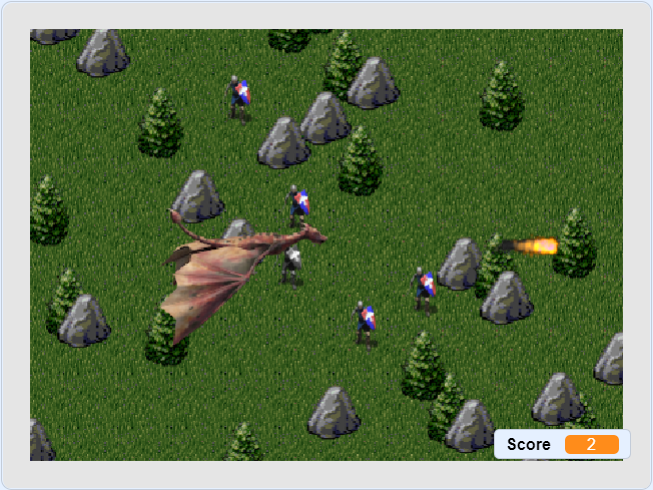

Bei Dragons Realm steuerst du einen Drachen, der sein Territorium gegen eindringende Raubritter verteidigt.
Mit den Pfeiltasten lenkst du den Drachen um den Pfeilen der Ritter ausweichen zu können (du kannst auch zwei Tasten gleichzeitig drücken; mit ↑ und → fliegt man zum Beispiel nach rechts oben). Mit der Leertaste spuckt der Drache Feuer, und kann Ritter zu Stein erstarren lassen.
Damit das Spiel auch auf Tablets und Handys funktioniert, wurde nachträglich eine Maus/Touch-Steuerung eingebaut. Generell ist das Spielerlebnis mit der Tastatur aber besser.

Dragons Realm beinhaltet viele Grafiken. Du kannst die vorgefertigten Figuren mit allen Kostümen (bar ohne Skripte) hier herunterladen:

## Downloads

[Background](scratch-dragons-realm-v3/Background.sprite3)

[Dragon](scratch-dragons-realm-v3/Dragon.sprite3)

[Fireball](scratch-dragons-realm-v3/Fireball.sprite3)

[Tiles](scratch-dragons-realm-v3/Tiles.sprite3)

[Knight](scratch-dragons-realm-v3/Knight.sprite3)

[Spear](scratch-dragons-realm-v3/Spear.sprite3)

## Die Figuren

Nun da du die Figuren heruntergeladen hast, können wie sie in dein neuen Projekt importieren. Lege dazu ein neues Scratch Projekt an. Bewege dann die Maus im Figuren-Panel über das "Figur wählen" Symbol. Ein blaues Menü erscheint. Klicke dort "Figur hochladen", und wähle "Dragon.sprite3" aus dem lokalen Dateisystemen aus. Wiederhole diesen Schritt für alle Figuren.

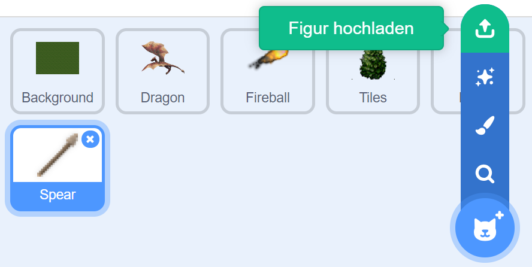

## Die Codeblöcke

Beginnen wir mit den Variablen, die wir global bzw. je Figur anlegen müssen. 
Bitte achte genau darauf, dass du die richtige Auswahl zwischen *Für alle Figuren* und *Nur für diese Figur* triffst:

|Variable|Figur|
|---|---|
|ClickAngle|Dragon|
|ClickControlled|Dragon|
|DeltaX|Dragon|
|DeltaY|Dragon|
|FirstSprite|Dragon|
|FireBallDirX|Fireball|
|FireBallDirY|Fireball|
|IsClone|Fireball|
|IsClone|Tiles|
|DeltaRandX|Tiles|
|DeltaRandY|Tiles|
|Frozen|Knight|
|KnightX|Knight|
|KnightY|Knight|
|IsClone|Spear|
|ShootSpearStepCount|Spear|
|DirectionX|Für alle Figuren|
|DirectionY|Für alle Figuren|
|GameOver|Für alle Figuren|
|Lives|Für alle Figuren|
|LiveLbl|Für alle Figuren|
|PrevDirectionX|Für alle Figuren|
|PrevDirectionY|Für alle Figuren|
|Score|Für alle Figuren|
|ScoreLbl|Für alle Figuren|
|ScrollDirectionX|Für alle Figuren|
|ScrollDirectionY|Für alle Figuren|
|ShootActive|Für alle Figuren|
|ShootSpearActive|Für alle Figuren|
|ShootSpearDirX|Für alle Figuren|
|ShootSpearDirY|Für alle Figuren|
|ShootSpearX|Für alle Figuren|
|ShootSpearY|Für alle Figuren|

Für die Figur des Drachen sollten die Variablen (lokal und global) danach so aussehen:

## Code der Figur Dragon

Wir wollen den Drachen lenken und Feuerbälle abfeuern.
Gleichzeitig müssen wir dafür sorgen, dass der Drache immer die Flügel bewegt.
Das nennt man eine Animation.
In dem *StartAnimation* Codeblock werden laufend Kostüme ausgetauscht, um für die Flügelbewegung zu sorgen.
Im Skript *StartControl* ist die Tastatur- und Maus-Steuerung des Drachen implementiert.

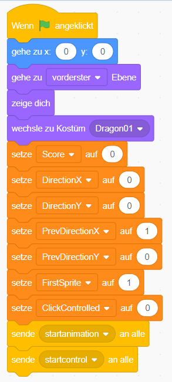

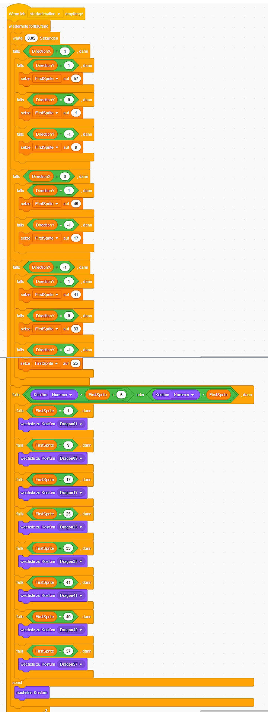

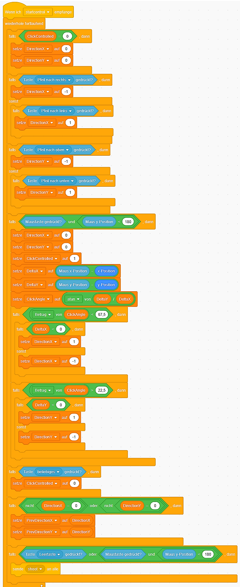

Der Drache sollte sich jetzt eigentlich schon steuern lassen und mit den Flügeln flattern. Probiere es einmal aus!
  
## Code der Figur Background

Die Figur *Background* enthält das Gras, über das der Drache fliegt.
Dennoch ist das kein Bühnenbild, denn wir wollen, dass sich die Landschaft bewegt.
Wir verwenden hier erstmals einen selbst definierten Block namens *ScrollThrough*.
Blöcke dienen der Wiederverwendung von Code. Du erkennst sie an der rosernen Farbe.
Sie werden unter *Meine Blöcke* / *Neuer Block* angelegt.

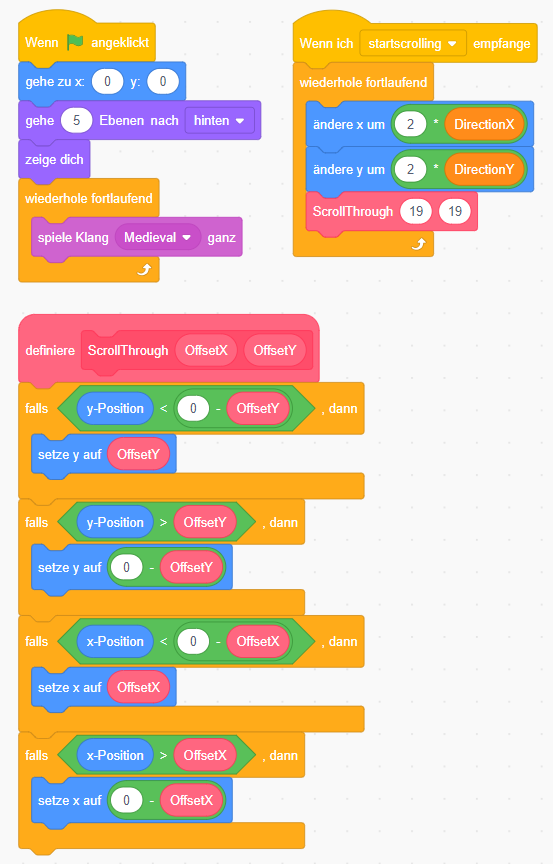

Wie du sieht, wird hier auch die Hintergrundmusik abgespielt (*spiele Klang Medieval ganz*).
Diesen Klang musst du zunächst laden. Klicke dazu auf *Klänge* / *Klang wählen* / *Klang hochladen*.
Selektiere die Datei Medieval.mp3. Sie liegt im *dragons* Verzeichnis, das du von den Mentoren erhalten hast.

So legt man den Block *ScrollThrough* an:

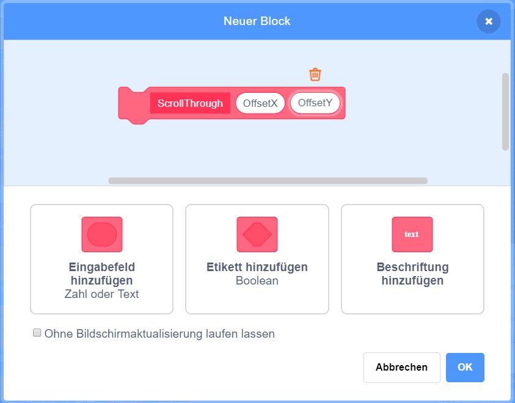

Wenn man genau schaut, bemerkt man, dass der *ScrollThrough*-Block eigentlich nur einmal aufgerufen wird.
So gesehen wäre er nicht unbedingt nötig um Code-Duplikate zu vermeiden.
In einer ersten Implementierung von Dragons Realm war das Kostüm *Grass* Teil der Figur *Tiles*, wo der Block noch einmal existiert, und von dort stammt der Block auch jetzt noch. Leider erlaubt Scratch die Wiederverwendung von Blöcken nur innerhalb einer Figur, nicht über mehrere Figuren hinweg.

## Code der Figur Border

Das Kostüm *Border* ist nur ein grauer Rand. Wir benötigen ihn, um das Scrollen der Landschaft umsetzen zu können.
Gras, Bäume und Felsen bewegen sich bis hinter dem Rand, und tauchen auf der anderen Seite des Spiels wieder auf.
Dadurch entsteht der Eindruck einer Bewegung.
Da Scratch Figuren nur eine beschränkte Anzahl von Pixeln hinter dem Spielrand verschwinden können, benötigen wir diesen zusätzlichen Randbereich. Andernfalls würde das Spiel zu sehr flackern.

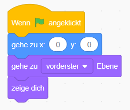

## Code der Figur Fireball

Der Feuerball wird abgeschossen, wenn er die Nachricht *Shoot* erhält.
Da wir immer wieder Feuerbälle brauchen, wird er als Klon angelegt.
Im Hauptskript wird das passende Kostüm gewählt, danach bewegt sich der Feuerball rasch in der Richtung, in die der Drache zu dem Zeitpunkt blickt.

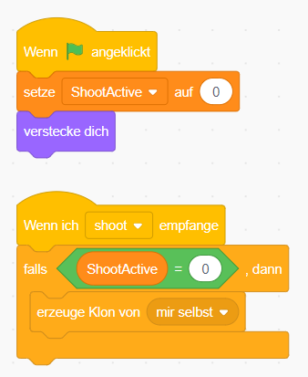

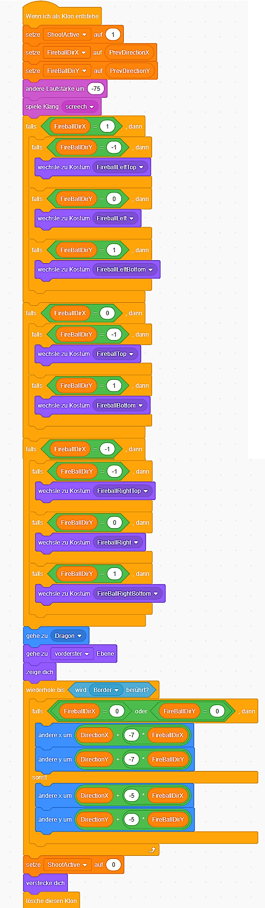

## Code der Figur Tiles

Bäume und Felsen werden zu Spielstart an zufälliger Position angelegt.
Dabei ist die Reihenfolge der Klone wichtig, damit weiter vorne liegende Objekt vor dahinterliegenden Objekten erscheinen und diese verdecken. Daher starten wir bei einer Y-Position von 180 und arbeiten uns bis -180 durch.

Ähnlich wie das Gras müssen auch Bäume und Felsen unter dem Drachen durchscrollen.
Wir haben daher die gleiche Implementierung, wenn die *StartScrolling* Nachricht empfangen wird.

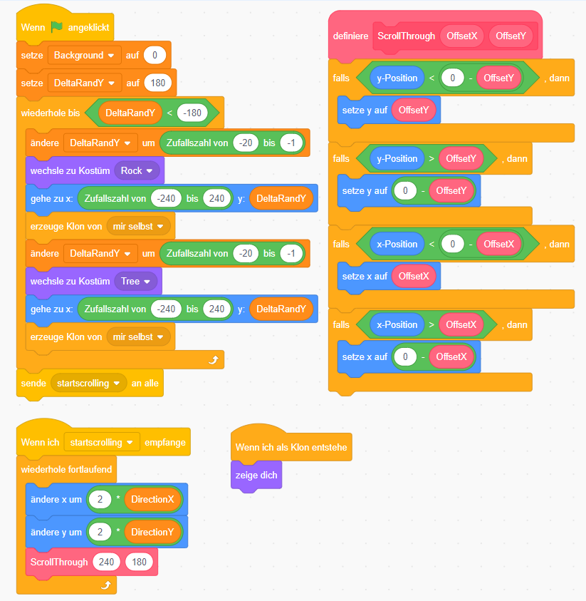

## Code der Figur Knight

Unser letztes Figuren-Skript ist für den Ritter.
Ritter erscheinen zufällig, und müssen zuerst an einer freien Position platziert werden.
Das fragen wir mittels einer *wird Tiles berührt* Kondition ab. Danach wandert der Ritter weiter, bis er auf ein Hindernis trifft, woraufhin er seine Richtung wieder ändert.

Berührt der Ritter den Feuerball, so erstarrt er (die Variable *Frozen* wird auf 1 gesetzt, und er wird zu Stein und bewegt sich nicht mehr).

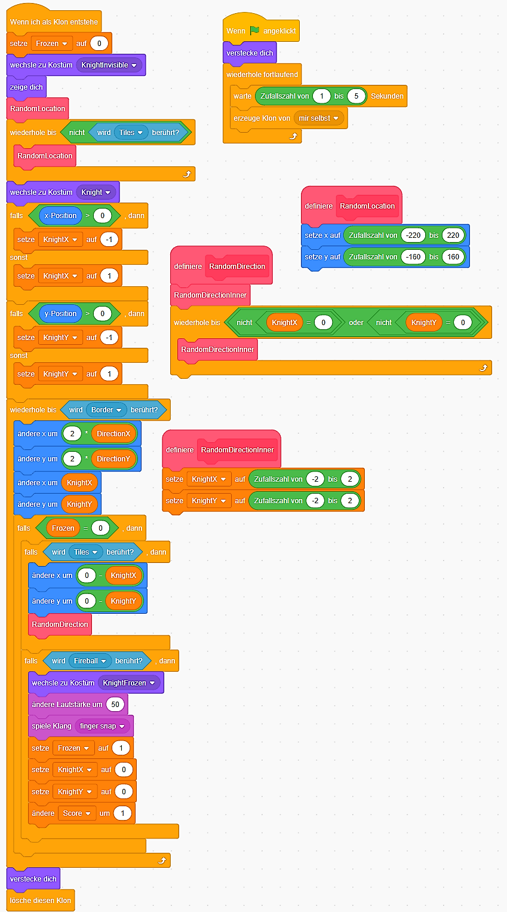

## Herunterladen

Du kannst das fertige Projekt unter [dragonrealm.sb3](scratch-dragons-realm-v3/Dragonrealm.sb3) herunterladen.
