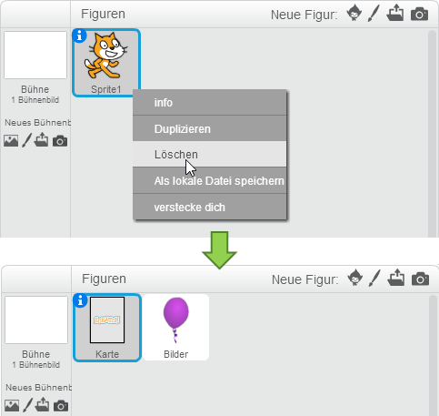

# Scratch Memory

In diesem Spiel musst du zusammenpassende Paare finden. Du darfst immer nur zwei Karten gleichzeitig umdrehen. Wie viele Versuche brauchst du, bis du alle Paare gefunden hast?

Das Spiel besteht aus 2 Figuren und 10 Skripten.

## Figuren anlegen

## Daten anlegen

Das Spiel besteht nur aus zwei Figuren: der Karte mit einer Vorder- und einer Rückseite und der Bilder, die auf den Karten angezeigt werden sollen. 
Alle Bilder werden als Kostüme in einer Figur zusammengefasst.

1. {: .right}
Lösche als erstes die Figur Scratchy mit dem Namen *Sprite1* indem du mit der rechten Maustaste darauf klickst. 
Im angezeigten Menü kannst du Scratchy löschen.

## Skripte für die Karte
4. {: .right}
Jetzt wirds etwas komplizierter: wir möchten den Spieler um seinen Tipp fragen, dafür wählen wir aus dem Punkt "Fühlen" die Frage aus. An dieser Stelle wartet der Computer dann auf eine Eingabe - und speichert diese in einer... - Variable! Sie heißt "Antwort". 
Daher können wir nach der Frage überprüfen, ob die Antwort korrekt war: falls die Antwort gleich unserer Zufallszahl ist, dann hat der Spieler die Zahl erraten!

5. {: .right}
Im Moment hätten wir dann genau einen Versuch - wahrscheinlich ist das zu wenig. Wir brauchen eine Schleife, und müssen so oft fragen, bis der Spieler die richtige Antwort erraten hat (oder zu viele Versuche benötigt hat).  Dafür legen wir uns eine neue Variable an, wir nennen sie "erraten". Solange die Variable den Wert 0 hat, bitten wir den Spieler um einen weiteren Tipp. Sobald der Tipp richtig war, setzen wir die Variable auf 1 - und hören auf zu fragen.  Achte genau auf die Unterschiede zum vorherigen Skript!

6. {: .right}
Damit man schneller zum Ziel kommt, geben wir noch Tipps, ob die gesuchte Zahl kleiner oder größer als die Eingabe ist.

## Skripte für die Figuren

7. {: .right}
Damit man sehen kann, welche Tipps bereits abgegeben wurden, fügen wir eine neue Liste zu unserem Programm hinzu. Listen findest du im Menüpunkt "Daten", sie funktionieren so ähnlich wie Variablen.  
Durch Anklicken der kleinen Box erscheint die Liste auch auf der Bühne.

8. {: .right}
Lösche am Beginn alle Einträge aus der Liste und füge neue Einträge ein, sobald ein Tipp abgegeben wurde. Achte wieder auf die Änderungen im Skript.

## Weitere Ideen
* ...

## Ausprobieren

Du kannst das fertige Projekt unter [https://scratch.mit.edu/projects/75528668/](https://scratch.mit.edu/projects/75528668/){:target="_blank"} ausprobieren.

## Gesamte Skripte je Figur

### Karte

### Figuren

