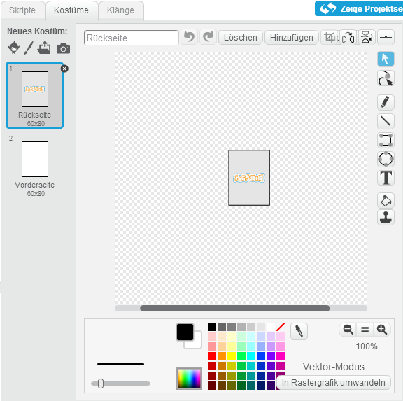
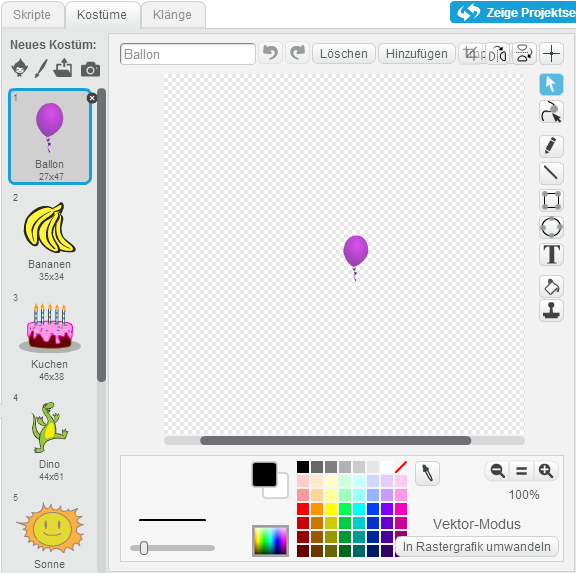
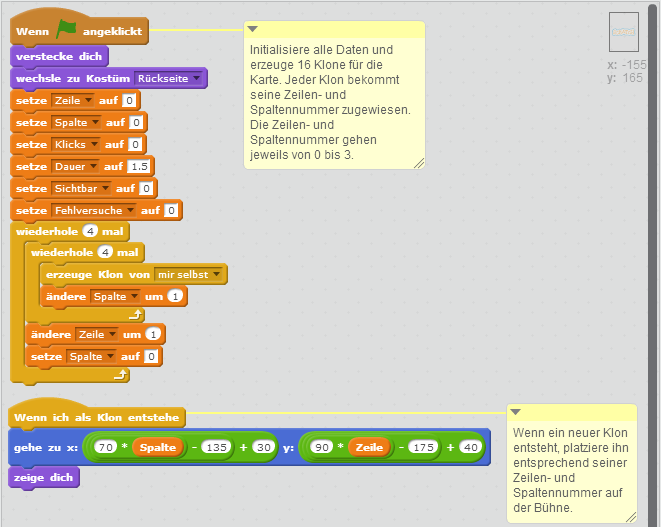
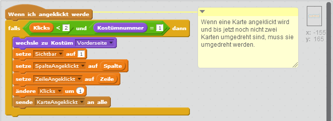
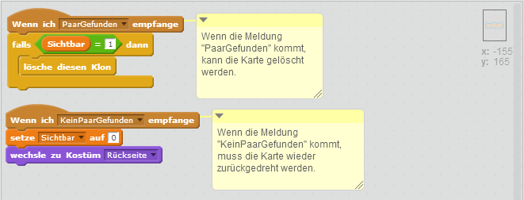
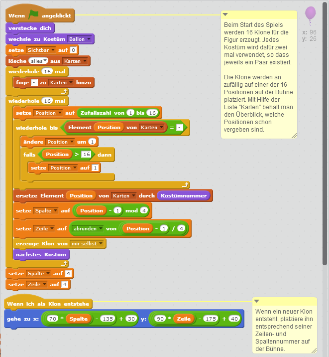
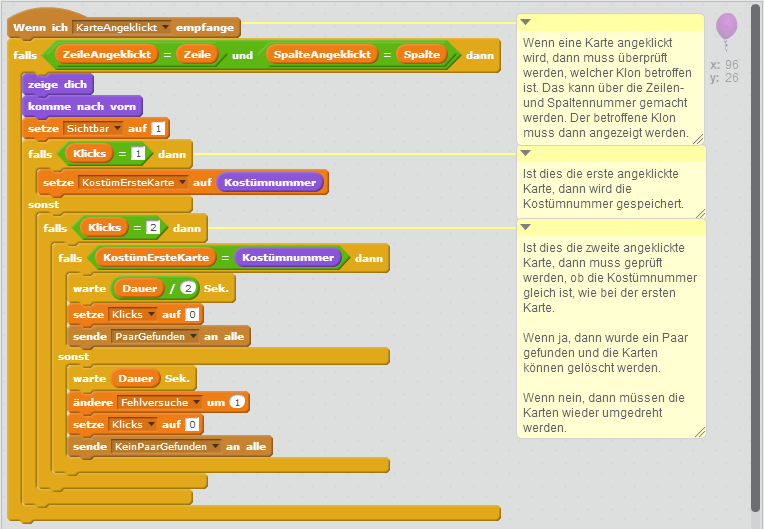
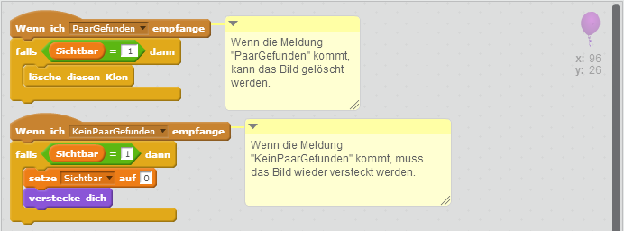
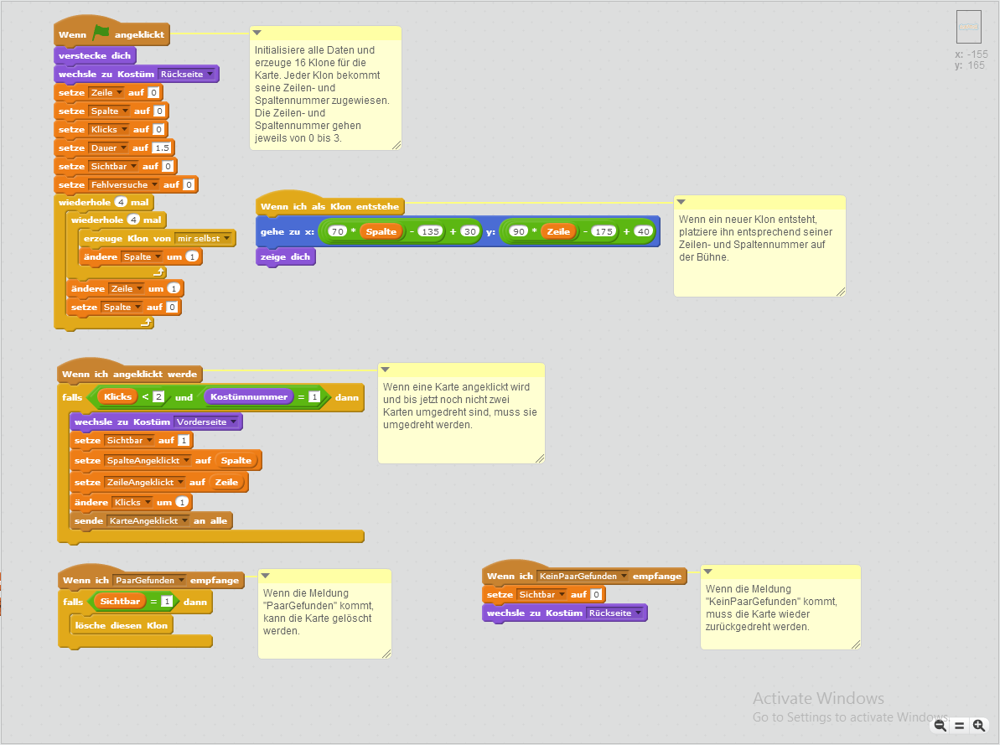
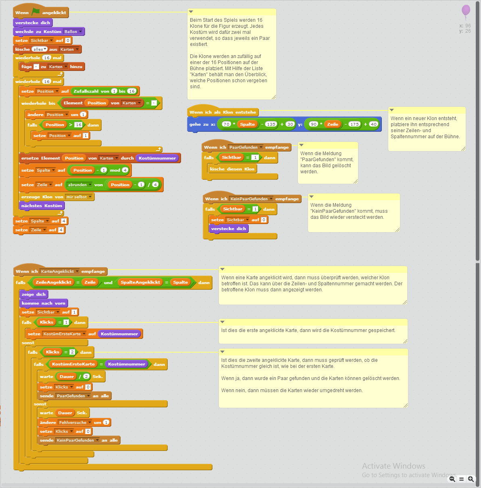

# Scratch Memory

In diesem Spiel musst du zusammenpassende Paare finden. Du darfst immer nur zwei Karten gleichzeitig umdrehen. Wie viele Versuche brauchst du, bis du alle Paare gefunden hast?

Das Spiel besteht aus 2 Figuren und 10 Skripten.

## Figuren anlegen

Das Spiel besteht aus nur zwei Figuren: der Karte mit einer Vorder- und einer Rückseite und der Bilder, die auf den Karten angezeigt werden sollen. 
Alle Bilder werden als Kostüme in einer Figur zusammengefasst.

1. {: .right}
Lösche als erstes die Figur Scratchy mit dem Namen *Sprite1* indem du mit der rechten Maustaste darauf klickst. 
Im angezeigten Menü kannst du Scratchy löschen.

2. {: .right}
Die Karte besteht aus zwei Kostümen: der Vorder- und der Rückseite. Die Rückseite ist grau und zeigt das Scratch Logo. Die Vorderseite ist weiß. Auf dieser werden später die Bilder angezeigt. 
Achte darauf, dass die Karte eine Breite von 60 und eine Höhe von 80 hat.  
Vergiss nicht beide Kostüme mit dem Fadenkreuz zu zentrieren.

3. {: .right}
Die Figur Bilder besteht aus acht Kostümen, nämlich den acht verschiedenen Bilder, die auf den Karten angezeigt werden sollen. Wähle acht Bilder aus oder zeichne selber welche. 
Die Bilder müssen kleiner als die Karte sein, sonst würden sie nachher über den Rand der Karte hinausschauen.  
Vergiss nicht alle Kostüme mit dem Fadenkreuz zu zentrieren.

## Daten anlegen

In diesem Spiel werden eine ganze Menge an Daten benötigt. Sie werden später in den Skripten verwendet. Lege als erstes folgende Daten an:

### Daten für alle Figuren

* Dauer
* Fehlversuche
* Klicks
* KostümErsteKarte
* Position
* SpalteAngeklickt
* ZeileAngeklickt

### Listen für alle Figuren

* Karten

### Daten für die Karte

* Sichtbar
* Spalte
* Zeile

### Daten für die Bilder

* Sichtbar
* Spalte
* Zeile

## Skripte für die Karte
1. {: .right}
Als erstes müssen die Karten auf der Bühne angeordnet werden. Wir wollen vier Spalten und vier Zeilen mit Karten - das sind insgesamt 16 Karten.  
Erzeuge dazu 16 Klone von der Karte und platziere sie an der richtigen Position.

1. {: .right}
Wenn eine Karte angeklickt wird, muss sie angezeigt werden. Es dürfe immer nur zwei Karten gleichzeitig angezeigt werden.

1. {: .right}
Wenn die Meldung "PaarGefunden" kommt, kann die Karte gelöscht werden.  
Wenn die Meldung "KeinPaarGefunden" kommt, muss die Karte wieder zurückgedreht werden.

## Skripte für die Bilder

1. {: .right}
Damit man sehen kann, welche Tipps bereits abgegeben wurden, fügen wir eine neue Liste zu unserem Programm hinzu. Listen findest du im Menüpunkt "Daten", sie funktionieren so ähnlich wie Variablen.  
Durch Anklicken der kleinen Box erscheint die Liste auch auf der Bühne.

1. {: .right}
Lösche am Beginn alle Einträge aus der Liste und füge neue Einträge ein, sobald ein Tipp abgegeben wurde. Achte wieder auf die Änderungen im Skript.

1. {: .right}
Lösche am Beginn alle Einträge aus der Liste und füge neue Einträge ein, sobald ein Tipp abgegeben wurde. Achte wieder auf die Änderungen im Skript.

## Weitere Ideen
* Zähle mit wie viele Paare gefunden wurden und zeige dem Benutzer an, wenn er alle entdeckt hat.

## Ausprobieren

Du kannst das fertige Projekt unter [https://scratch.mit.edu/projects/75528668/](https://scratch.mit.edu/projects/75528668/){:target="_blank"} ausprobieren.

## Gesamte Skripte je Figur

### Karte

{: .fullWidth}

### Bilder

{: .fullWidth}
