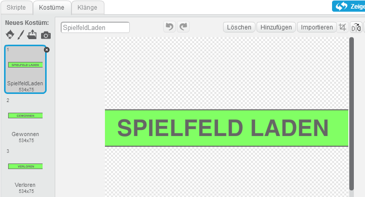
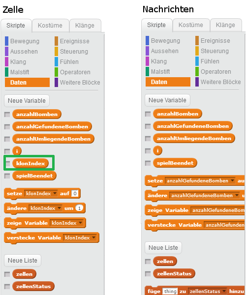
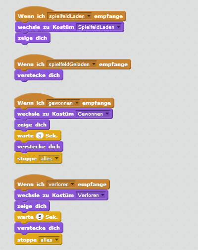
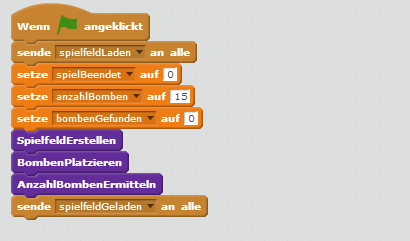

# Scratch Minesweeper

In diesem Spiel musst du die Bomben im Spielfeld finden. Klicke auf eine Zelle um sie umzudrehen. Wenn du gleichzeitig die Leertaste drückst, markierst du eine Zelle als Bombe.

Das Spiel besteht aus 2 Figuren und 15 Skripten.

## Figuren anlegen

Das Spiel besteht aus nur zwei Figuren: einer Zelle für das Spielfeld und verschiedenen Nachrichten, die dem Spieler angezeigt werden können.

1. {: .right}
Lösche als erstes die Figur Scratchy mit dem Namen *Sprite1* indem du mit der rechten Maustaste darauf klickst. 
Im angezeigten Menü kannst du Scratchy löschen.

2. {: .right}
Die Figur "Zelle" besteht aus mehreren Kostümen - einer nicht aufgedeckten Zelle, einer Bombe, einer leeren Zelle, einer Fahne und den Ziffern 1 bis 8. 
Damit du nicht alle Figuren selbst zeichnen musst, kannst du die Figur unter <a href="scratch-minesweeper/Zelle.sprite2">Zelle.sprite2</a> downloaden.

3. {: .right}
Die zweite Figur "Nachrichten" besteht aus drei Kostümen - den Nachrichten "Spielfeld laden", "Gewonnen" und "Verloren". Diese kannst du nach deinen Vorstellungen gestalten.

## Daten anlegen

In diesem Spiel werden eine ganze Menge an Daten benötigt. Sie werden später in den Skripten verwendet. Lege als erstes folgende Daten an:

### Daten für alle Figuren

* anzahlBomben
* anzahlGefundeneBomben
* anzahlUmliegendeBomben
* i
* spielBeendet

### Listen für alle Figuren

* zellen
* zellenStatus

### Daten für die Zelle

* klonIndex

Wenn du alle Variablen und Listen richtig angelegt hast, solltest du bei den Figuren "Zelle" und "Nachrichten" folgende Daten sehen:

## Skripte für die Nachrichten

1. {: .right}
Für die Figur "Nachrichten" brauchen wir nur wenige Skripte. Sie reagiert auf Nachrichten, 
die von der Figur "Zelle" geschickt werden und zeigt dem Benutzer die entsprechende Nachricht an. 
Es gibt vier mögliche Nachrichten, auf die die Figur reagieren kann: spielfeldLaden, spielfeldGeladen, gewonnen und verloren.

## Skripte für die Zelle

1. {: .right}
Als erstes müssen wir das Spielfeld initialisieren. Dazu schicken wir zuerst einmal eine Nachricht an die Figur "Nachrichten", 
dass die Meldung "Spielfeld laden" angezeigt werden soll. Dann werden die Daten auf einen passenden Wert gesetzt. 
Als nächstes erstellen wir das Spielfeld, platzieren die Bomben und ermitteln für jedes Feld die Anzahl der umliegenden Bomben. 
Dazu verwenden wir eigene, neue Blöcke. Der Inhalt dazu kommt später. Am Schluss schicken wir nochmal eine Nachricht, dass das Spielfeld jetzt fertig geladen ist.

1. {: .right}
Wird eine Karte angeklickt, schickt sie die Nachricht "KarteAngeklickt". Es muss dann überprüft werden, welcher Klon des Bilder davon betroffen ist.  
Handelt es sich um die erste angeklickte Karte, wird ihre Kostümnummer gespeichert.  
Ist dies die zweite angeklickte Karte, dann muss geprüft werden, ob die Kostümnummer gleich ist, wie bei der ersten Karte. Wenn ja, dann wurde ein Paar gefunden und die Karten können gelöscht werden. 
Wenn nein, dann müssen die Karten wieder umgedreht werden.

1. {: .right}
Wenn die Meldung "KeinPaarGefunden" kommt, muss das Bild wieder versteckt werden.  
Wenn die Meldung "PaarGefunden" kommt, kann das Bild gelöscht werden.

## Ausprobieren

Du kannst das fertige Projekt unter [https://scratch.mit.edu/projects/111781317/](https://scratch.mit.edu/projects/111781317/){:target="_blank"} ausprobieren.