# Scratch Pac Man

Pac-Man ist ein klassisches Computerspiel. Es erschien erstmals 1980 in Japan.

Pac-Man muß alle bunten Pillen einsammeln, ohne den Geistern in die Arme zu laufen. Die blauen Pillen verleihen ihm für kurze Zeit Superkräfte, und er kann Geister einfrieren.

Du kannst das fertige Spiel unter [https://scratch.mit.edu/projects/97137611](https://scratch.mit.edu/projects/97137611){:target="_blank"} auch gleich ausprobieren.

Das Spiel besteht aus 3 Figuren und 19 Skripten.

## Vorbereitungen

Grafiken und Musik stellen dir deine Mentoren gerne via Memorystick zur Verfügung, bzw. 
kannst du sie auch unter [http://coderdojo-linz.github.io/trainingsanleitungen/scratch/scratch-pac-man/pac-man.zip](https://coderdojo-linz.github.io/trainingsanleitungen/scratch/scratch-pac-man/pac-man.zip){:target="_blank"} herunterladen. 
Für das Spiel benötigen wir ein Bühnenbild, und insgesamt drei Figuren: PacMan, Ghost und Pill.

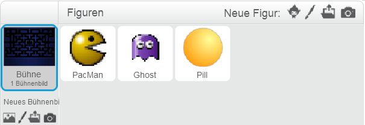

## Die Bühne „Stage“

In das Bühnenbild lädst du bitte die Grafik „Stage.png“ und den Klang „PacMan.mp3“. Auf der Bühne wollen wir auch die globalen Variablen definieren, und eine Liste namens „GridDef“:

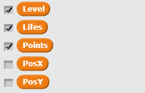

Weiters beinhaltet die Bühne Skripte für den Spielstart und das Abspielen der Hintergrundmusik:

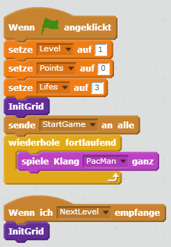

Die Grid-Daten stehen in der Liste „GridDef“. Jeder Listen-Eintrag beinhaltet eine Ziffernkette. Die Ziffern bestimmen wie das jeweilige Gridfeld aussieht, und zwar nach folgendem Schema:

0 = Wand 
1 = Gelbe Pille 
2 = Blaue Pille 
3 = Leer 
4 = Tunnel 

Damit du das nicht alles einzeln abtippen mußt, hier nochmal die Daten in Textform - 
wenn du diese Seite im Internet unter [http://coderdojo-linz.github.io/trainingsanleitungen/scratch/scratch-pac-man.html](http://coderdojo-linz.github.io/trainingsanleitungen/scratch/scratch-pac-man.html){:target="_blank"} aufrufst, 
kannst du Zeile für Zeile in die Zwischenablage kopieren und in dein Skript einfügen.

Zeile 1:	0000000000000000000000000000000000000000000000000000 
Zeile 2:	0111111111111001111111111001111111111001111111111110 
Zeile 3:	0100001000001001000000001001000000001001000001000010 
Zeile 4:	0100001000001001000000001001000000001001000001000010 
Zeile 5:	0100001000001001000000001001000000001001000001000010 
Zeile 6:	0211111111111111111111111111111111111111111111111120 
Zeile 7:	0100001001000000001001000000001001000000001001000010 
Zeile 8:	0100001001000000001001000000001001000000001001000010 
Zeile 9:	0111111001111001111001111001111001111001111001111110 
Zeile 10:	0000001001001001000000001001000000001001001001000000 
Zeile 11:	0000001001001001000000001001000000001001001001000000 
Zeile 12:	0000001001001111111001111111111001111111001001000000 
Zeile 13:	0000001001001000001001000030001001000001001001000000 
Zeile 14:	0000001001001000001001000030001001000001001001000000 
Zeile 15:	0411111111111001111111000030001111111001111111111140 
Zeile 16:	0000001001000001000001000000001000001000001001000000 
Zeile 17:	0000001001000001000001000000001000001000001001000000 
Zeile 18:	0000001001111111111001111111111001111111111001000000 
Zeile 19:	0000001001000000001001000000001001000000001001000000 
Zeile 20:	0000001001000000001001000000001001000000001001000000 
Zeile 21:	0211111111111001111111111001111111111001111111111120 
Zeile 22:	0100001000001001000000001001000000001001000001000010 
Zeile 23:	0100001000001001000000001001000000001001000001000010 
Zeile 24:	0111001111111111111111111111111111111111111111001110 
Zeile 25:	0001001001000000001001000000001001000000001001001000 
Zeile 26:	0001001001000000001001000000001001000000001001001000 
Zeile 27:	0111111001111001111001111001111001111001111001111110 
Zeile 28:	0100000000001001000000001001000000001001000000000010 
Zeile 29:	0100000000001001000000001001000000001001000000000010 
Zeile 30:	0111111111111111111111111111111111111111111111111110 
Zeile 31:	0000000000000000000000000000000000000000000000000000 

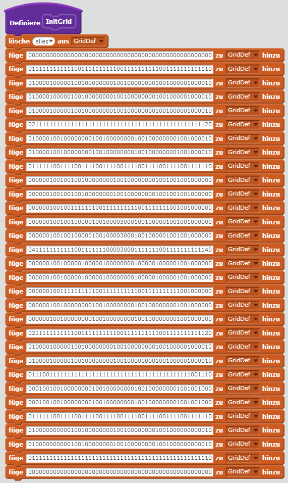

## Die Figur „PacMan“

PacMan besteht aus acht Kostümen, für jeweils jede Richtung und einmal mit geschlossenem, einmal mit offenem Mund. Lade dazu einfach die „PacMan*.png“ Grafiken in die Figur.

Die PacMan Skripte sind relativ umfangreich. Hier die benötigten Variablen, bitte denke daran daß du sie als „Nur für diese Figur“ definierst (außer PosX, PosY, Level, Life und Points, die wir ja schon global in der Bühne definiert haben):

{: .floatLeft}

{: .floatLeft}

Wir verwenden wieder lila Blöcke zur Wiederverwendung von Code. Bitte achte darauf daß du dabei immer die Option „Ohne Bildschirmaktualisierung laufen lassen“ selektierst, sonst könnte es sein, daß dein Programm zu langsam ist.

Hier läuft ein sogenannter Timer, damit PacMan nach zehn Sekunden seine Superkräfte auch wieder verliert. Der „Reset“-Block dient dem Zurücksetzen auf den Ursprungszustand von PacMan. Die Tastatursteuerung ist hier ebenfalls implementiert.

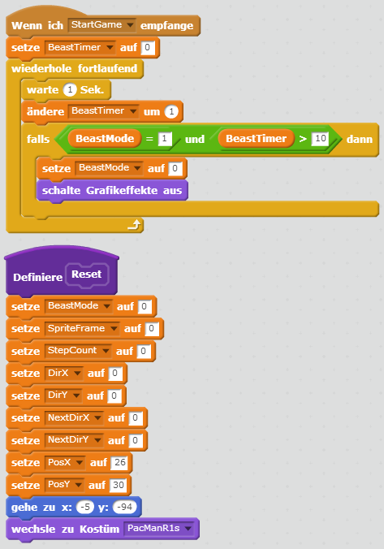

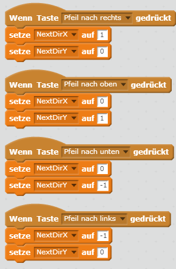

Das PacMan-Hauptprogramm läuft in einer Schleife bis alle Leben verbraucht sind. 
Wird ein Geist berührt, verliert man ein Leben und PacMan’s Aussehen ändert sich. 

Weiters wird die Bewegungsrichtung abgefragt, und PacMan bewegt sich im Grid entsprechend weiter. 
Jeder Schritt entspricht drei Bildschirmpixeln, und nach drei Schritten (also neun Pixeln) ist das nächste Grid-Feld erreicht. Wenn PacMan an einer Wand ansteht, stoppt die Bewegung. 
Und wenn wir den Tunnel erreicht haben, wird der Block „HandlePortal“ aufgerufen. 

Am Schluß ändern wir noch die Bewegungsrichtung, falls in der Zwischenzeit eine Taste gedrückt wurde, und wenn wir abbiegen können. 
Das erlaubt dem Spieler schon vorzeitig Tasten zu drücken (noch bevor eine Abzweigung erreicht ist), und dadurch kann man PacMan sehr schnell lenken.

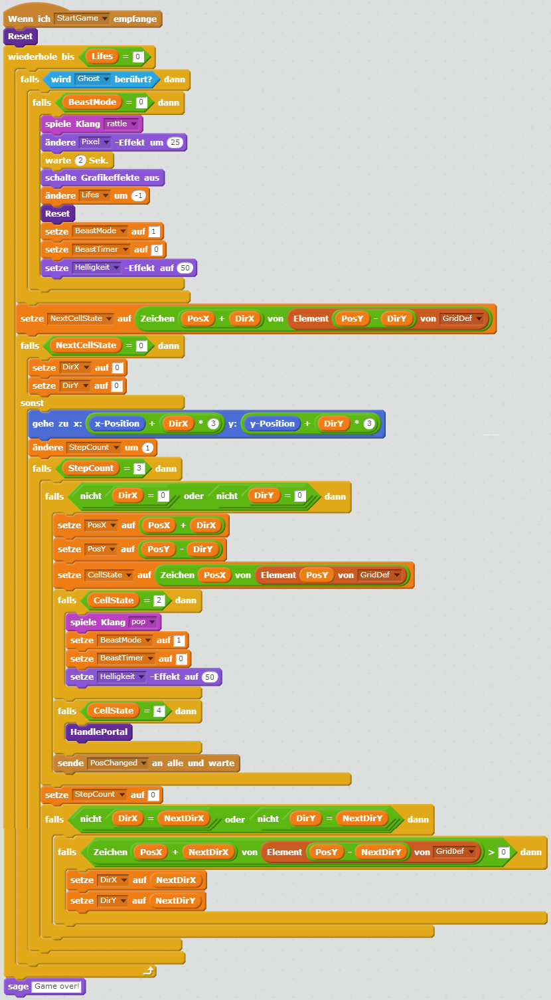

Im Block „HandlePortal“ durchsuchen wir die Grid-Definition nach dem Gegenportal, das ebenfalls den Wert „4“ hat, und setzen PacMan‘s Position neu.

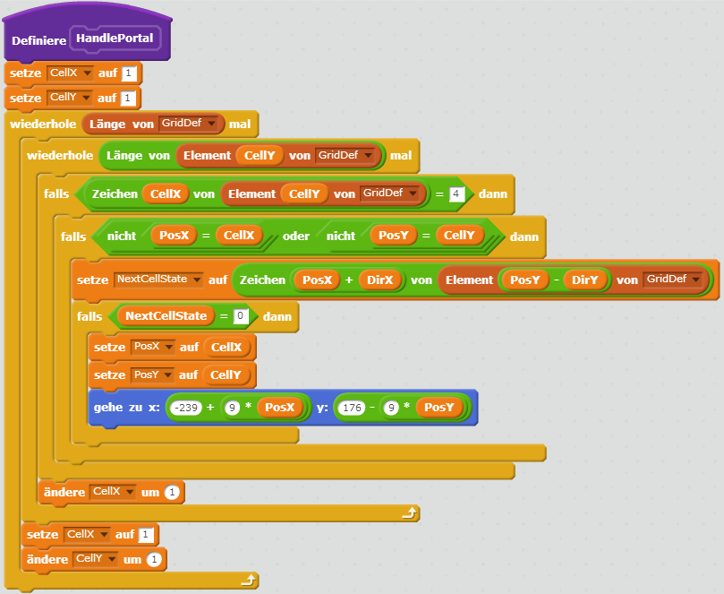

Schließlich benötigen wir noch folgenden Code für die Animation von PacMan – je nach Richtung wird eine andere Figur ausgewählt:

## Die Figur „Ghost“

Ghost hat drei Kostüme, Ghost1, Ghost2 und Ghost3, die du wieder auf dem Memorystick oder im Download-Archiv findest.

Die drei Geister werden wir als Klone erzeugen, daher ist es besonders wichtig alle Variablen von Ghost als „Nur für diese Figur“ zu definieren -  denn sonst gäbe es sie nur einmal global, und nicht für jeden Klon.

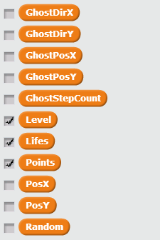

Beim Start des Spieles klonen wir die drei Geister und setzen sie auf ihre Positionen.

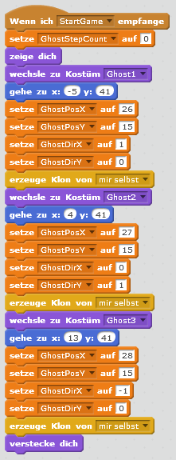

In der Ghost-Hauptschleife bewegen wir den Geist ähnlich durch das Grid wie zuvor PacMan. Wird er von PacMan mit Superkräften berührt, so friert er für zehn Sekunden ein. Die Geister werden auch mit jedem Leven schneller. Und wir rufen den Block „CalcNextDir“ auf, um zu berechnen, wohin der Geist laufen soll.

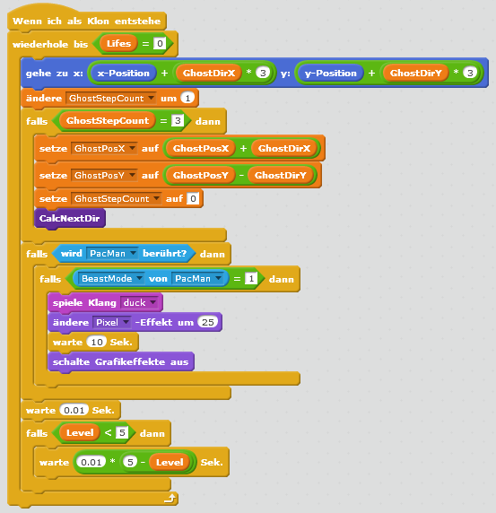

Im Block „CalcNextDir“ versucht der Geist möglichst rasch an PacMan heranzukommen. Dazu berechnen wir in welcher Richtung und wie weit entfernt PacMan steht. 
Ergibt sich eine Möglichkeit eine Abzweigung zu nehmen um die Distanz zu verkürzen, machen wir das durch Richtungswechsel; einem kleinen Zufallsfaktor folgend tun wir das aber nicht immer, dadurch vermeiden wir ein „Hängenbleiben“ hinter Ecken, und auch daß sich zwei Geister nebeneinander immer gleich bewegen. Wenn keine eindeutige Strategie möglich ist, wählen wir die nächste Richtung zufällig. Mit den „GridDef > 0“-Abfragen prüfen wir, ob PacMan das nächste Feld betreten kann.

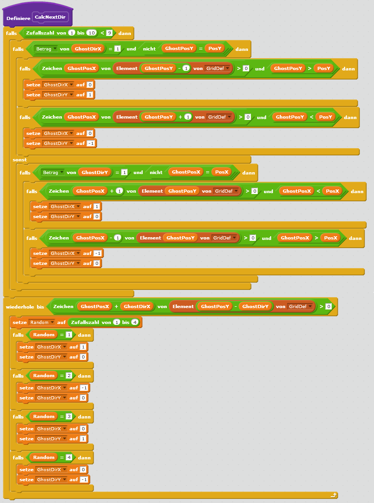

## Die Figur „Pill“

Die beiden Kostüme der Pillen können wir einfach aus der Scratch-Bibliothek laden („Ball“). 

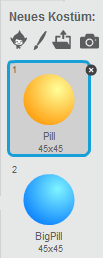

Wir benötigen folgende Variablen:

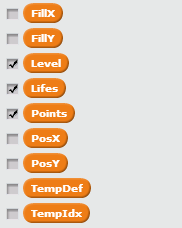

Bei Spielstart befüllen wir das Grid mit den Pillen:

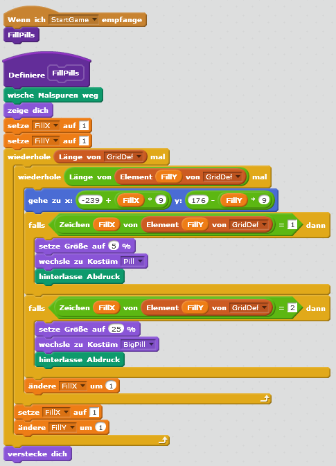

Wenn PacMan seine Position verändert, fragen wir ab ob er eine Pille berührt, und löschen sie vom Bildschirm. Außerdem müssen wir auch den „GridDef“-Eintrag an der entsprechenden Stelle aktualisieren, denn das Feld ist jetzt leer. Und wir stellen hier fest, ob alle Pillen gegessen wurden - denn dann können wir den nächsten Level aktivieren.

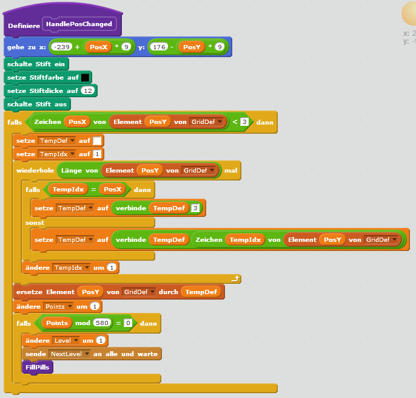

## Ausprobieren

Du kannst das fertige Projekt unter [https://scratch.mit.edu/projects/97137611/](https://scratch.mit.edu/projects/97137611/){:target="_blank"} ausprobieren.

<h2 class="page-break-before">Gesamte Skripte je Figur</h2>
