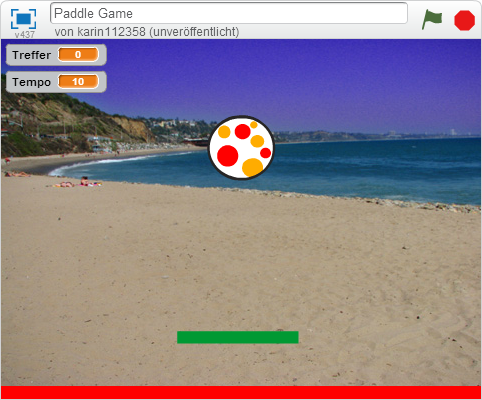
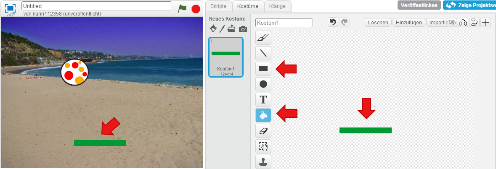
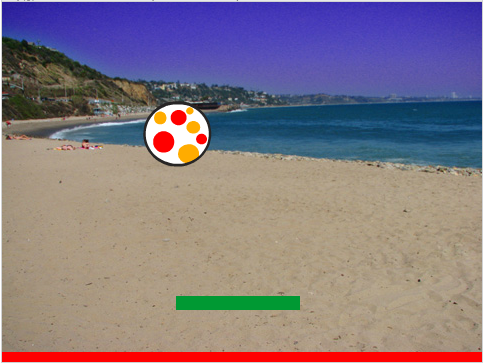
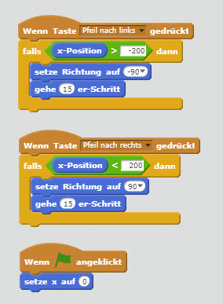
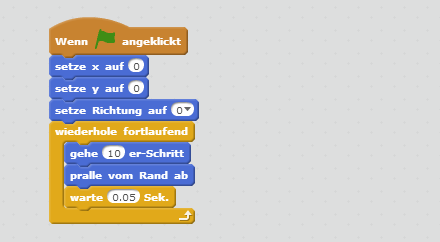
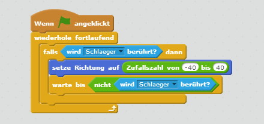
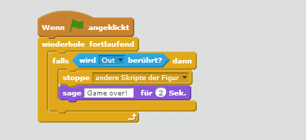
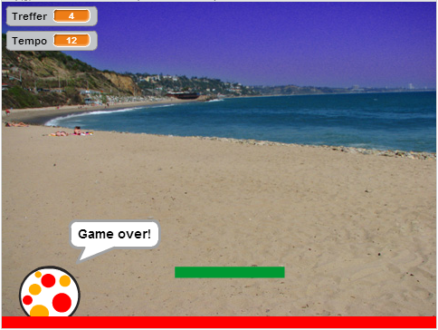

# Scratch Paddle Game Scratch 2.0 <a href="scratch-paddle-game-v3.html" class="change-scratch-version">Scratch 3.0</a>

In dieser Übung baust du ein kleines Spiel, indem du versuchst, einen Ball mit einem Schläger in der Luft zu halten.

## Bühne und Figuren anlegen

1. {: .right}
Als erstes legst du fest, wie dein Spielfeld aussehen soll. Wir brauchen die Bühne, hier der Strand, einen Ball, einen Schläger und einen Bereich, der markiert, wo der Ball im *Out* ist.  
Wenn du ein neues Projekt startest, siehst du eine weiße Bühne mit Scratchy, der Katze. 
Wähle als erstes links unten ein Bühnenbild aus. Den Strand findest du im Thema *Sport*. Du kannst aber auch ein anderes Bühnenbild verwenden.

2. {: .right}
Als nächstes lösche die Figur Scratchy mit dem Namen *Sprite1* indem du mit der rechten Maustaste darauf klickst.
Im angezeigten Menü kannst du Scratchy löschen.

3. {: .right}
Jetzt brauchen wir einen Ball und einen Schläger. Rechts neben dem Bühnenbild findest du einen Menüpunkt, mit dem du neue Figuren hinzufügen kannst. Bei Thema *Sport* findest du verschiedene Bälle. Wähle einen davon aus.

4. {: .right}
Als nächstes ist der Schläger dran. Diesen malen wir selbst. Dafür gibt es rechts neben dem Punkt *Figur hinzufügen* einen weiteren Punkt *Figur zeichnen*. Wählen ihn aus und du bekommst rechts eine Zeichenfläche.

5. Male ein einfaches Rechteck, dass
 den Ball daran hindern wird, am Boden aufzuschlagen. Du brauchst dazu 
das Werkzeug um Rechtecke zu malen und das Werkzeug um Flächen auszufüllen.  
Wenn du das Rechteck gemalt hast, kannst du es im linke Bereich auf der Bühne verschieben. Verschiebe es in den unteren Bereich der Bühne, aber nicht ganz nach unten. Hier brauchen wir noch ein wenig Platz für den Bereich, indem der Ball im *Out* ist.

6. {: .right}
Jetzt brauchst du noch den *Out* Bereich. Dafür malst du eine weitere Figur - ein Rechteck in einer anderen Farbe.
Das Rechteck muss so breit wie der ganze Zeichenbereich sein. Das Rechteck schiebst du dann auf der Bühne ganz nach unten.

7. {: .right}
Damit du später die Figuren leichter verwenden kannst, gib ihnen Namen wie *Schlaeger* und *Out* anstelle von *Sprite 1* und *Sprite 2*.
Du kannst die Eigenschaften von Figuren ändern, indem du auf das blaue *i* links über der Figur klickst.

## Schläger nach links und rechts bewegen

1. {: .right}
Damit du den Ball in der Luft halten kannst, musst du den Schläger nach links und rechts bewegen können. 
Verwende dazu das Ereignis *Wenn Taste ... gedrückt*. Du kannst einmal *Pfeil nach links* und einmal *Pfeil nach rechts* auswählen.
Wird der *Pfeil nach links* gedrückt, setze die Richtung auf -90 Grad. Das bedeutet der Schläger bewegt sich nach links. Dann bewege ihn 15 Schritte.
Für den *Pfeil nach rechts* setze die Richtung stattdessen auf 90 Grad.  
Damit der Schläger nicht am linken oder rechten Rand verschwindet, kannst du prüfen, ob die *x-Position* des Schlägers noch nicht zu klein oder groß ist, bevor du den Schläger bewegst.  
Wenn du jetzt die Pfeiltasten nach links oder rechts drückt, bewegt sich der Schläger.  
Beim Start des Spiels soll der Schläger in der Mitte sein. Verwende dafür den Block *Wenn Fahne angeklickt* und setze die x-Position des Schlägers auf 0.

## Ball herumhüpfen lassen

1. {: .right}
Als nächstes kannst du den Ball bewegen. Wenn das Spiel gestartet wird, soll der Ball in die Mitte des Spielfelds gesetzt werden. Dazu setzt du die x- und y-Position auf 0. Setze außerdem die Richtung auf 0 - das heißt der Ball bewegt sich nach oben.  
Dann kannst du die Bewegung starten. Wiederhole dazu drei Blöcke: *gehe 10er-Schritt*, *pralle vom Rand ab* - damit wechselt der Ball die Richtung, wenn er den Rand erreicht und *warte 0.05 Sek.* - damit bestimmst du die Gewschwindigkeit des Balls.  
Wenn du diesen Block ausführst, pendelt der Ball zwischen dem oberen und unteren Rand der Bühne. Den Schläger ignoriert er aber noch.

2. {: .right}
Um die Richtung des Balls zu ändern, wenn er den Schläger berührt, brauchst du einen weiteren Block, der beim Start des Spiels ausgeführt wird. 
Hier wird fortlaufend geprüft, ob der Ball gerade den Schläger berührt. Wenn ja, wird die Richtung auf einen zufälligen Wert zwischen -40 und 40 geändert.  
Die Richtung 0 Grad bedeutet gerade nach oben. Ein Wert zwischen -40 und 40 sagt aus, dass der Ball gerade nach oben oder aber auch etwas links oder rechts davon fliegt.  
Dann warte, bis der Ball den Schläger nicht mehr berührt, bevor der Block weiter ausgeführt wird.

3. {: .right}
Als letztes musst du noch erkennen, wann der Ball den Out-Bereich berührt. Dann ist das Spiel vorbei.

## Weitere Ideen

* Lass den Ball nicht fix 10 Schritte gehen, sondern erhöhe die Anzahl der Schritte mit der Zeit, so dass 
das Spiel immer schwieriger wird.
* Zähle die Anzahl der Treffer und sage dem Spieler am Ende des Spiels, wie oft er den Ball getroffen hat.
* Steuere den Schläger mit der Maus statt mit der Tastatur.
* Bringe nach einiger Zeit einen weiteren Ball ins Spiel.

## Ausprobieren

Du kannst das fertige Projekt unter [https://scratch.mit.edu/projects/68631192/](https://scratch.mit.edu/projects/68631192/){:target="_blank"} ausprobieren.