# Weihnachtspakete fangen

Leider ist das Förderband in der Werkstatt des Weihnachtsmanns kaputt. Kannst du die Pakete auffangen, bevor sie auf den Boden fallen
und kaputt gehen.

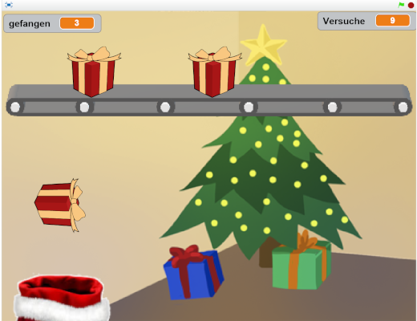{: .right}

## Vorbereitung

Lade dir zuerst die [Zip Datei](scratch-pakete-fangen/figuren.zip) herunter.

Du brauchst als erstes 4 Figuren:
* die Geschenkspakete (aus der Scratch Bibliothek)
* das Förderband (du findest es in der ZIP-Datei)
* den Weihnachtssack (du findest ihn in der ZIP-Datei)
* die Mitteilung, dass du zu viele Pakete fallen gelassen hast (bitte selbst erstellen)

In der Figur "Paket" müssen wir zuerst noch 2 Kostüme hinzufügen, die anzeigen, ob das Paket am Boden zerbrochen ist, oder erfolgreich gefangen wurde.

{:style="float:left;"}

Ich habe ein rotes X und einen Stern dafür genommen. Du findest sie auch in der Scratch Bibliothek und kannst sie einfach in der Kostümauswahl hinzufügen.

Danach können wir auch schon mit den Skripten beginnen.
## Steuerung der Pakete

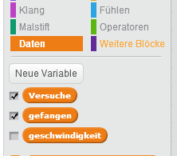{:style="float:right;"}
Wir benötigen ein paar Variablen, um
* zu zählen, wie viele Pakete wir schon gefangen haben
* uns zu merken, wie viele Pakete bereits zerbrochen sind
* eine Möglichkeit zu haben, die Geschwindigkeit und damit die Schwierigkeit einzustellen.

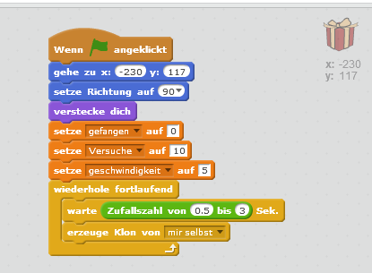{:style="float:right;"}
Als erstes stellen wir die Basiseinstellungen ein. Dann wird alle 0,5 - 3 Sekunden ein neues Paket erzeugt. Dieses Paket wird auf dem Förderband entlang gleiten.

Wir benötigen auch noch ein paar Funktionsblöcke ("Weitere Blöcke"). Damit werden wir das Haupt-Skript ein wenig aufteilen.
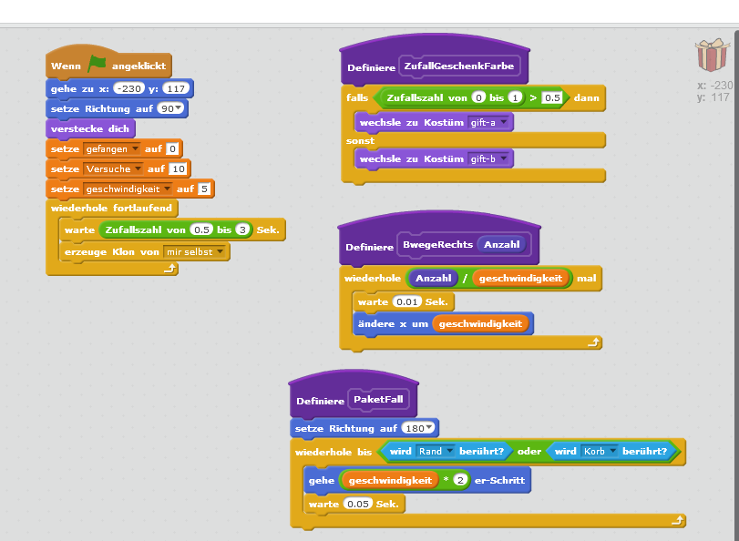{:style="float:right;"}

Dann geht es auch schon los. Wir werden das neue Paket zuerst bis zu einer von 4 zufälligen Positionen fahren lassen. Dort soll das Paket dann runterfallen.
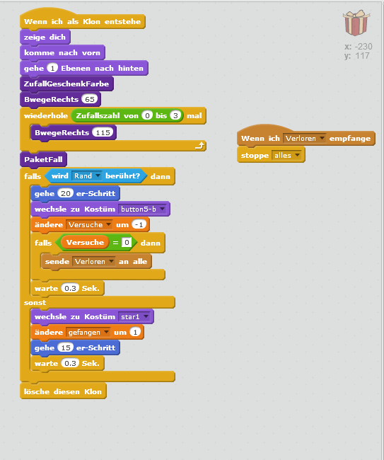{:style="float:right;"}
Das kann auf eine von 2 Arten ausgehen:
* Der Rand wird berührt (Geschenk ist kaputt).
* Der Sack wird getroffen (Geschenk wurde eingesammelt).

Als nächstes möchten wir natürlich auch den Geschenk-Sack steuern.

## Steuerung des Geschenk-Sacks

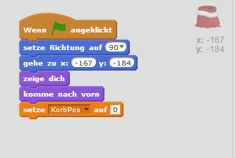{:style="float:right;"}
Auch der Geschenk-Sack möchte am Anfang an die richtige Position gestellt werden.

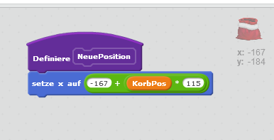{:style="float:right;"}
Hier definieren wir einen Funktionsblock ("Weitere Blöcke"), damit wir die Positionsformel nicht jedes mal eingeben müssen.

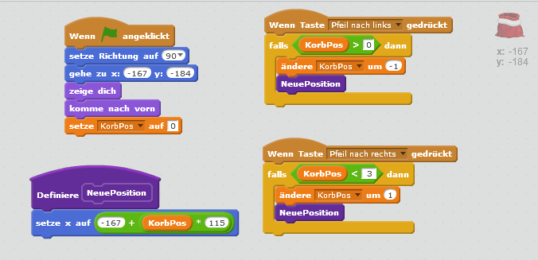{:style="float:right;"}
Weiters soll sich der Sack mit den Pfeiltasten nach rechts und links bewegen lassen. Dafür verwenden wir natürlich den Funktionsblock, den wir vorhin definiert haben.

## Das Förderband

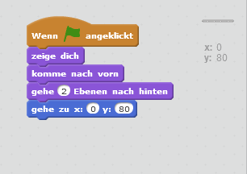{:style="float:right;"}
Die Förderband-Figur befindet sich in der ZIP-Datei und kann einfach hinzugefügt werden. Die Skripte dafür sind sehr einfach und sollen nur die Position festlegen.

## Die Abschiedsmeldung

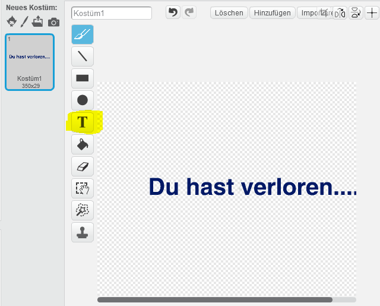{:style="float:right;"}
Diese Figur solltest du selbst entwerfen. Lass dir etwas Lustiges oder Tröstendes einfallen.

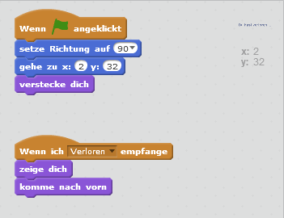{:style="float:right;"}
Auch dafür sind die Skripte sehr einfach und legen nur die Position fest. Ausserdem soll die Abschiedsnachricht angezeigt werden, wenn das Spiel beendet wurde.

**Viel Spass beim Pakete sammeln!**
