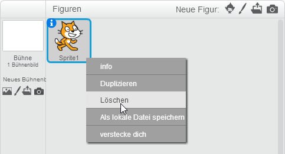
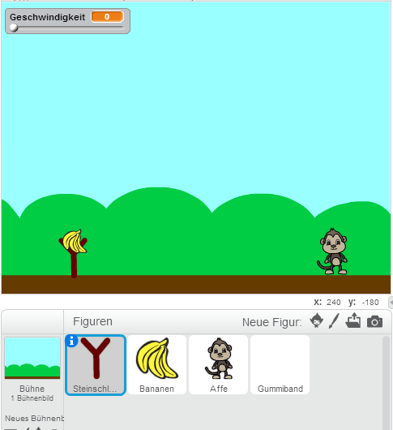
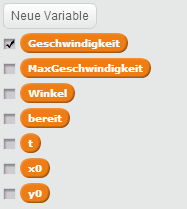
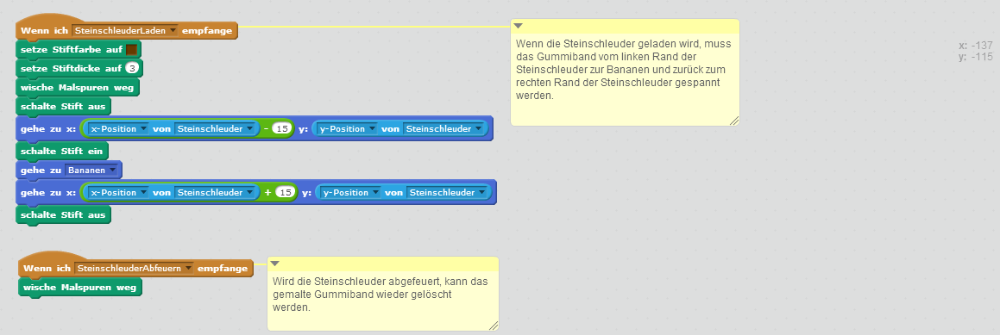
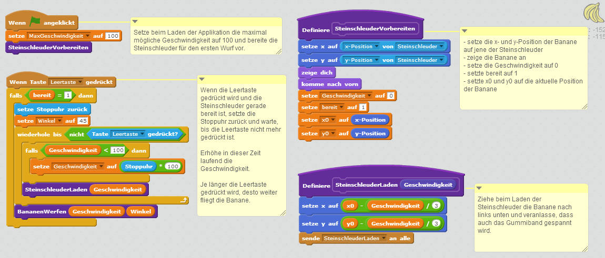
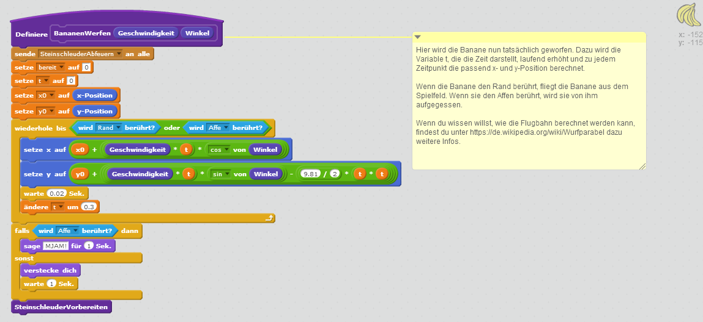

# Scratch Affe füttern Scratch 2.0 <a href="scratch-slingshot-v3.html" class="change-scratch-version">Scratch 3.0</a>

Drücke die Leertaste, um die Steinschleuder zu laden. Je länger du drückst, desto mehr wird die Steinschleuder 
gespannt und desto weiter wirfst du.

Das Spiel besteht aus 4 Figuren und 7 Skripten.

## Figuren anlegen

1. {: .right}
Lösche als erstes die Figur Scratchy mit dem Namen *Sprite1* indem du mit der rechten Maustaste darauf klickst. 
Im angezeigten Menü kannst du Scratchy löschen.

1. {: .right}
Lege ein Bühnenbild und die Figuren für die Steinschleuder, die Bananen, den Affen und das Gummiband an. 
Lege das Gummiband mit dem Pinsel an. Wir brauchen hier keine Figur auszuwählen, da wir das Gummiband später 
mit Hilfe eines Skripts zeichnen werden.

## Daten

1. {: .right}
Wir brauchen für das Spiel verschiedene Variablen:
  **Geschwindigkeit**: sie gibt an, wie schnell die Banane abgeschossen wird und damit auch wie weit sie fliegt
  **MaxGeschwindigkeit**: sie gibt an, wie weit die Steinschleuder maximal geladen werden kann
  **Winkel**: der Winkel, in dem die Banane geworfen wird, wird verwenden hier 45°
  **bereit**: gibt an, ob die Steinschleuder gerade bereit für einen Wurf ist
  **t**: die vergangene Zeit während des Wurfs
  **x0**: die x-Position der Banane am Beginn des Wurfs
  **y0**: die y-Position der Banane am Beginn des Wurfs
  Alle Variablen gelten für alle Figuren.

## Skripte für das Gummiband

Das Gummiband enthält unter Kostüme nur ein leeres Kostüm. Wenn die Steinschleuder geladen ist, malen wir mit dem 
Stift das Gummiband. Es muss vom linken Rand der Steinschleuder zur Bananen und zurück zum rechten Rand der Steinschleuder gespannt werden.

  
## Skripte für die Banane

Die Banane wird beim Drücken der Leertaste in der Steinschleuder eingespannt. Je länger man drückt, desto 
weiter wird die Banane zurückgezogen. So fliegt sie dann weiter.

Wenn man die Leertaste loslässt, wird die Banane abgefeuert. Hier kommt jetzt der wirklich spannenden Teil. Du 
musst die Flugbahn der Banane berechnen.

	
## Weitere Ideen

* Mach den Winkel mit den Pfeiltasten veränderbar.
* Mache die Steinschleuder mit der Maus steuerbar. Unter [https://scratch.mit.edu/projects/89442992/](https://scratch.mit.edu/projects/89442992/){:target="_blank"} findest 
du ein Beispiel, wie das funktionieren könnte.

## Ausprobieren

Du kannst das fertige Projekt unter [https://scratch.mit.edu/projects/89889614/](https://scratch.mit.edu/projects/89889614/){:target="_blank"} ausprobieren.