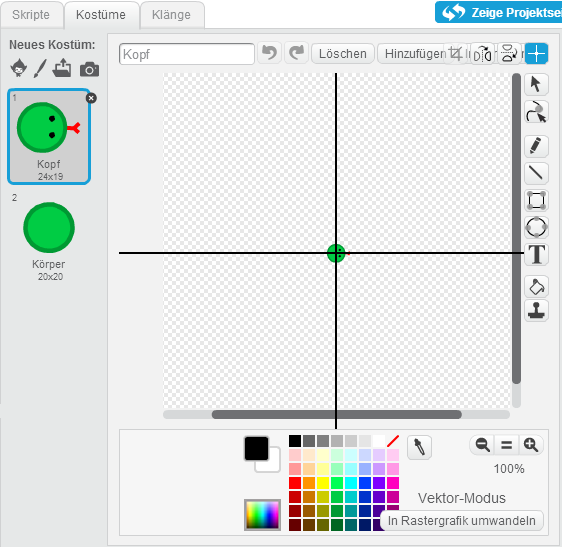

# Scratch Snake

Steuere die Schlange, um die Äpfel aufzusammeln. Aber pass auch, dass du nicht den Rand berührst und auch keinen Knoten in die Schlange machst, wenn sie länger wird.

Das Spiel besteht aus 3 Figuren und 14 Skripten. In der folgenden Anleitung findest du einige Fragezeichen in den Skripten. Hier bist du gefordert, die richtige Lösung zu finden!

Wenn du noch keine Idee hast, welche Bausteine hier fehlen könnten, findest am Ende der Anleitung die vollständigen Skripte.

## Figuren anlegen

1. {: .right}
Lösche als erstes die Figur Scratchy mit dem Namen *Sprite1* indem du mit der rechten Maustaste darauf klickst. 
Im angezeigten Menü kannst du Scratchy löschen.

2. {: .right}
Die Schlange besteht aus zwei Kostümen - dem Kopf und dem Körper. Wir wollen, dass sich die Schlange später in 20iger Schritten bewegt. Die Figur darf daher nicht größer als 20 sein. 
Eine Ausnahme ist die Zunge, die darf etwas länger sein.

3. {: .right}
Der Apfel braucht nur ein Kostüm. Damit er von der Schlange nur erwischt wird, wenn diese sich genau über den Apfel bewegt, darf auch der Apfel nicht größer als 20 sein.

4. {: .right}
Dann brauchst du noch eine Figur für die "Game Over" Meldung (Englisch für "das Spiel aus aus"), die angezeigt wird, wenn der Spieler verloren hat.

5. {: .right}
Vergiss nicht, dass du mit Hilfe des Fadenkreuzes rechts oben für alle Figuren den Mittelpunkt markieren musst.

## Daten

1. {: .right}
Damit du den Fisch bewegen kannst, musst er nach links und rechts sowie oben und unten bewegt werden können.  
  • Wähle zuerst den Fisch aus, damit er blau umrandet ist. 
  • Im Tab *Skripte* kannst du deinen Fisch nun bewegen. Verwende das Ereignis *Wenn Taste ... gedrückt* unter *Ereignisse*. 
  • Verknüpfe es jeweils mit einer Drehung *setze Richtung auf ...* unter *Bewegung*, damit der Fisch in die richtige Richtung schaut. 
  • Außerdem brauchen wir *gehe ...er Schritt*, um den Fisch zu bewegen.  
Für *Pfeil nach oben* gedrückt: Richtung 0 Grad, gehe 10er-Schritte. 
Für *Pfeil nach unten* gedrückt: Richtung 180 Grad, gehe 10er-Schritte. 
Für *Pfeil nach rechts* gedrückt: Richtung 90 Grad, gehe 10er-Schritte. 
Für *Pfeil nach links* gedrückt: Richtung -90 Grad, gehe 10er-Schritte.  
Je größer die Schrittanzahl, desto schneller ist dein Fisch.

## Haifisch bewegen

1. {: .right}
Jetzt soll der Haifisch im Aquarium herumschwimmen.   
  • Wähle dazu den Haifisch aus, damit er blau umrandet ist. 
  • Im Tab *Skripte* kannst du den Haifisch nun bewegen. 
  • Unter *Ereignisse* wähle *Wenn ... angeklickt*. 
  • Anschließend wähle *wiederhole fortlaufend* bei *Steuerung* aus. 
  • Bewege den Haifisch mit *gehe 10er-Schritt*, *warte 0,1 Sek.", *pralle vom Rand ab* und *drehe dich um ... Grad* 
  • Um etwas mehr Zufall reinzubringen, nimm im Menü *Operatoren* den Block *Zufallszahl von 1 bis 10* und ziehe ihn an die Stelle der 15 Grad.

  
## Fisch fangen

1. {: .right}
Wenn der Haifisch den Fisch berüht, soll der Fisch ausgeblendet und wieder ins linke obere Eck gesetzt werden.   
  • Wähle dazu den Fisch aus, damit er blau umrandet ist. 
  • Im Tab *Skripte* kannst du den Fisch verschwinden lassen, sobald er den Haifisch berührt. 
  • Unter *Ereignisse* wähle *Wenn ... angeklickt*. 
  • Setze den Fisch an Position -230 und 170 mittels *gehe zu x: -230, y: 170*, um den Fisch ins linke obere Eck zu setzen, und *zeige dich*. 
  • Falls jetzt der Hai berührt wird (*Steuerung* *falls ... dann*), dann *sende "berührt" an alle*, *verstecke dich*, *warte 5 Sekunden*, *zeige dich*, und gehe wieder ins linke obere Eck mit *gehe zu x: -230, y: 170*. Anschließend sage *Willkommen zurück* für 2 Sekunden.

2. {: .right}
Wenn der Haifisch den Fisch berüht, soll er zwei mal schnappen und das Spiel "Game Over" sein.   
  • Wähle dazu den Haifisch aus, damit er blau umrandet ist. 
  • Im Tab *Skripte* kannst du den Haifisch "Game Over" sagen lassen. 
  • Unter *Ereignisse* wähle *Wenn ich ... empfange*, der Hai reagiert somit auf die vom Fisch ausgelöste Nachricht. 
  • Anschließend wähle *wiederhole 2 mal* bei *Steuerung* aus. 
  • Um den Haifisch schnappen zu lassen, gibt es unter *Aussehen* verschiedene Varianten des Hais. Füge folgende Blöcke in den Wiederhol-Block: *wechsle zu Kostüm b*, *warte 0,3 Sek.*, *wechsel zu Kostüm a*, *warte 0,3 Sek.* 
  • Und um den Haifisch "Game over" sagen zu lassen, füge einen neuen *Wenn ich ... empfange* Block hinzu und *sage "Game Over!" für 4.5 Sekunden*.

## Weitere Ideen

* ...

## Ausprobieren

Du kannst das fertige Projekt unter [https://scratch.mit.edu/projects/73821694/](https://scratch.mit.edu/projects/73821694/){:target="_blank"} ausprobieren.

## Gesamte Skripte je Figur