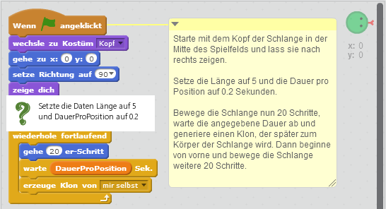
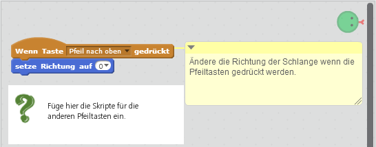
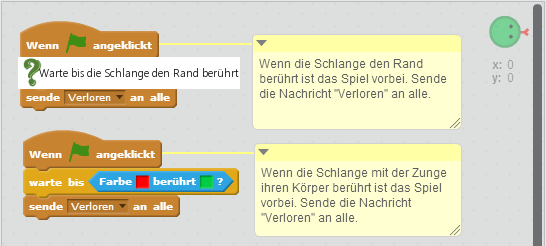
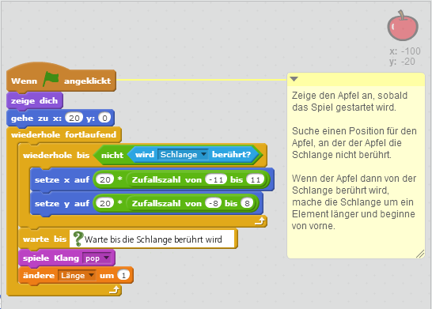
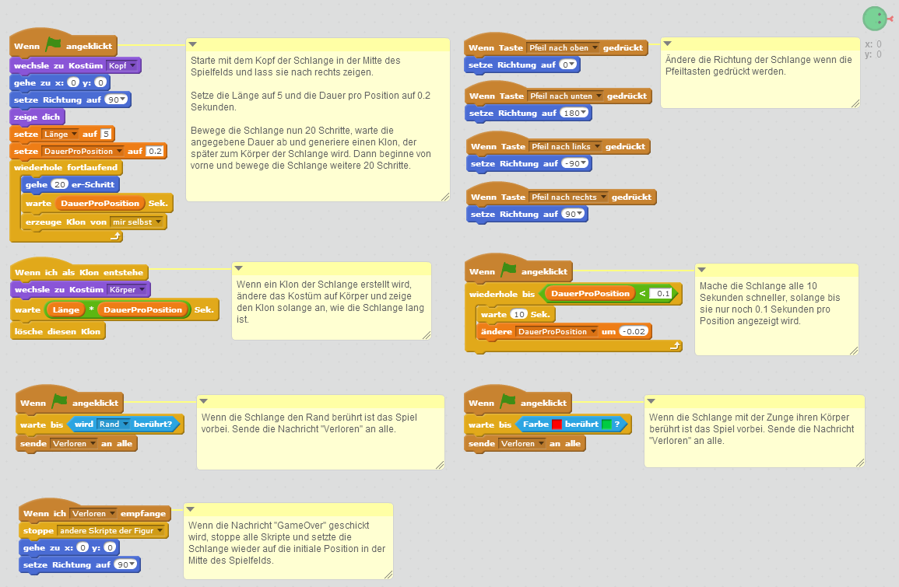

# Scratch Snake

	

	

		
Steuere die Schlange, um die Äpfel aufzusammeln. Aber pass auch, dass du nicht den Rand berührst und auch keinen Knoten in die Schlange machst, wenn sie länger wird.

		
Das Spiel besteht aus 3 Figuren und 14 Skripten. In der folgenden Anleitung findest du einige Fragezeichen in den Skripten. Hier bist du gefordert, die richtige Lösung zu finden!

		
Wenn du noch keine Idee hast, welche Bausteine hier fehlen könnten, findest du am Ende der Anleitung die vollständigen Skripte.

		<table class="table sushi-stats">
			<tbody>
				<tr>
					<td>Figuren</td>
					<td>3</td>
				</tr>
				<tr>
					<td>Skripte</td>
					<td>14</td>
				</tr>
				<tr>
					<td>Daten</td>
					<td>2</td>
				</tr>
			</tbody>
		</table>
	

## Bühne & Figuren

Das Spiel besteht aus drei Figuren: der Schlange, dem Apfel und einer Nachricht, wenn das Spiel zu Ende ist.

<table class="table sushi-overview">
	<tr class="subtitle">
		<td colspan="3">Übersicht</td>
	</tr>
	<tr>
		<td>Bühne & Figuren</td>
		<td colspan="2"></td>
	</tr>
	<tr class="subtitle">
		<td colspan="3">Bühne</td>
	</tr>
	<tr>
		<td>Bühne</td>
		<td></td>
		<td>Für dieses Spiel brauchen wir kein Bühnenbild. Du kannst es einfach weiß lassen.</td>
	</tr>
	<tr class="subtitle">
		<td colspan="3">Figuren</td>
	</tr>
	<tr>
		<td>Schlange</td>
		<td>
			<ul class="sushi-customes">
				<li></li>
				<li></li>
			</ul>
		</td>
		<td>
			
Die Schlange besteht aus zwei Kostümen - dem Kopf und dem Körper. Der Kopf und der Körper der Schlange dürfen nicht größer als 20 sein. Nur die Zunge beim Kopf darf das überschreiten.

			
Am besten, du malst zuerst den Körper mit einer Größe von 20, kopierst diesen dann für den Kopf und fügst Augen und eine Zunge hinzu.

			
Beachte auch, dass der Körper eine andere Farbe als der Kopf haben muss.

		</td>
	</tr>
	<tr>
		<td>Apfel</td>
		<td></td>
		<td>
			
Der Apfel braucht nur ein Kostüm. Damit er von der Schlange nur erwischt wird, wenn diese sich genau über den Apfel befindet, darf auch der Apfel nicht größer als 20 sein.

			
Du kannst den Apfel selber malen, oder du verwendet den Apfel aus der Scratch Figurenbibliothek.

		</td>
	</tr>
	<tr>
		<td>SpielZuEnde</td>
		<td></td>
		<td>
			
Dann brauchst du noch eine Figur für die "Game Over" Meldung (Englisch für "das Spiel aus aus"), die angezeigt wird, wenn der Spieler verloren hat.

		</td>
	</tr>
</table>

Vergiss nicht, dass du mit Hilfe des Fadenkreuzes rechts oben für alle Figuren den Mittelpunkt markieren musst. Bei der Schlange musst du das für beide Kostüme machen.

## Daten

Damit sich die Schlange bewegen kann müssen wir zwei Informationen speichern: die Länge der Schlange und wie lange jeder Teil der Schlange auf einer Position bleibt.  
Lege dafür zwei Variablen mit den Namen "DauerProPosition" und "Länge" an, die für alle Figuren zur Verfügung stehen.

<table class="table sushi-overview">
	<tr class="subtitle">
		<td>Daten</td>
		<td>Typ</td>
		<td>Figur</td>
	</tr>
	<tr>
		<td>DauerProPosition</td>
		<td>Variable</td>
		<td>für alle Figuren</td>
	</tr>
	<tr>
		<td>Länge</td>
		<td>Variable</td>
		<td>für alle Figuren</td>
	</tr>
</table>

## Skripte für die Schlange

1. {: .right}
Zeige als erstes den Kopf der Schlange in der Mitte der Bühne an und lass sie nach rechts schauen.  
Dann setze die Werte für die Daten Länge auf 5 und für DauerProPosition auf 0.2.  
Dann lass die Schlange fortlaufend 20iger Schritte gehen, warte für DauerProPosition Sekunden und erzeuge dann einen Klon. Der Klon wird später der Körper der Schlange.

2. {: .right}
Mache den Klon zum Körper der Schlange indem du das Kostüm auf Körper wechselst.  
Zeige Klon für jede Position im Körper für die LängeProPosition an.  
Wenn die Schlange eine Länge von 3 hat, dann wird der Klon für 3 * 0.2 Sekunden = 0.6 Sekunden angezeigt. Wenn die Schlange schon eine Länge von 10 hat,
dann wird der Klon für 10 * 0.2 Sekunden = 2 Sekunden angezeigt.  
Lösche dann den Klon.

3. {: .right}
Ändere mit den Pfeiltasten die Richtung der Schlange.

4. {: .right}
Mach die DauerProPosition alle 10 Sekunden um 0.02 kleiner. Wenn die Schlange weniger lang an einer Position verweilt wird sie schneller.

5. {: .right}
Das Spiel ist vorbei wenn die Schlange entweder den Rand berührt oder wenn die Zunge der Schlange (rot) ihren Körper (grün) berührt. Sende dann die Nachricht "Verloren".

6. {: .right}
Wenn die Nachricht "Verloren" versandt wurde, stoppe alle Skripte und setzte die Schlange wieder auf die Anfangsposition.

## Skripte für den Apfel

1. {: .right}
Der Apfel muss zwei Aufgaben erfüllen: er muss eine Position finden, an der sich die Schlange gerade nicht befindet und er muss erkennen, wenn er von der Schlange berührt wird.  
  • Zeige den Apfel als erste an und setzte ihn auf die Position x: 20, y: 0. 
  • Dann wiederhole fortlaufend folgende Schritte: 
    • Finde eine Position, an der sich die Schlange gerade nicht befindet. 
    • Generiere dazu Zufallszahlen, die ein Vielfaches von 20 sind. Wir bewegen die Schlange in 20iger Schritten, daher sollte auch der Apfel auf einem Vielfachen von 20 platziert sein. 
    • Wiederhole das Generieren der Zufallszahlen solange, bis du eine Position findest, an der die Schlange gerade nicht berührt wird. 
	• Dann warte bis der Apfel von der Schlange berührt wird. 
	• Spiele einen Klang ab und mach die Schlange um einen Körperteil länger. 
	• Dann beginne wieder von vorne und suche eine neue Position für den Apfel.

## Skripte für SpielZuEnde

1. {: .right}
Die Figur SpielZuEnde wird erst angezeigt, wenn du mit der Schlange entweder den Rand oder die Schlange selbst berührst.
  • Beim Start des Spiels verstecke die Figur SpielZuEnde und setzte sie in die Mitte der Bühne. 
  • Wenn du die Nachricht "Verloren" empfängst, zeige die Figur an und spiele einen Klang. Nach drei Sekunden kannst du die Figur wieder verstecken und alle Skripte stoppten.

## Weitere Ideen

* Zähle mit, wie viele Äpfel du erwischst, bevor die Schlange zu lange wird.

## Ausprobieren

Du kannst das fertige Projekt unter [https://scratch.mit.edu/projects/73821694/](https://scratch.mit.edu/projects/73821694/){:target="_blank"} ausprobieren.

## Gesamte Skripte je Figur

### Schlange

### Apfel

### SpielZuEnde

