# The Game of Life

Die Idee zu „The Game Of Life“ geht auf den Mathematiker John Conway zurück. Das Spielfeld besteht aus einem großen Raster von Zellen, die zwei Zustände haben können: „tot“ (weiß) oder „lebendig“  (schwarz). Basierend auf dem Zustand des Rasters wird die nächste Generation von Zellen berechnet, und zwar nach folgenden Regeln:

* Eine tote Zelle mit genau drei lebenden Nachbarn wird neu geboren
* Lebende Zellen mit weniger als zwei lebenden Nachbarn sterben an Einsamkeit
* Lebende Zellen mit zwei oder drei lebenden Nachbarn bleiben am Leben
* Lebende Zellen mit mehr als drei lebenden Nachbarn sterben an Überbevölkerung

Durch diese einfachen Regeln können aus bestimmten Anfangsmustern komplexe Strukturen entstehen. Es gibt stabile Muster, oszillierende Objekte wie Pulsare oder sogar Raumschiffe. Wer weiß, vielleicht entsteht auf deinem Raster irgendwann eine neue künstliche Lebensform? Durch Klick in das Grid wird das vorausgewählte Muster angelegt.

Du kannst das fertige Spiel unter [https://scratch.mit.edu/projects/96326891](https://scratch.mit.edu/projects/96326891){:target="_blank"} auch gleich ausprobieren.

Das Spiel besteht aus 2 Figuren und 21 Skripten.

## Die Figuren und Skripte

Wir benötigen nur zwei Figuren namens „Selection“ und „Grid“. Selection dient der Anzeige eines einfachen Befehlsmenüs im unteren Bereich. Grid ist unser Spielfeld, das sich fortlaufend selbst neu zeichnet.

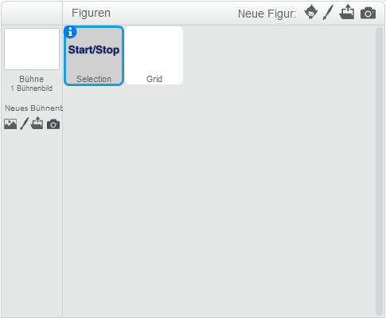

## Die Figur Selection

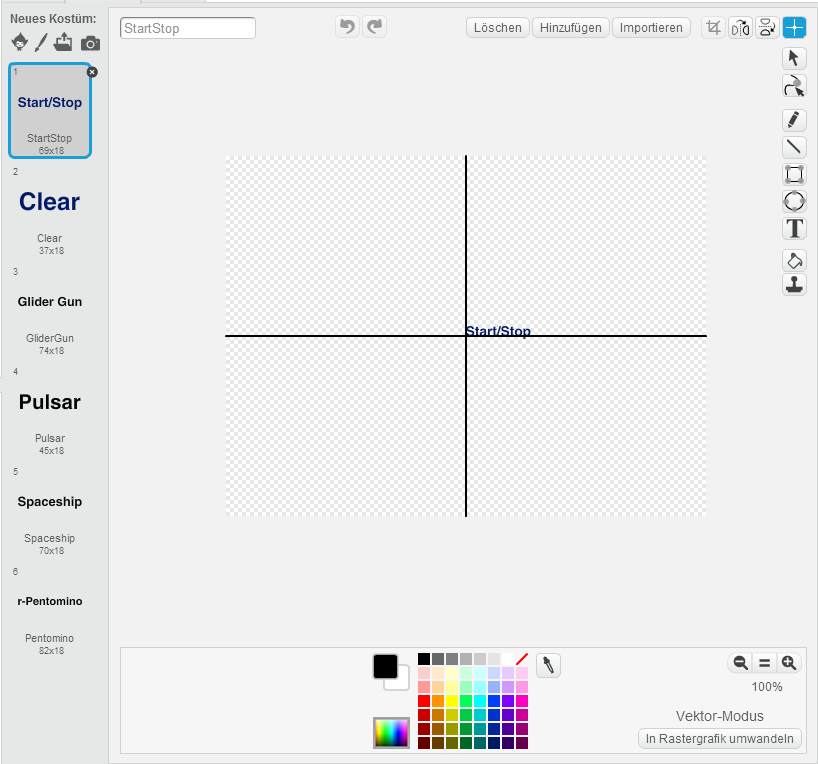

Für die Figur Selection benötigen wir sechs Kostüme für die sechs Kommandos, die man via Mausklick ausführen kann. Verwende dazu das Textwerkzeug, und schreibe die Namen der Kommandos wie oben angegeben in das Zeichenfeld. Setze den Drehpunkt der Kostüme jeweils in das linke untere Eck des Textbereichs. Wähle den Textbereich nicht zu groß, damit die Befehle nebeneinander Platz haben. Eine Höhe von 18 Pixeln geht sich gut aus. Du kannst das Textfeld auch nachträglich kleiner machen.

Die Skripte von Selection sind relativ einfach. Sie dienen dazu die Menükommandos zu zeichnen, und bei Mausklick entsprechende Nachrichten an das Grid zu senden:

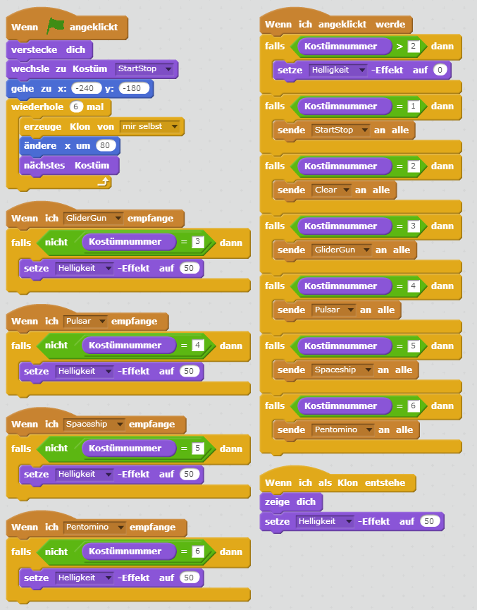

## Die Figur Grid

Her ist das eigentliche Spiel implementiert. Das Grid zeichnet sich mit dem Malstift selbst, daher hat es nur ein leeres Kostüm:

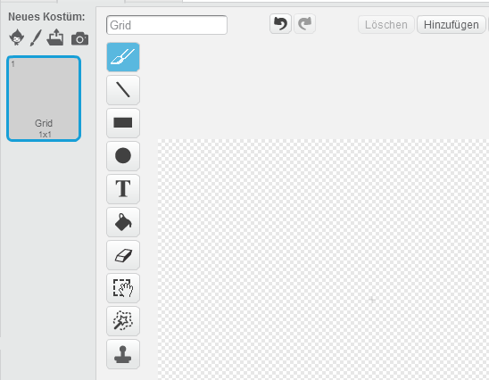

Nun können wir die Variablen anlegen. Bitte erstelle alle Variablen für „Nur für diese Figur“, also für die Figur Grid:

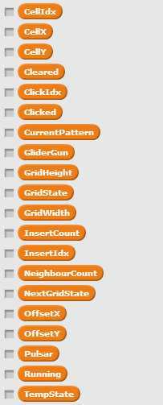

Jetzt müssen wir das Grid noch programmieren. Wir beginnen mit Funktionsblöcken, die wir später im Hauptprogramm benötigen werden.

InsertPattern dient dem Einfügen von Mustern in das Grid. Wichtig: Selektiere bei allen Blöcken „Ohne Bildschirmaktualisierung laufen lassen“, sonst ist das Programm zu langsam.

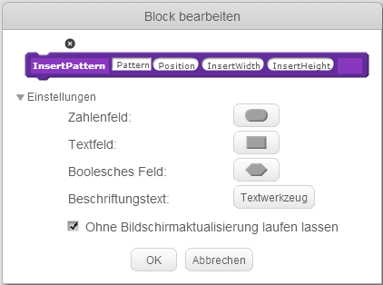

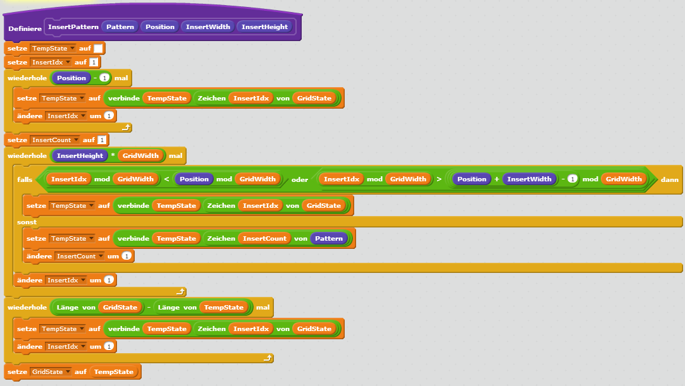

In CalcNextGeneration wird die nächste Generation von Zellen berechnet:

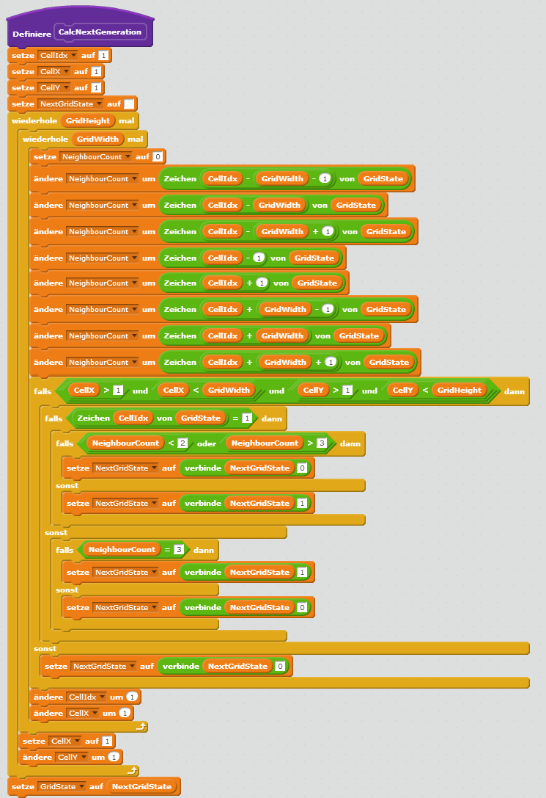

Paint dient dem Zeichnen des Grids mit dem Malstift. In InitGrid wird das Grid leer befüllt:

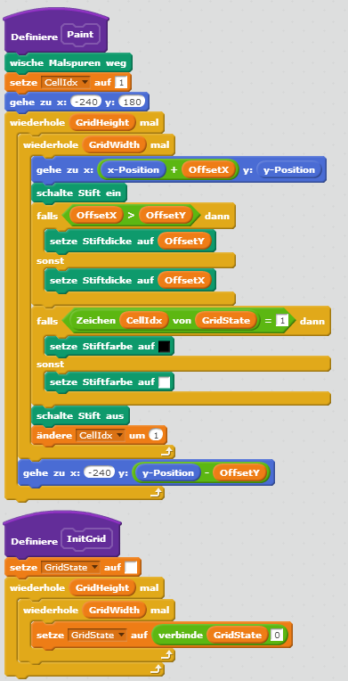

Nun folgt das Hauptprogramm, das zuerst alle Variablen initialisiert, und dann in einer Hauptschleife die Neuberechnung und das Zeichnen des Grids aufruft. Außerdem wird abgefragt, ob neue Muster einzufügen sind.

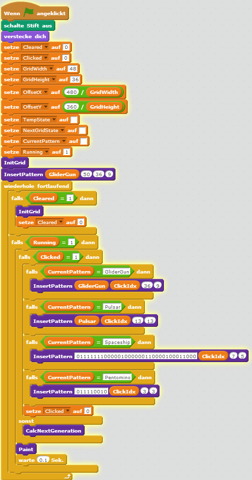

Zuguterletzt benötigen wir noch einige Funktionen zur Nachrichtenbehandlung:

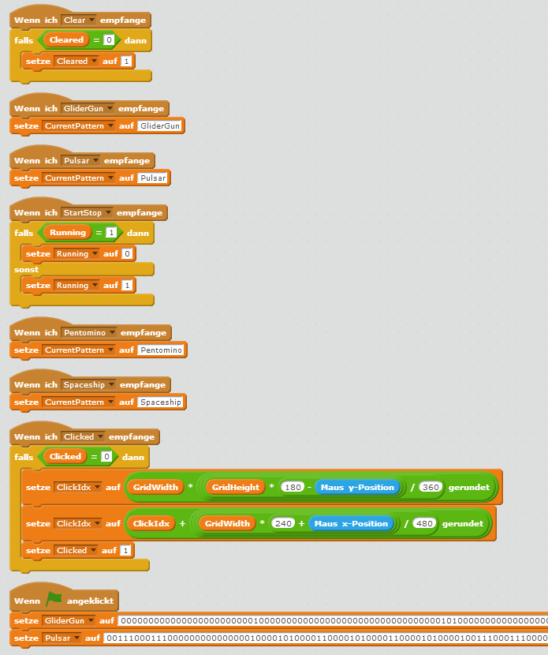

Wie du siehst definieren wir hier die beiden großen Muster GliderGun und Pulsar. Wie das Grid selbst bestehen sie aus einer langen Zeichenkette von 0en und 1en – so lange, dass man sie gar nicht in einer Zeile drucken kann. Daher hier nochmal zum Abtippen oder Kopieren aus dem Internet:

GliderGun: 
000000000000000000000000100000000000 
000000000000000000000010100000000000 
000000000000110000001100000000000000 
000000000001000100001100000000000011 
110000000010000010001100000000000011 
110000000010001011000010100000000000 
000000000010000010000000100000000000 
000000000001000100000000000000000000 
000000000000110000000000000000000000<

Pulsar: 
0011100011100 
0000000000000 
1000010100001 
1000010100001 
1000010100001 
0011100011100 
0000000000000 
0011100011100 
1000010100001 
1000010100001 
1000010100001 
0000000000000 
0011100011100 

## Ausprobieren

Du kannst das fertige Projekt unter [https://scratch.mit.edu/projects/96326891](https://scratch.mit.edu/projects/96326891){:target="_blank"} ausprobieren.
