# Scratch Weihnachtsspiel 2016

In diesem Spiel musst du möglichst viele, bunte Kugeln an den Weihnachtsbaum hängen. Wie viele Punkte schaffst du?

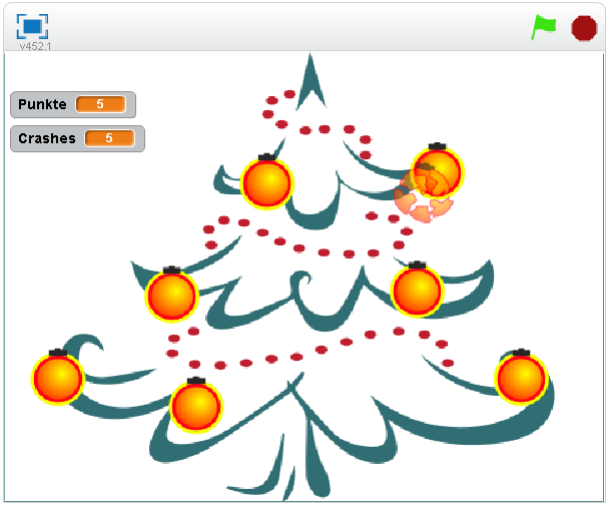

## Spielregeln

1. Die Kugeln fallen von oben nach unten und bleiben mit der schwarzen Befestigung an den grünen Zweigen des Baums hängen.

1. Die Geschwindigkeit der Kugeln steigert sich alle 10 Sekunden.

1. Für jede erfolgreich an den Baum gehängte Kugel gibt es einen Punkt.

1. Wenn eine Kugel eine andere berührt oder auf den Boden fällt, zerspringt die berührte Kugel. Ein Punkt wird abgezogen.

1. Das Spiel ist vorbei, wenn du 10 Kugeln kaputt gemacht hast. Wie viele Punkte schaffst du bis dahin? 

## Bühne und Figuren anlegen

1. Damit du nicht alles zeichnen muss, haben wir die Grafiken für das Spiel vorbereitet. Du kannst sie [herunterladen](scratch-weihnachten-2016/weihnachten-2016-grafiken.zip){: target="_blank"}. Falls du nicht weißt wie das geht, hol dir Hilfe bei einer CoderDojo Mentorin oder einem Mentor.

1. 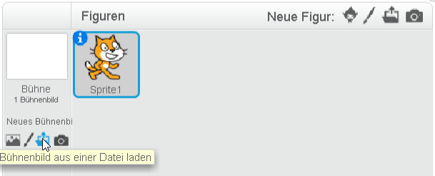{: .right}
Als erstes legst du fest, wie dein Spielfeld aussehen soll. Wir brauchen zuerst den Weihnachtsbaum, auf den wir die Kugeln hängen. Wähle links unten unter *Bühnenbild aus einer Datei laden* die Grafik *christmas-tree.png*.

1. 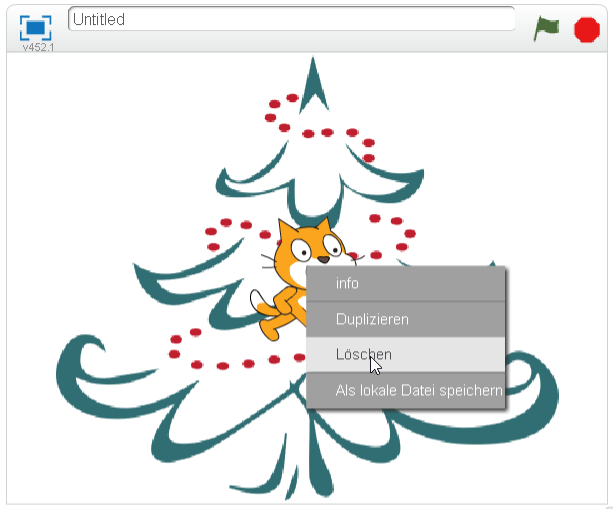{: .right}
Als nächstes lösche die Figur Scratchy mit dem Namen *Sprite1* indem du mit der rechten Maustaste darauf klickst. 
Im angezeigten Menü kannst du Scratchy löschen.

1. {: .right}
Jetzt brauchen wir die Kugel, die wir auf den Baum hängen. Klicke dazu auf *Figur aus einer Datei laden* und füge die Grafik *glass-ball.png*.

1. 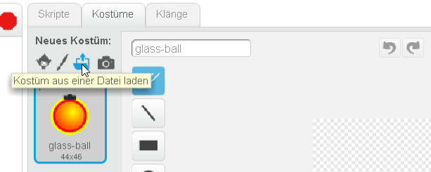{: .right}
Für die zerspringende Kugel brauchen wir weitere Kostüme. Klicke auf *Kostüm aus Datei laden* und füge die Dateien *glass-ball-break-1.png* bis *glass-ball-break-4.png* als zusätzliche Kostüme ein.

1. 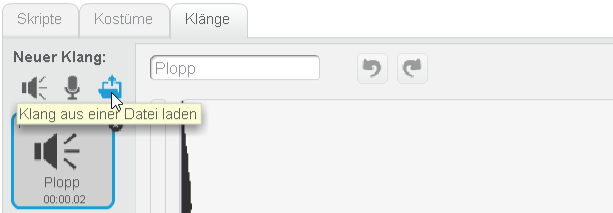{: .right}
Wenn eine Kugel kaputt geht, möchten wir ein Klirren abspielen. Klicke im Tab *Klänge* auf *Klang aus einer Datei laden*. Füge den Klang *klirr.wav* hinzu.

1. 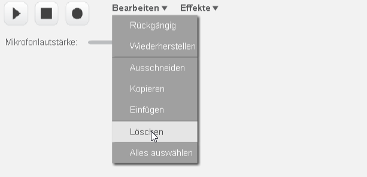{: .right}
Wie du siehst, ist bei dem Klang am Beginn eine Zeit Stille. Das siehst du an der flachen Linie. Markiere den stillen Bereich mit der Maus und lösche ihn, indem du auf *Bearbeiten/Löschen* klickst. 

1. 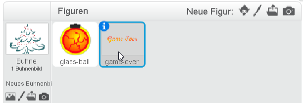{: .right}
Als letztes brauchen wir noch eine Figur für die *Game Over* Anzeige am Ende des Spiels. Füge dafür die Figur *game-over.png* hinzu.

## *Game Over* Anzeige

1. {: .right}
Die Programmierung der *Game Over* Anzeige ist am einfachsten. Diese Figur soll solange unsichtbar bleiben, bis das Spiel zu Ende ist.  
  • Wähle zuerst die *Game Over* Figur aus, damit sie blau umrandet ist. 
  • Im Tab *Skripte* kannst du nun programmieren. Verwende die Blöcke wie in der Abbildung gezeigt.

## Kugel bewegen

1. {: .right}
Jetzt starten wir mit der Programmierung der Kugel.   
  • Wähle dazu die Figur der Kugel aus, damit sie blau umrandet ist. 
  • Im Tab *Skripte* kannst du nun programmieren. Verwende die Blöcke wie in der Abbildung gezeigt.

1. 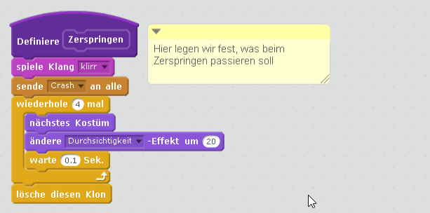{: .right}
Die Kugel soll zerspringen wenn sie auf eine andere Kugel trifft *und* wenn sie auf den Boden fällt. Damit wir den Programmteil, der das Zerspringen steuert, nicht zwei Mal programmieren müssen, erstellen wir einen eigenen Block. Das machst du im Tab *Skripte* unter *Weitere Blöcke*. Verwende die Blöcke wie in der Abbildung gezeigt.

1. {: .right}
Für den nächsten Programmteil brauchen wir *Variablen*. Diese legt man unter *Daten* an. Achte darauf, dass für alle Variablen beim Anlegen *Für alle Figuren* angeklickt ist. Lege die Variablen wie in der Abbildung gezeigt an.
  • *Crashes* zählt, wie viele Kugeln schon kaputt gegangen sind. 
  • *Game Over* soll auf Null stehen, solange das Spiel läuft. Wenn das Spiel verloren ist, setzen wir diese Variable auf Eins. 
  • *Geschwindigkeit* steuert, wie schnell die Kugeln fallen. 
  • In der Variablen *Punkte* zählen wir die Punkte.

1. 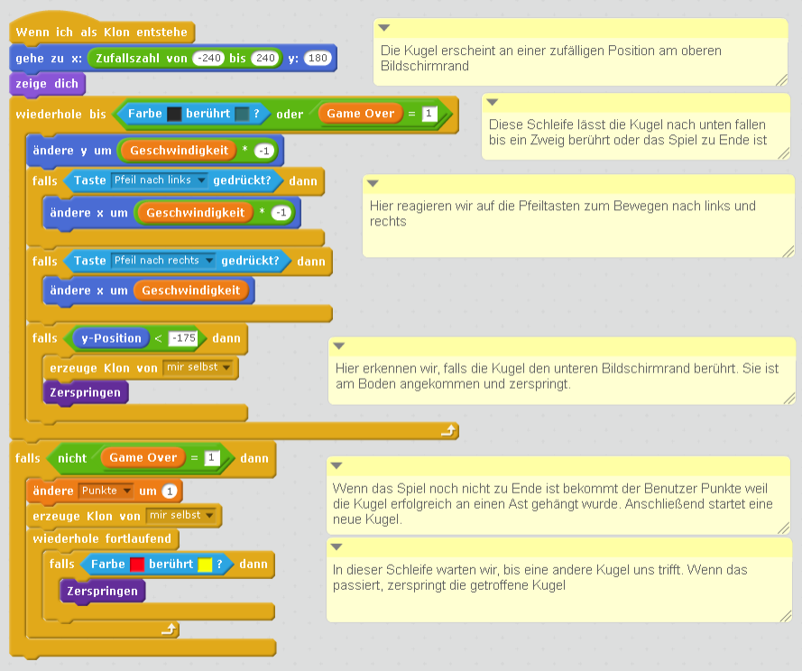{: .right}
Jetzt programmieren wir den wichtigsten Teil des Spiels, die Steuerung der Kugel. Verwende die Blöcke wie in der Abbildung gezeigt.

1. Jetzt kannst du dein Spiel schon probieren. Die Punkte funktionieren noch nicht, die Kugeln sollten aber schon funktionieren.

## Punkte verwalten

1. 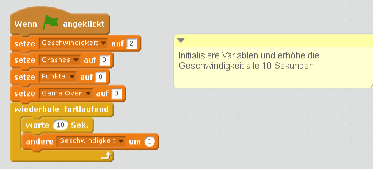{: .right}
Im Skript des Bühnenbilds verwalten wir die Punkte.   
  • Wähle das Bühnenbild mit dem Weihnachtsbaum aus, damit er blau umrandet ist. 
  • Im Tab *Skripte* kannst du nun programmieren. Verwende die Blöcke wie in der Abbildung gezeigt.

1. 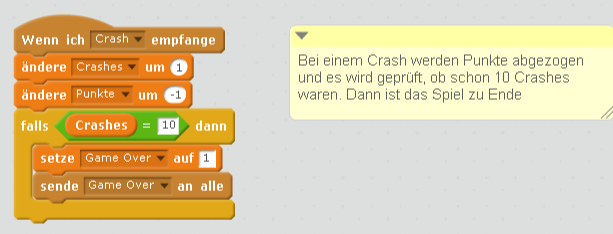{: .right}
Als letztes fehlt jetzt noch der Programmteil, der zählt, wie oft eine Kugel kaputt gegangen ist. Außerdem stellt er fest, wenn das Programm zu Ende ist.

1. Probiere dein Projekt jetzt aus. Klappt alles? Wie viele Punkte erreichst du, bevor zu viele Kugeln kaputt gegangen sind?

## Ausprobieren

Du kannst das fertige Projekt unter [https://scratch.mit.edu/projects/133877597/](https://scratch.mit.edu/projects/133877597/){:target="_blank"} ausprobieren.