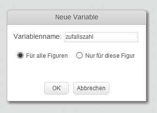
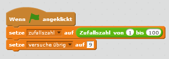
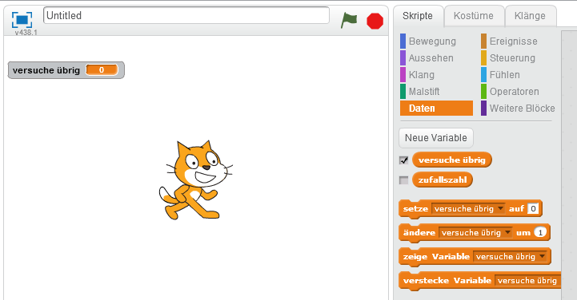
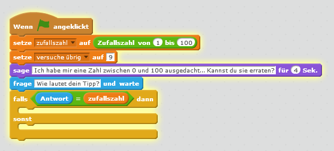
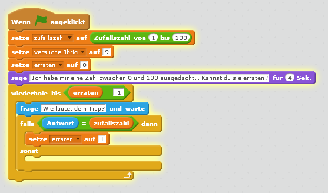
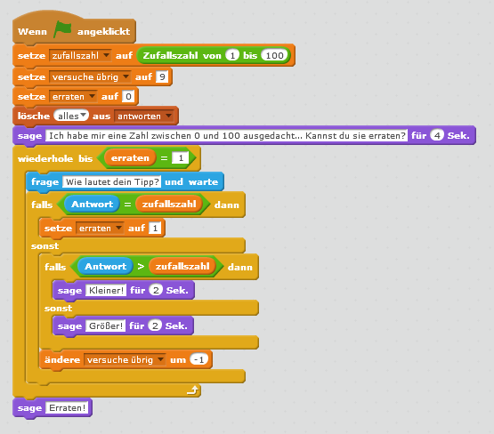
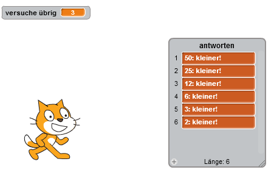
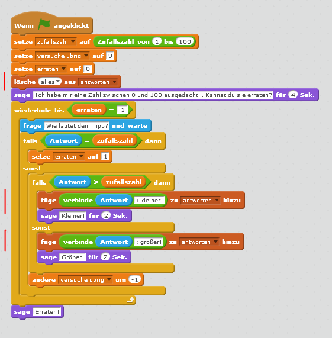

# Scratch Zahlenraten

In diesem Spiel musst du eine Zahl erraten, die sich der Computer ausgedacht hat. Schaffst du es in weniger als 9 Versuchen?

## Variablen anlegen

1. {: .right}
Wir Menschen merken uns Dinge im Gehirn. Wenn sich der Computer etwas merken soll, dann braucht er dafür Variablen. In unserem Spiel soll sich der Computer eine Zufallszahl ausdenken, sie uns aber nicht verraten. 
Wir legen dafür unter "Daten" eine "Neue Variable" an und nennen sie "zufallszahl".

2. {: .right}
Sobald das Programm gestartet wird, soll sich der Computer die Zufallszahl ausdenken und das Ergebnis in unserer neuen Variable speichern. Wir wählen einen Zahlenraum von 1 bis 100 - du kannst das Spiel aber natürlich einfacher oder schwieriger machen.
Zusätzlich möchten wir mitzählen, wie viele Versuche noch übrig sind. Dafür erstellen wir eine weitere Variable "versuche übrig" und setzen sie am Beginn auf den Wert 9.

3. {: .right}
Im Punkt "Daten" siehst du alle angelegten Variablen, mit dem Kästchen daneben kannst du einstellen, ob die Variable auf der Bühne zu sehen sein soll. Wir wollen die Anzahl der möglichen Versuche sehen, die Zufallszahl soll natürlich nicht angezeigt werden.

## Zahlen raten und vergleichen
4. {: .right}
Jetzt wirds etwas komplizierter: wir möchten den Spieler um seinen Tipp fragen, dafür wählen wir aus dem Punkt "Fühlen" die Frage aus. An dieser Stelle wartet der Computer dann auf eine Eingabe - und speichert diese in einer... - Variable! Sie heißt "Antwort". 
Daher können wir nach der Frage überprüfen, ob die Antwort korrekt war: falls die Antwort gleich unserer Zufallszahl ist, dann hat der Spieler die Zahl erraten!

5. {: .right}
Im Moment hätten wir dann genau einen Versuch - wahrscheinlich ist das zu wenig. Wir brauchen eine Schleife, und müssen so oft fragen, bis der Spieler die richtige Antwort erraten hat (oder zu viele Versuche benötigt hat).  Dafür legen wir uns eine neue Variable an, wir nennen sie "erraten". Solange die Variable den Wert 0 hat, bitten wir den Spieler um einen weiteren Tipp. Sobald der Tipp richtig war, setzen wir die Variable auf 1 - und hören auf zu fragen.  Achte genau auf die Unterschiede zum vorherigen Skript!

6. {: .right}
Damit man schneller zum Ziel kommt, geben wir noch Tipps, ob die gesuchte Zahl kleiner oder größer als die Eingabe ist.

## Alle Tipps anzeigen

7. {: .right}
Damit man sehen kann, welche Tipps bereits abgegeben wurden, fügen wir eine neue Liste zu unserem Programm hinzu. Listen findest du im Menüpunkt "Daten", sie funktionieren so ähnlich wie Variablen.  
Durch Anklicken der kleinen Box erscheint die Liste auch auf der Bühne.

8. {: .right}
Lösche am Beginn alle Einträge aus der Liste und füge neue Einträge ein, sobald ein Tipp abgegeben wurde. Achte wieder auf die Änderungen im Skript.

## Fertig!
Los geht´s - wie viele Tipps benötigst du?

## Weitere Ideen
* Im Moment bricht das Spiel noch nicht ab, wenn keine Versuche mehr übrig sind - schaffst du das?
* Statt "größer" und "kleiner" könntest du auch versuchen, andere Angaben zu machen - zB "weit daneben", "nicht schlecht", "ganz knapp"!
* Du könntest am Beginn fragen, wie groß der Zahlenraum sein soll!
