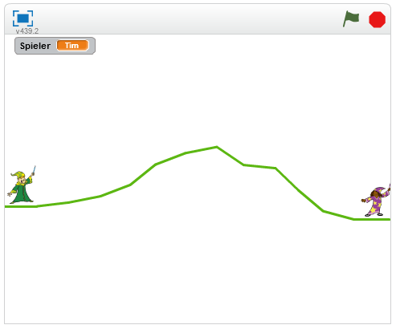
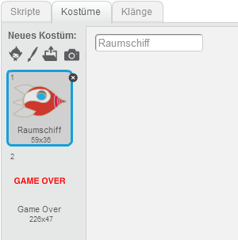
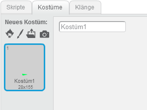
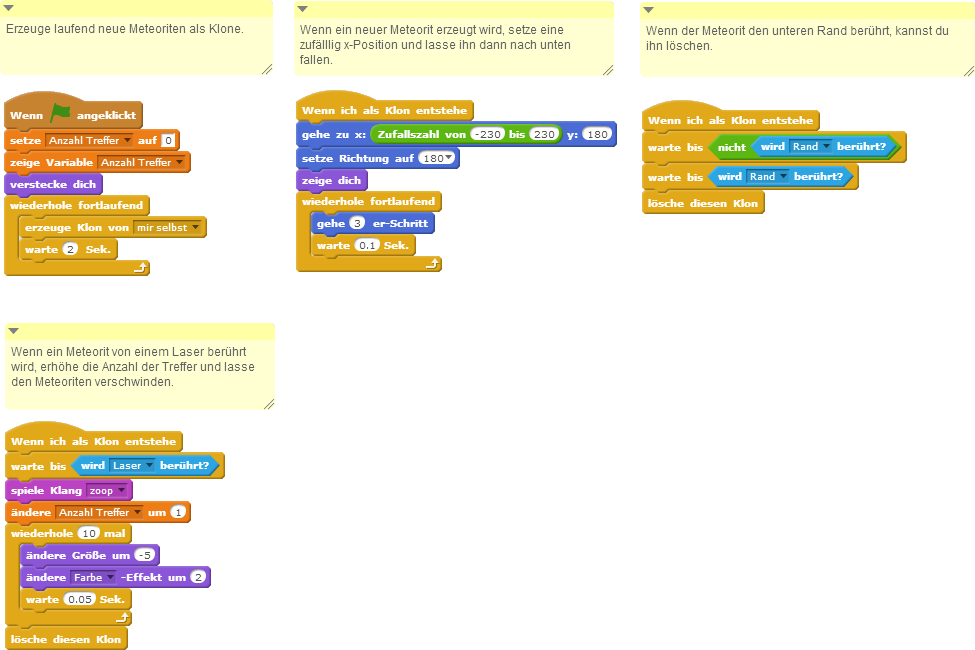

# Die Zauberlehrlinge

Die Zauberlehrlinge Tim und Melley haben wieder mal gestritten und versuchen sich jetzt gegenseitig in Frösche zu verwandeln. Dieses Spiel kannst du später gemeinsam mit einem Freund oder einer Freundin spielen. Ihr seid dabei immer abwechselnd an der Reihe einen Zauberspruch zu verschießen. Doch es ist gar nicht so leicht, den anderen zu treffen - man muss genau in die richtige Richtung zielen!

{: .right}

Damit es nicht langweilig wird, wollen wir die Landschaft im Hintergrund jedes mal ein bisschen anders zeichnen. Damit fangen wir an.

## Landschaft zeichnen

Um die Landschaft zu zeichnen, verwenden wir eine unsichtbare Figur, die mit dem Malstift einmal von links nach rechts durch das Bild läuft.

* Erstelle eine Figur und lösche ihr Kostüm - die Figur selbst ist im Spiel nicht sichtbar, nur ihr Malstift.
* Gib der Figur den Namen "Landschaft".
* Erstelle ein Skript für die Figur, das läuft, wenn die grüne Fahne angeklickt wird.

Wenn du mit der Maus über die Bühne fährst, siehst du rechts unten die zwei Werte x und y. x verändert sich, wenn du mit der Maus von links nach rechts fährst, y wenn du von oben nach unten fährst.
Unsere unsichtbare Figur soll jetzt einmal von ganz links (x: -240) bis ganz rechts (x: 240) laufen.

* Setze x auf -240 (ganz links).

Auf welcher Höhe (bei welchem y) wir beginnen, soll zufällig entschieden werden. Den Wert müssen wir uns aber merken, damit wir nachher die Figur Tim dort hinstellen müssen. Lege unter Daten eine neue Variable mit Namen "Position Tim" an.

* Erstelle unter Daten eine Variable namens "Position Tim".
* Setze "Position Tim" auf einen zufälligen Wert zwischen -140 und 100.
* Setze y auf "Position Tim".

Bevor wir losgehen, müssen wir noch den Malstift richtig einstellen.

* Wische alle Malspuren weg.
* Setze die Stiftfarbe und -dicke (z.B. auf grün und 3, aber du kannst da ruhig ein bisschen experimentieren).
* Schalte den Stift ein

Die ersten paar Schritte müssen wir gerade nach rechts machen, damit Tim dort gut stehen kann.

* Setze Richtung auf 90 (rechts).
* Gehe einen 40er Schritt.

Wenn du jetzt auf die grüne Fahne klickst, müsstest du links einen grünen Strich sehen (jedesmal auf anderer Höhe).

{: .right}

Jetzt müssen wir solange nach 

Das Skript soll folgendes machen:

2. {: .right}
Als erste Figur brauchst du das Raumschiff. Es besteht aus zwei Kostümen: dem Raumschiff selbst und einem weiteren Kostüm das angezeigt wird, 
wenn das Spiel vorbei ist. Zeige den Text "Game Over" an oder male ein passendes Bild

3. {: .right}
Die nächste Figur ist der Laserstrahl, der von der Rakte abgefeuert werden kann.

4. {: .right}
Und als letzte Figur brauchst du noch einen Meteoriten.

## Skripte für das Raumschiff

Das Raumschiff hat drei Aufgaben:

    <ol>
        <li>Es muss erkennen, wann es von einem Meteoriten getroffen wurde und dann das Spiel beenden.</li>
        <li>Mit den Pfeiltasten kann es nach links und rechts bewegt werden.</li>
        <li>Mit den Tasten a und d kann es nach links und rechts gedreht werden.</li>
    </ol>

## Skripte für den Laser

Jedesmal wenn die Leertaste gedrückt wird, muss ein neuer Laserstrahl erzeugt und abgefeuert werden.

## Skripte für den Meteoriten

## Weitere Ideen

* Füge Klänge für das Abfeuern eines Laserstrahls, für das Treffen eines Metoriten und das Zerstören des Raumschiffes hinzu.
* Verwende Variablen um die Geschwindigkeit der Meteoriten und die Anzahl der erzeugten Meteoriten mit der Zeit zu erhöhen.

## Ausprobieren

Du kannst das fertige Projekt unter [https://scratch.mit.edu/projects/70593136/](https://scratch.mit.edu/projects/70593136/){:target="_blank"} ausprobieren.