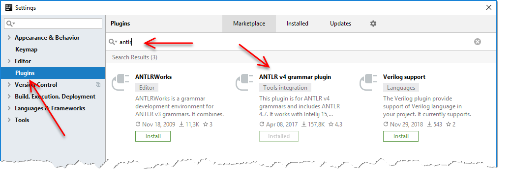
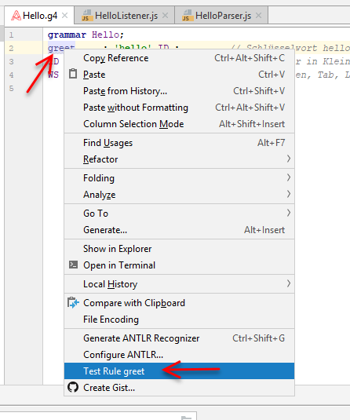

# ANTLR Hello World

## Installation

* Installieren von [IntelliJ Community Edition](https://www.jetbrains.com/idea/download/#section=windows) (kostenlos)

* IntelliJ starten

* Ein neues Projekt mit *New Project* - *Empty Project* starten. In dieser Anleitung gehen wir davon aus, dass das Projekt *antlr-hello-world* heißt.

* *Settings*-Dialog mit *Strg+Alt+S* öffnen, nach dem *antlr* Plugin suchen und installieren
  

* IntelliJ neu starten und das zuvor angelegte Projekt wieder laden

## Erste Grammatik anlegen

* Neue Datei *Hello.g4* anlegen
  

* Folgende Grammatik in die neue Datei einfügen:

```txt
grammar Hello;
greet     : 'hello' ID ;         // Schlüsselwort hello gefolgt von einem Identifier
ID        : [a-z]+ ;             // Identifier in Kleinbuchstaben
WS        : [ \t\r\n]+ -> skip ; // Leerzeichen, Tab, Leerzeilen ignorieren
```

* Rechte Maustaste auf die Regel `greet` und *Test Rule greet* anklicken
  

* *hello world* eingeben und ansehen, wie ANTLR den Text nach der angegebenen Grammatik zerlegt
  

* Experimentiere mit folgenden Eingaben (beachte die Fehler, die angezeigt werden)
  * *hello*
  * *helo world*

## Chat Grammatik

```txt
grammar test;

/*
 * Lexer Rules
 */

fragment A          : ('A'|'a') ;
fragment S          : ('S'|'s') ;
fragment Y          : ('Y'|'y') ;
fragment H          : ('H'|'h') ;
fragment O          : ('O'|'o') ;
fragment U          : ('U'|'u') ;
fragment T          : ('T'|'t') ;

fragment LOWERCASE  : [a-z] ;
fragment UPPERCASE  : [A-Z] ;

SAYS                : S A Y S ;

SHOUTS              : S H O U T S;

WORD                : (LOWERCASE | UPPERCASE | '_')+ ;

WHITESPACE          : (' ' | '\t');

NEWLINE             : ('\r'? '\n' | '\r')+ ;

/*
 * Parser Rules
 */

chat                : line+ EOF ;

line                : name command message NEWLINE;

message             : (emoticon | mention | WORD | WHITESPACE)+ ;

name                : WORD WHITESPACE;

command             : (SAYS | SHOUTS) ':' WHITESPACE ;

emoticon            : ':' '-'? ')'
                    | ':' '-'? '('
                    ;

mention             : '@' WORD ;
```

### Testsätze:

* *tim SAYS: hello world*
* *john SHOUTS: hello @michael :-)*
