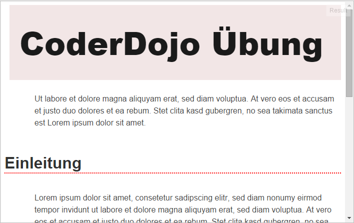
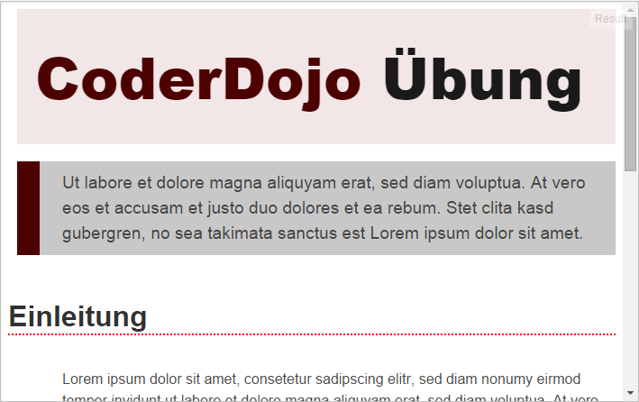
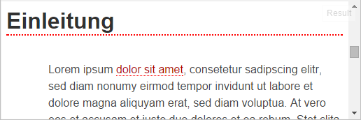
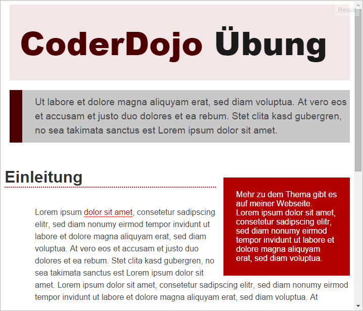
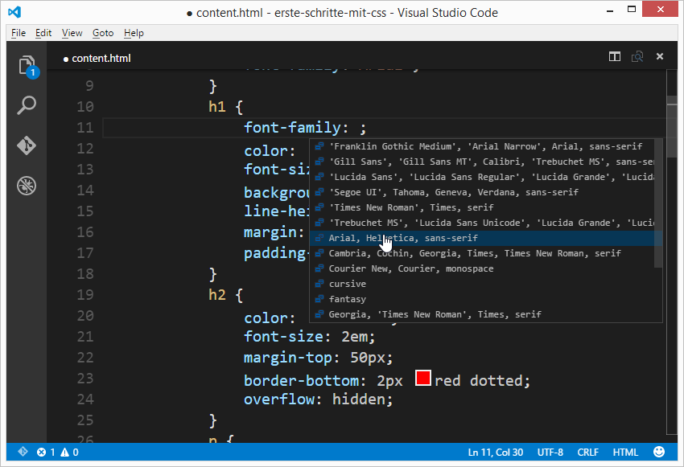

# Erste Schritte mit CSS

## Ziel der Übung

In dieser Übung lernst du *Cascading Style Sheets* (kurz CSS) kennen. Unser Ziel ist es, eine HTML-Seite mit CSS zu formatieren und hübsch zu gestalten. Wenn du nach dieser Übung mehr über CSS lernen willst oder während der Übung Detailfragen hast, kannst du einen Blick auf [die CSS Einführung auf w3schools.com](http://www.w3schools.com/css/css_intro.asp){:target="_blank"} werfen.

Falls du noch überhaupt keine Erfahrung mit HTML hast, wende dich an eine CoderDojo Mentorin oder einen Mentor. Sie werden dir die HTML-Basics erklären oder dir eine Übung für HTML-Grundlagen zeigen.

## Entwicklungsumgebung öffnen

Besonders einfach ist es mit HTML und CSS zu experimentieren, indem man die Webseite [https://jsfiddle.net/](https://jsfiddle.net/){:target="_blank"} verwendet.

1. Öffne einen Webbrowser deiner Wahl und navigiere zu [https://jsfiddle.net/](https://jsfiddle.net/){:target="_blank"}.

2. Klicke rechts oben auf *Login/Sign up*, und lege dir einen Benutzer an. Die Anmeldung ist wichtig, damit du deine Arbeitsergebnisse speichern kannst.

3. Nach dem Anlegen des Benutzers kehre zurück zum *JSFIDDLE Editor*, damit wir mit der Übung beginnen können.

## HTML Grundgerüst

Zum Experimentiere mit Styles brauchen wir Inhalt, den wir gestalten können. Der Inhalt kommt in JSFIDDLE in das Eingabefeld links oben, das mit *HTML* beschriftet ist.

1. Erstelle eine Überschrift erster Ordnung: `<h1>CoderDojo &Uuml;bung</h1>`.

2. Als nächstes möchten wir etwas Fließtext. Dazu müssen wir etwas Text generieren. Sehr einfach geht das mit *Lorem Ipsum Generatoren*. Sie erzeugen sinnlosen Text, der für Entwürfe als Platzhalter dient. Einen solchen Generator findest du unter [http://www.loremipsum.de/](http://www.loremipsum.de/){:target="_blank"}. Öffne diese Seite, generiere 50 Wörter und kopiere sie in die Zwischenablage. Anschließend füge den kopierten Text in einen HTML-Absatz ein: `
Lorem ipsum dolor sit amet ...
`.

3. Erstelle darunter eine Überschrift zweiter Ordnung: `<h2>Einleitung</h2>`.

4. Für analog zu Schritt 2 wieder Fließtext ein.

5. Wiederhole die Schritte 3 und 4 ein paar Mal mit verändertem Text, damit wir ein wenig Inhalt zum Experimentieren haben.

5. Klicke auf *Run* und kontrolliere, ob dein HTML richtig angezeigt wird. 

## Erste Formatierungen

Unser Ziel ist folgendes Layout. Wir möchten es nur mit Hilfe von CSS erreichen, ohne den HTML-Code zu verändern. 

1. Als erstes ändern wir die Schriftart für den gesamten Text der Seite. Dazu formatieren wir den gesamten *body* der HTML-Seite mit folgendem CSS Element. Füge es in JSFIDDLE rechts oben im Bereich *CSS* ein und probiere die Auswirkung aus, indem du auf *Run* drückst.

        body {
            font-family:'Arial';
        }

2. Formatiere die Überschrift erster Ordnung mit folgendem CSS Element. 

        h1 {
            font-family:'Arial Black';
            color: #1a1a1a;
            font-size: 4em;
            background: #F2E6E6;
            line-height: 150px;
            margin: 0px 0px 0px 10px;
            padding-left: 20px;
        }

3. Formatiere die Überschriften zweiter Ordnung mit folgendem CSS:

        h2 {
            color: #313131;
            font-size: 2em;
            margin-top: 50px;
            border-bottom: 2px red dotted;
            overflow: hidden;
        }

3. Formatiere den Fließtext mit folgendem CSS:

        p {
            color: #464646;
            line-height: 150%;
            padding-top: 10px;
            padding-left: 60px;
        }

4. Spiele mit verschiedenen Farben (siehe auch [HTML Color Picker](http://www.w3schools.com/tags/ref_colorpicker.asp){:target="_blank"}), Schriftgrößen und Abständen, indem du die CSS Elemente veränderst. Lies dazu auf [w3schools](http://www.w3schools.com/css/css_text.asp){:target="_blank"} nach, um mehr über Textformatierung, Schriftarten, Ränder etc. zu erfahren.

## Klassen und IDs selektieren

Als nächstes möchten wir mit Hilfe von *CSS selectors* gewisse Teile unserer Webseite besonders hervorheben. Unser Ziel ist folgendes Layout: 

1. Markiere den ersten Fließtext direkt unter der `h1` Überschrift mit einer CSS Klasse: `
...
`

2. Formatiere den Fließtext mit der Klasse *intro* mit folgendem CSS:

        .intro {
            font-size: larger;
            padding-bottom: 10px;
            background: #c8c8c8;
            border-left: solid 25px #4c0000;
            margin-left: 10px;
            padding-left: 25px;
        }

3. Wir möchten in der ersten Überschrift das Wort *CoderDojo* in dunklem Rot hervorheben. Umschließe dafür das Wort *CoderDojo* mit einem `span` Element und ordne die CSS Klasse `highlight` zu: `<h1>CoderDojo &Uuml;bung</h1>`.

5. Formatiere `highlight` mit folgendem CSS:

        .highlight {
            color: #4c0000;
        }

6. Ändere den `intro`-Fließtext von `class` auf `id`: `
...
`. Aktualisiere das Ergebnis und du wirst sehen, dass der `.intro`-Selektor nicht mehr funktioniert.

7. Ändere den CSS-Selektor von `.intro` auf `#intro` und aktualisiere das Ergebnis. Wie du siehst klappt jetzt wieder alles. Mit `.` selektierst du alle auf Grundlage einer CSS Klasse, mit `#` auf Grundlage einer `id`.

## Verschachtelte Elemente selektieren

In der nächsten Übung möchten wir Hyperlinks im Fließtext schöner formatieren. So sieht unser Ziel-Layout aus: 

1. Mache im ersten Fließtext-Absatz ein paar Wörter zu einem Hyperlink:

        
Lorem ipsum <a href="http://www.google.at">dolor sit amet</a>, consetetur ...

2. Aktualisiere das Ergebnis und beachte, wie der Hyperlink standardmäßig formatiert wird.

3. Definiere einen Stil, der nur auf Hyperlinks (`a` Tag) innnerhalb von Fließtexten (`p` Tag) angewendet wird. Probiere den Stil aus und experimentiere mit den Einstellungen.

        p a {
            color: #330000;
            text-decoration: none;
            border-bottom: 1px red dotted;
        }

4. Wenn der Hyperlink schon einmal angeklickt wurde (`visited`), soll er eine leicht andere Farbe haben. Verwende dazu folgenden Stil und probiere ihn aus. `visited` ist eine sogenannte *pseudo-Klasse*. Mehr dazu findest du auf [w3school](http://www.w3schools.com/css/css_pseudo_classes.asp){:target="_blank"}.

        p a:visited {
            color: #b20000;
        }

## Arbeiten mit `div`

Unser Ziel ist es, einen Kasten mit einem wichtigen Hinweis rechts neben die Einleitung zu setzen. 

1. Füge vor der Einleitung den Kastentext hinzu. Umschließe ihn mit einem `div` Element mit der Klasse `sidebar`.

        

                Mehr zu dem Thema gibt es auf meiner Webseite. Lorem ipsum dolor sit amet, consetetur sadipscing elitr, sed diam nonumy eirmod tempor invidunt ut labore et dolore magna aliquyam erat, sed diam voluptua.
        

2. Formatiere die *sidebar* mit folgendem CSS. Experimentiere mit den Einstellungen.

        .sidebar {
            width: 200px;
            float: right;
            background: #b20000;
            padding: 25px;
            margin-left: 15px;
            margin-top: 50px;
            color: white;
        }

## Styles in HTML-Dateien

Bisher haben wir CSS nur in JSFIDDLE ausprobiert. Zum Abschluss werden wir den erstellten CSS-Code in einer echten HTML-Webseite ausprobieren.

1. Öffne einen beliebigen Texteditor. Es wäre ideal, wenn du einen Editor hast, der HTML und CSS besonders unterstützt. Eine kostenloses Produkt, das diese Funktionen bietet, ist [Visual Studio Code](https://code.visualstudio.com/){:target="_blank"}. Es funktioniert auf Windows, MacOS und Linux. Falls du keinen solchen Editor hast oder installieren kannst, kannst du die folgenden Schritte auch mit jedem anderer, bei dir eingebauten Editor machen (unter Windows z.B. *Notepad*).

2. Lege einen leeren Ordner an.

3. Erstelle mit dem Editor eine Datei namens *content.html* und füge dort folgenden Code ein:

        <!DOCTYPE html>
        <html>
        <head>
        	<title>Erste Schritte mit CSS</title>
        </head>
        <body>
        
        	<!-- Hier bitte den HTML-Code aus JSFIDDLE einfügen --> 
        
        </body>
        </html>

4. Ersetze den Kommentar `<!-- Hier bitte den HTML-Code aus JSFIDDLE einfügen -->` durch den HTML-Code, den du zuvor in JSFIDDLE geschrieben hast.

        <!DOCTYPE html>
        <html>
        <head>
        	<title>Erste Schritte mit CSS</title>
        </head>
        <body>
        
        <h1>CoderDojo &Uuml;bung</h1>
        
        
Ut labore ...

        
        
Mehr zu dem Thema ...

        <h2>Einleitung</h2>
        
Lorem ipsum <a href="http://www.google.at">dolor sit amet</a>, consetetur ...

        
        <h2>Mehr zum Thema</h2>
        
Lorem ipsum dolor sit amet, consetetur sadipscing elitr, ...

        
        <h2>Abschluss</h2>
        
Lorem ipsum dolor sit amet, ...
 
        
        </body>
        </html>

5. Füge innerhalb des `head` Elements das Element `style` ein. In das `style` Elements musst du den CSS-Code einfügen, den zuvor in JSFIDDLE erstellt hast. 

        <!DOCTYPE html>
        <html>
        <head>
        	<title>Erste Schritte mit CSS</title>
            
        </head>
        <body>
        ...

6. Falls du einen Editor wie *Visual Studio Code* verwendest, wirst du sehen, dass er dir das Schreiben von CSS erleichtert. Du musst nicht alles auswendig wissen. Der Editor bietet dir Auswahlmöglichkeiten an, zeigt dir gleich an, wie die gewählte Farbe aussieht und vieles mehr. 

7. Öffne die HTML-Datei mit einen Browser. Du solltest die schön formatierte Seite im Browser sehen.

## Weitere Übungen

1. Wir haben ein *internes Stylesheet* erstellt. Lies den Artikel unter [http://www.w3schools.com/css/css_howto.asp](http://www.w3schools.com/css/css_howto.asp){:target="_blank"} und versuche, unser Beispiel auf ein *externes Stylesheet* umzustellen.

2. Wenn du schon etwas Erfahrung mit CSS gesammelt hast, kannst du das [CSS Quiz auf w3schools](http://www.w3schools.com/css/css_quiz.asp){:target="_blank"} probieren. Wie viele Fragen kannst du richtig beantworten? Lies nach, um dein CSS-Wissen noch zu erweitern.

3. Baue dir einen Webserver mit Node.JS (eine Übungsbeispiel dafür findest du [hier](/trainingsanleitungen/web/nodejs-webserver.html)) und liefere damit den in dieser Übung erstellten HTML- und CSS-Code aus.