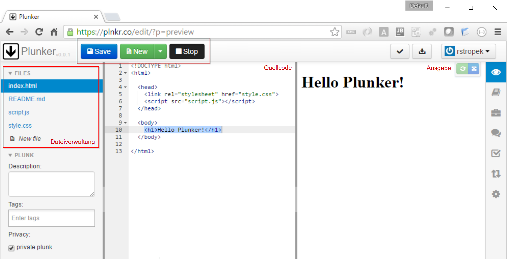

# Erste Schritte mit SVG

## Ziel der Übung

In dieser Übung lernst du [*Scalable Vector Graphics*](https://de.wikipedia.org/wiki/Scalable_Vector_Graphics){:target="_blank"} (kurz *SVG*) kennen. Unser Ziel sind:

* Wir wollen verstehen, was SVG ist und wofür es eingesetzt wird.
* Wir wollen Grafiken mit SVG in eine HTML-Seite einbauen.
* Wir wollen SVG mit JavaScript programmgesteuert erzeugen.
* Wir möchten SVG verwenden, um ein mathematisches Prinzip, die [Cardanischen Kreise](https://de.wikipedia.org/wiki/Cardanische_Kreise){:target="_blank"} veranschaulichen.

Wenn du nach dieser Übung mehr über SVG lernen willst oder während der Übung Detailfragen hast, kannst du einen Blick auf [die SVG Einführung auf w3schools.com](http://www.w3schools.com/svg/){:target="_blank"} werfen.

Falls du noch überhaupt keine Erfahrung mit HTML und JavaScript hast, wende dich an eine CoderDojo Mentorin oder einen Mentor. Sie werden dir die HTML-Basics erklären oder dir eine Übung für HTML-Grundlagen zeigen.

## Entwicklungsumgebung öffnen

In der [CSS Übung](erste-schritte-mit-css.md) hast du die Webseite  [https://jsfiddle.net/](https://jsfiddle.net/){:target="_blank"} zum Experimentieren mit HTML kennengelernt. Wenn du möchtest, kannst du sie auch für diese Übung verwenden. Wenn du allerdings etwas neues kennen lernen möchtest, verwende diesmal die Alternative [Plunker](https://plnkr.co){:target="_blank"}.

1. Öffne einen Webbrowser deiner Wahl und navigiere zu [https://plnkr.co](https://plnkr.co){:target="_blank"}.

1. Rechts oben siehst du den Buttton *Sign in with Github*. [Github](https://github.com/) ist eine sehr wichtige Seite für Coder. Man kann dort den Quellcode seiner Programme online speichern. Auf Github gibt es unzählige Projekte von Hobby-Codern und Profis. Falls du noch kein Github-Konto hast, klicke auf den Link und lege dir einen Benutzer an.

1. Du müsstest am Ende wieder bei Plunker landen und rechts oben deinen Github-Benutzer sehen. 

1. Starte als nächstes den Plunker Editor. 

1. Der Bildschirmaufbau des Plunker Editor ist recht einfach. Die folgende Grafik zeigt die wichtigsten Teile. Experimentiere ein wenig, indem du den HTML- und JavaScript-Code des generierten Beispiels veränderst und laufen lässt. 

Jetzt legen wir los. Vergiss bitte nicht, während der Arbeit hin und wieder eine Dateien zu speichern.

## Eine erste SVG Grafik

Sinn von SVG ist es, [Vektorgrafiken](https://de.wikipedia.org/wiki/Vektorgrafik){:target="_blank"} zu definieren. Diese lassen sich dann problemlos in HTML-Webseiten eingetten.

Im Gegensatz zu [Rastergrafiken](https://de.wikipedia.org/wiki/Rastergrafik){:target="_blank"} werden Vektorgrafiken nicht als einzelne Pixel sondern als Bildbeschreibung gespeichert. Dadurch lassen sie sich wunderbar vergrößern und verkleinern. Hier ein Beispiel: Das folgende Bild ist eine Rastergrafik, die um einen Faktor fünf vergrößert wurde:

{:width="500%"}

Hier nun das gleiche Bild als SVG-Vektorgrafik um einen Faktor fünf vergrößert. Siehst du, wie gestochen scharf es bleibt?

{:width="500%"}

## Weitere Übungen

1. Wir haben ein *internes Stylesheet* erstellt. Lies den Artikel unter [http://www.w3schools.com/css/css_howto.asp](http://www.w3schools.com/css/css_howto.asp){:target="_blank"} und versuche, unser Beispiel auf ein *externes Stylesheet* umzustellen.

2. Wenn du schon etwas Erfahrung mit CSS gesammelt hast, kannst du das [CSS Quiz auf w3schools](http://www.w3schools.com/css/css_quiz.asp){:target="_blank"} probieren. Wie viele Fragen kannst du richtig beantworten? Lies nach, um dein CSS-Wissen noch zu erweitern.

3. Baue dir einen Webserver mit Node.JS (eine Übungsbeispiel dafür findest du [hier](/trainingsanleitungen/web/nodejs-webserver.html)) und liefere damit den in dieser Übung erstellten HTML- und CSS-Code aus.

4. Möchtest du deine Webseite im Internet veröffentlichen? Ein Übungsbeispiel dafür findest du [hier](/trainingsanleitungen/web/dreamspark-azure.html).