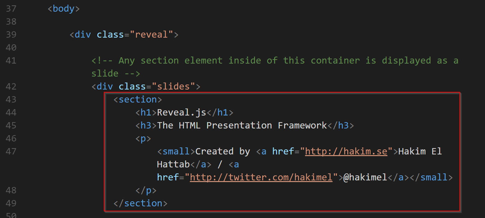

# Präsentationen mit HTML statt PowerPoint

## Ziel der Übung

Egal ob in der Schule, auf der Uni oder später im Beruf - es kommt immer wieder vor, dass man Präsentationen erstellen muss. Die meisten greifen dabei zu [Microsoft PowerPoint](https://products.office.com/de-at/powerpoint){:target="_blank"}.

Das muss aber nicht sein. Als Coder mit HTML- und CSS-Kenntnissen kann man beeindruckende Präsentationen für den Browser erstellen. In dieser Übung lernst du [Reveal.js](http://lab.hakim.se/reveal-js/){:target="_blank"} kennen. Mit Grundkenntnissen in HTML und CSS kannst du mit Reveal deine nächste Präsentation ganz ohne PowerPoint erledigen.

**Bitte beachte, dass dieses Beispiel keine Übung für Anfänger ist!** Falls HTML, CSS und [Visual Studio Code](https://code.visualstudio.com/ "Homepage von Visual Studio Code"){:target="_blank"} für dich neu sind, mache dich erst mit diesen Technologien und Werkzeugen vertraut. Dazu sind folgende Übungsbeispiele zu empfehlen:

* HTML Grundlagen: [Meine erste Webseite](http://coderdojo-linz.github.io/trainingsanleitungen/web/html-meine-erste-webseite.html)
* CSS Grundlagen: [Erste Schritte mit CSS](http://coderdojo-linz.github.io/trainingsanleitungen/web/erste-schritte-mit-css.html)

## Systemvoraussetzungen

Du kannst diese Übung unter Windows, Linux oder MacOS machen. Alle verwendeten Tools sind plattformunabhängig und kostenlos.

Folgende Software musst du installieren, damit du die Übung machen kannst:

* Ein HTML-Editor deiner Wahl. Falls du noch keinen Favoriten hast, wirf einen Blick auf die Liste der Editoren, die in [Meine erste Webseite](http://coderdojo-linz.github.io/trainingsanleitungen/web/html-meine-erste-webseite.html) erwähnt ist. Im Zweifelsfall empfehlen wir [Visual Studio Code](https://code.visualstudio.com/ "Homepage von Visual Studio Code"){:target="_blank"}

* Die Quellcode-Versionskontrollsoftware [Git](https://git-scm.com/downloads){:target="_blank"}.

* [Node.js](https://nodejs.org/ "Node.js Homepage"){:target="_blank"}

Beachte, dass du für die letzten beiden Tools unter Linux und MacOS einen [Package Manager](https://de.wikipedia.org/wiki/Paketverwaltung "Mehr über Paketverwaltung auf Wikipedia nachlesen"){:target="_blank"} zur Installation verwenden musst. Anleitungen dazu findest du, indem du etwas wie `Install Git Ubuntu` oder `Install Node.js mac os` mit Google suchst.

## Reveal.js

[Reveal.js](http://lab.hakim.se/reveal-js/){:target="_blank"} ist ein Framework zur einfachen Erstellung von HTML-basierenden Präsentationen. 

** Öffne die [Webseite von Reveal.js](http://lab.hakim.se/reveal-js/){:target="_blank"} und gehe die Präsentation, die du dort findest, durch.** Mache dich mit den Möglichkeiten von Reveal.js vertraut.

## Reveal.js installieren

Genug Theorie, lass uns loslegen.

1. Erstelle einen leeren Ordner namens `CoderDojoSlides`.

2. Starte einen Command Prompt (Windows) bzw. ein Terminal-Fenster (Linux, Mac) und wechsle in den erstellten Ordner `CoderDojoSlides`.

4. Mit Git kannst du Reveal.js in dem Verzeichnis installieren. Dazu gibst du das Kommando `git clone https://github.com/hakimel/reveal.js.git` ein. Falls ein Fehler kommt, kontrolliere, ob du [Git](https://git-scm.com/downloads){:target="_blank"} richtig installiert hast. 
**Wenn du mehr über Git lernen möchtest, sprich einen CoderDojo Mentor darauf an.**

5. Durch den letzten Schritt hast du ein Unterverzeichnis `reveal.js` erstellt. Wechsle mit `cd reveal.js` in dieses Verzeichnis.

6. Mit dem Kommando `npm install` installierst du die Systemvoraussetzungen für Reveal.js. Hab etwas Geduld nachdem du es gestartet hast. Es kann ein paar Minuten dauern. 
**Wenn du mehr über [NPM](https://www.npmjs.com/){:target="_blank"} lernen möchtest, sprich einen CoderDojo Mentor darauf an.**

7.  Jetzt kannst du Reveal starten. Das machst du mit dem Kommando `grunt serve`. Dadurch wird dein PC zu einem Webserver und es öffnet sich ein Browser, mit der Adresse [http://localhost:8000/#/](http://localhost:8000/#/){:target="_blank"}, der dir die Startseite von Reveal.js zeigt, die jetzt aber auf deinem Computer läuft.

## Eigene Präsentation erstellen

Jetzt sind wir bereit, eine eigene Präsentation zu erstellen.

1. Starte [Visual Studio Code](https://code.visualstudio.com/ "Homepage von Visual Studio Code"){:target="_blank"} oder deinen Lieblingseditor für HTML.

2. Öffne den Ordner `reveal.js`, den du zuvor erstellt hast.

3. Öffne die Datei `index.html`, die sich im Ordner `reveal.js` befindet.

4. Suche dir die erste Folie im HTML-Code heraus. Im folgenden Bild ist sie markiert: 

5. Verändere etwas an der Folie. Du könntest einen Absatz hinzufügen (`
...
`), eine Überschrift ergänzen (`<h3>...</h3>`) oder ein Bild einfügen (``).

6. Speichere deine Änderungen ab.

7. Wechsle in den Browser (Adresse [http://localhost:8000/#/](http://localhost:8000/#/){:target="_blank"}) und aktualisiere die Ansicht. Du müsstest deine Änderungen sehen. 

## Weitere Schritte

1. Mache dich mit den Möglichkeiten von Reveal.js anhand des Muster-Codes in `index.html` vertraut.

2. Ändere `index.html` und schau dir jeweils an, ob deine Änderungen die gewünschte Wirkung haben.

3. Versuche, `index.html` so zu ändern, dass sie eine Präsentation über ein Thema enthält, das dich interessiert.  

## Weitere Übungen

1. Möchtest du deine Präsentation im Internet veröffentlichen? Lass dir von einem CoderDojo-Mentor zeigen, wie das geht.

2. Möchtest du die Schriften, Farben etc. verändern? Mach dich dafür anhand des Beispiels [Erste Schritte mit CSS](/trainingsanleitungen/web/erste-schritte-mit-css.html) mit CSS vertraut.
