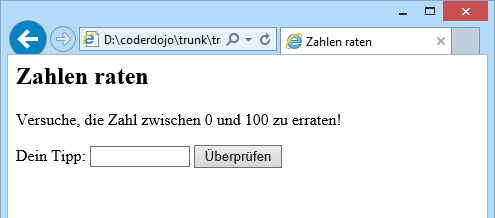
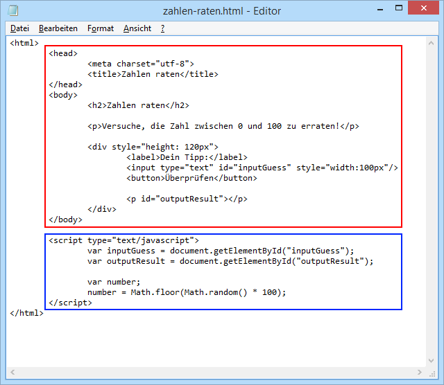

# Zahlen raten

In dieser Übung programmierst du ein einfaches "Zahlen raten" Spiel und siehst, wie man mit JavaScript Ein- und Ausgaben machen kann.

Das Spiel soll folgendermaßen funktionieren: Der Computer denkt sich eine Zahl zwischen 0 und 100 aus und der Spieler muss versuchen, diese Zahl mit möglichst wenigen Versuchen zu erraten. Dazu kann er einen Tipp eingeben. Der Computer sagt dann "Niedriger" oder "Höher", und der Spieler kann einen neuen Tipp eingeben, bis er die richtige Zahl erraten hat.

## HTML Seite herunterladen

Die Programmiersprache JavaScript wird vor allem auf Webseiten im Internet verwendet. Damit du nicht bei Null beginnen musst, kannst du dir eine HTML-Seite [hier](https://raw.githubusercontent.com/coderdojo-linz/coderdojo-linz.github.io/master/trainingsanleitungen/web/javascript-zahlen-raten/zahlen-raten.html){:target="_blank"} herunterladen. Speichere die Datei auf deinem Computer ab und öffne sie mit einem Webbrowser (du kannst die Datei einfach ins Browserfenster hineinziehen).

Du solltest folgende Seite sehen:

Falls du diese Warnung siehst, klicke auf "Geblockte Inhalte zulassen". 

Wenn man Scripts oder Programme aus dem Internet herunterlädt, muss man immer vorsichtig sein, wenn man nicht genau weiß, was sie machen. In diesem Fall wissen wir aber, dass die Datei nicht gefährlich ist.

## Das Spiel

Wenn du jetzt eine Zahl eingibst und auf "Überprüfen"" klickst, passiert noch nichts. Das werden wir jetzt ändern. Öffne dazu die HTML-Datei mit einem Texteditor (z.B. Notepad, Word ist nicht so gut geeignet). Dort siehst du zwei Bereiche: Einen für den HTML-Code (rot) und einen für den JavaScript-Code (blau).

Wir wollen darauf reagieren, wenn der Spieler auf "Überprüfen" klickt. Erweitere dazu den Button im HTML-Bereich um folgenden Code:

    <button onclick="checkNumber()">Überprüfen</button>

Ergänze außerdem den JavaScript-Bereich (nach der Zeile `number = ...`):

    count = 0;

    function checkNumber() {
		count = count + 1;
		outputCount.innerHTML = "Du hast bisher " + count + " Versuche gebraucht."
    }

Speichere deine Änderungen, lade die Seite im Browser neu (z.B. durch Drücken der Taste F5 auf deiner Tastatur) und klicke nochmal auf "Überprüfen". Nach jedem Klick wird jetzt die Anzahl der Versuche angezeigt.
	
Natürlich fehlt jetzt noch der wichtigste Teil des Spiels: Die Überprüfung, ob die Zahl stimmt und der Hinweis, ob man zu hoch oder zu niedrig getippt hat. Dafür brauchen wir noch etwas mehr Code.

## Ist das überhaupt eine Zahl?

Vielleicht ist es dir schon aufgefallen: Man kann in das Tippfeld nicht nur Zahlen eingeben, sondern auch Buchstaben. Bevor wir die Zahlen vergleichen können, müssen wir zuerst sicher sein, ob das überhaupt eine gültige Eingabe ist.

Füge dazu folgenden Codezeilen vor `count = count + 1;` ein:

    var guess = parseInt(inputGuess.value);
    
    if (isNaN(guess))
        outputResult.innerHTML  = "Bitte gib eine Zahl ein.";

Speichere die Änderungen wieder ab und aktualisiere die Seite im Browser. Wenn du eine Zahl eingibst und auf "Überprüfen" klickst, werden nur die Versuche hochgezählt. Aber wenn du Buchstaben in das Feld schreibst (oder es einfach leer lässt), wird die Meldung "Bitte gib eine Zahl ein." angezeigt.

## Höher oder niedriger?

Jetzt wo wir wissen, dass die Zahl gültig ist, können wir sie mit der Zahl des Computers vergleichen. Dazu musst du den Code direkt unter der zuletzt eingefügten Zeile erweitern:

    else if (guess < number)
        outputResult.innerHTML  = "Dein Tipp war zu niedrig.";
    else if (guess > number)
        outputResult.innerHTML  = "Dein Tipp war zu hoch.";
    else if (guess == number)
        outputResult.innerHTML  = "Richtig!";		
		
Achte darauf, das beim dritten Vergleich wirklich zwei Ist-Gleich-Zeichen hintereinander stehen!

Danach abspeichern, Seite aktualisieren, das kennst du ja schon. Und jetzt kannst du dein Spiel schon einmal bis zum Ende spielen! Wie viele Versuche brauchst du, bis du die Zahl erraten hast? Schaffst du es unter 10?

Wenn du das Spiel neu starten willst, musst du übrigens einfach die Seite neu laden. Das könnten wir im letzten Schritt noch einfacher machen, wenn du noch Lust hast.

## Spiel neu starten

Am besten legen wir einen eigenen Button dafür an. Ergänze dazu im HTML-Bereich folgende Code-Zeile (zwischen `
` und `</body>`):

    <button onclick="newGame()">Neu beginnen</button>

Damit hast du einen Button, aber es passiert noch nichts wenn du darauf klickst. Erweitere dazu den JavaScript-Bereich:

    function newGame() {
        number = Math.floor(Math.random() * 100);
        count = 0;
	
		inputGuess.value = "";
        outputResult.innerHTML = "";
        outputCount.innerHTML = "";
    }
	
Jetzt kannst du das Spiel jederzeit neu starten. Die fertige Datei kannst du [hier ](https://raw.githubusercontent.com/coderdojo-linz/coderdojo-linz.github.io/master/trainingsanleitungen/web/javascript-zahlen-raten/zahlen-raten-final.html){:target="_blank"} herunterladen.

## Wie geht's weiter?

Wenn du noch weiterprogrammieren willst, hier noch ein paar Ideen:

* Nach dem ersten Versuch ist der angezeigte Text noch etwas unschön: "Du hast bisher 1 Versuche gebraucht." Besser wäre "Du hast bisher 1 Versuch gebraucht." (Einzahl)
* Lass den Computer genauere Hinweise geben: "Dein Tipp war viel zu hoch." oder "Fast! Dein Tipp war ein bisschen zu niedrig."
* Wähle (zufallsbasiert) zwischen verschiedenen gleichbedeutenden Antworten: "Dein Tipp war zu hoch.", "Nein, das ist zu hoch.", "Du musst niedriger tippen."