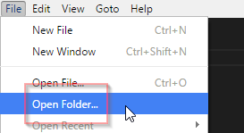
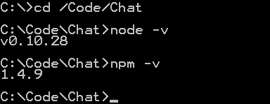
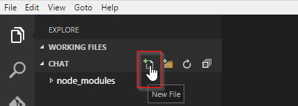

# Einen Node.js Webserver programmieren

## Ziel der Übung

In dieser Übung lernst du, wie du eine Anwendung für das Web mit [Server- und Clientteil](https://de.wikipedia.org/wiki/Client-Server-Modell "Client-Server-Modell auf Wikipedia nachlesen"){:target="_blank"} baust. Du solltest mit HTML und JavaScript schon etwas vertraut sein. Falls das ganz neu für dich ist, frage erst einen Mentor um Übungsbeispiele, bei denen du die Grundlagen von HTML und JavaScript lernst.

## Visual Studio Code Editor installieren

Ganz einfache HTML und JavaScript Programme kann man in einfachen Editoren wie *Notepad* erstellen. Wenn es aber etwas umfangreicher wird, braucht man etwas besseres. Es gibt viele verschiedene Editoren für Programmieren mit JavaScript. Manche davon sind kostenlos und manche kostenpflichtig. In dieser Übung verwenden wir [Visual Studio Code](https://code.visualstudio.com/ "Homepage von Visual Studio Code"){:target="_blank"}. Das Programm ist kostenlos und funktioniert auf Windows, Linux und MacOS.

1. Falls du *Visual Studio Code* bei dir noch nicht installiert hast, lade es von [hier](https://code.visualstudio.com/ "Homepage von Visual Studio Code"){:target="_blank"} herunter und führe die Installation durch.

2. Erstelle einen neuen Ordner auf deiner lokalen Festplatte. Dort werden wir unseren Programmcode speichern. In dieser Anleitung gehen wir davon aus, dass der Ordner *C:\Code\Chat* heißt. Du kannst ihn aber auch anders nennen.

3. Starte Visual Studio Code.

3. Öffne den Ordner *C:\Code\Chat* in Visual Studio Code. 

Jetzt sind wir bereit, unseren Code zu schreiben. Bevor wir das tun, müssen wir aber noch weitere Vorbereitungsarbeiten durchführen.

## Node.js installieren

Unser Programm braucht einen Server und einen Client. Auf beiden Seiten wollen wir JavaScript programmieren. Am Client führt der Browser JavaScript aus. Am Server gibt es dafür [Node.js](https://nodejs.org/ "Node.js Homepage"){:target="_blank"}. Um während der Entwicklung den Server lokal auf unserem Computer ausführen zu können, müssen wir Node.js installieren.

1. Node.js installieren: 
Unter Windows kannst du einfach auf *Install* auf der [Homepage von Node.js](https://nodejs.org/ "Node.js Homepage"){:target="_blank"} klicken. Unter Linux verwendest du einen [Package Manager](https://de.wikipedia.org/wiki/Paketverwaltung "Mehr über Paketverwaltung auf Wikipedia nachlesen"){:target="_blank"} zur Installation. Anleitungen für verschiedene Arten von Linux findest du [hier](https://github.com/joyent/node/wiki/Installing-Node.js-via-package-manager){:target="_blank"}.

2. Öffne eine Kommandozeile ([Anleitung für Windows](http://praxistipps.chip.de/windows-konsole-oeffnen-so-gehts_1320){:target="_blank"}) bzw. eine Konsolenfenster ([Anleitung für Linux](http://www.pcwelt.de/ratgeber/Die_10_wichtigsten_Linux-Befehle_fuer_Einsteiger-Kommandozeile_alias_Terminal-8858519.html){:target="_blank"}).

3. Wechsle in das von dir angelegte Verzeichnis mit dem *cd* Befehl (*Change Directory*): `cd /Code/Chat`.

4. Prüfe, ob Node.js funktioniert. Dazu verwendest du die beiden Befehle `node -v` und `npm -v`. Falls ein Fehler auftritt, bitte einen Mentor dir zu helfen. 

Jetzt sind wir bereit, loszulegen.

## Den Server vorbereiten

Der Server muss die HTML-Dateien an die verbundenen Browser schicken. Für Node.js gibt es für solche Basisfunktionen sogenannte [Module](https://nodejs.org/api/modules.html "Mehr über Node.js Module erfahren"){:target="_blank"}. Für dieses Beispiel musst du nicht im Detail wissen, was Node.js Module sind und wie sie intern funktionieren. Das wird ein Thema für später. Wir werden hier einfach zwei fertige Module verwenden. Diese sind:

*  [express](https://www.npmjs.com/package/express){:target="_blank"}
*  [http](https://nodejs.org/api/http.html){:target="_blank"}

Das *http* Modul ist in Node.js immer vorhanden. *express* müssen wir installieren. Das geschieht in der Kommandozeile mit dem Befehl `npm install express` (*Achtung:* Bevor du ihn ausführst, stelle sicher, dass du im Verzeichnis *C:\Code\Chat* bist).

*npm* steht für *Node.js Package Manager*, also ein Programm zum Verwalten von Node.js Paketen. Mehr über NPM kannst du [hier](https://docs.npmjs.com/ "NPM Dokumentation"){:target="_blank"} erfahren. Du brauchst aber für dieses Beispiel kein Detailwissen über NPM. Das kannst du auch gerne später nachlesen.

Wenn du die beiden *npm* Befehle ausgeführt hast, müsste deine Verzeichnisstruktur so aussehen: 

## Den Servercode programmieren

1. Erstelle eine neue Datei in Visual Studio Code. Nenne sie *server.js*. 

2. Direkt neben dem Symbol für *Neue Datei* findest du das Kommando für *Neues Verzeichnis*. Lege ein Verzeichnis namens *public* an. Es wird die öffentlich sichtbaren HTML-Dateien enthalten, daher der Name *public*.

3. Einen Webserver zu programmieren ist mit Node.js nicht schwierig. Es reichen ein paar Zeilen Code. Hier sind sie. Schreibe sie in deine *server.js* Datei und achte besonders auf die enthaltenen Kommentarzeilen:

        // express und http Module importieren. Sie sind dazu da, die HTML-Dateien
        // aus dem Ordner "public" zu veröffentlichen.
        var express = require('express');
        var app = express();
        var server = require('http').createServer(app);
        var port = 3000;
        
        // Mit diesem Kommando starten wir den Webserver.
        server.listen(port, function () {
        	// Wir geben einen Hinweis aus, dass der Webserer läuft.
        	console.log('Webserver läuft und hört auf Port %d', port);
        });
        
        // Hier teilen wir express mit, dass die öffentlichen HTML-Dateien
        // im Ordner "public" zu finden sind.
        app.use(express.static(__dirname + '/public'));
        
        // Fertig. Wir haben unseren ersten, eigenen Webserver programmiert :-)

4. Noch können wir nichts ausprobieren, da unser *public* Verzeichnis leer ist. Erstelle daher im *public* Verzeichnis eine Datei namens *chat.html* und füge zum Testen folgenden Inhalt ein. Wie du siehst enthält die Datei nur eine Begrüßung, sonst nichts.

        <!doctype html>
        <html lang="de">
        <head>
            <meta charset="UTF-8">
            <title>CoderDojo Linz | Chat Beispiel</title>
        </head>
        <body>
            <h1>Hallo Chat!</h1>
        </body>
        </html>

5. Geschafft, jetzt können wir unseren Webserver ausprobieren. Starte dazu das Kommando `node server.js` in der Kommandozeile. Es müsste die Meldung erscheinen `Webserver läuft und hört auf Port 3000`. 

6. Starte einen Webbrowser und öffne die URL `http://localhost:3000/chat.html`. Siehst du deine HTML Seite? Falls ein Fehler auftritt, bitte einen Mentor um Hilfe.

